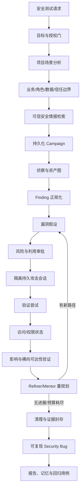
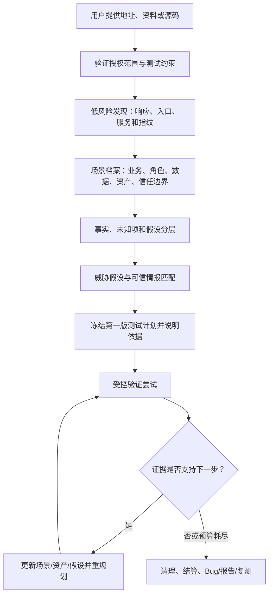

# Security Testing Mode 持续渗透验证升级方案

> 版本：v1.14
> 日期：2026-08-03  
> 状态：实施中；P-1、P0、P0-B、P1、P2、P3、P4 已通过阶段验收；S6（P4 到 Campaign/报告闭环映射）与 S7（受控安装失败路径）已完成真实验收；S1/S6 报告 artifact 共享 MinIO 交付、S1 场景多样性与否定语境修复、S2 结构化安全情报摄取与报告交付、S4 Security Bug 可下载复现包、S5 Security Bug 复测执行器已完成本地/真实后端验证
> 适用范围：`Agent_Server/src/modes/security_testing_mode/` 及其安全执行内核；本版新增数据影响证明质量门与 Finding → Security Bug 影响字段闭环
> 参考基线：[security_testing_mode_vs_pentagi_2026-08-01.md](security_testing_mode_vs_pentagi_2026-08-01.md)

## 1. 升级目标

当前安全模式已经能完成授权范围内的扫描、任务调度、审批、证据收集和报告生成，但还不能完整回答下面的问题：

> 发现一个漏洞后，系统能否在不越权、不失控的前提下继续验证利用条件、访问权限、影响范围和防守控制，并在失败后换路线？

本方案把产品目标从“安全扫描与发现汇总”升级为“受控持续渗透验证”：

```text
项目场景分析
  -> 业务、角色、数据与信任边界建模
  -> 安全情报检索与攻击假设
  -> 资产发现
  -> 漏洞假设
  -> 风险审批
  -> 隔离环境中的验证尝试
  -> 访问/权限/影响证明
  -> 失败换路线或人工介入
  -> 清理与证据封存
  -> 可复现 Bug、报告、记忆和复测
```

本方案借鉴 PentAGI 的 Flow/Task/Subtask、Refiner、Reflector、Mentor、Terminal/File、Installer 和 Graphiti 思路，但保留本项目的目标 allowlist、风险策略、服务端审批、最小权限和审计要求。

## 2. 现状与问题边界

### 2.1 已具备的能力

- [runtime.py](../src/modes/security_testing_mode/runtime.py) 已有 Campaign 阶段机、多 Worker 执行、失败分析、Reflection、报告和记忆持久化。
- [execution_environment_service.py](../src/application/security/execution_environment_service.py) 已支持 Docker、detached 任务轮询、文件上下行、容器清理和执行前目标校验。
- [command_profiles.py](../src/application/security/command_profiles.py) 已有约 20 个受控 profile，覆盖网络侦察、Web 扫描、服务审计、凭证和部分 exploit 信息查询。
- [campaign_state.py](../src/modes/security_testing_mode/campaign_state.py) 已有任务、子任务、发现、证据、凭证会话和执行记录模型。
- [memory_service.py](../src/modes/security_testing_mode/memory_service.py) 已能按目标指纹召回历史成功 profile。
- [request_interpreter.py](../src/modes/security_testing_mode/request_interpreter.py) 能提取 URL/主机/网段、风险偏好、关注项和排除项，但还没有业务场景、角色、数据和信任边界模型。
- [campaign_state.py](../src/modes/security_testing_mode/campaign_state.py) 的 `FindingRecord` 已有严重级别、CVSS、CVE、证据、复现步骤和验证状态字段；[report_builder.py](../src/modes/security_testing_mode/report_builder.py) 也能渲染复现步骤。

### 2.2 本次要解决的架构缺口

1. 输入地址后只完成目标类型识别和固定 baseline profile 选择，缺少专业项目场景分析与威胁建模。
2. `security-doc-analyst` 和 `attack-surface-planner` 已注册，但没有成为 Campaign 规划前的必经执行阶段。
3. `knowledge-rag` 主要检索本地文档和历史 Observation，没有外部安全情报的摄取、溯源、版本匹配和可信度验证流程。
4. Campaign 到报告之间缺少可循环的攻击链状态。
5. finding 没有统一进入 hypothesis、verification、impact 验证的契约。
6. Finding 虽有 `reproduction_steps`，但当前 normalizer 基本不填；开放端口或模板命中也可能直接标为 `verified`，混淆“观察到、确认漏洞、可利用、影响已证明”。
7. 没有独立、可去重、可复测的 Security Bug 生命周期和持久化模型。
8. 普通命令之间没有持久 Shell/PTY 会话状态。
9. Exploit Coder 没有代码写入、编译、执行、结果回传闭环。
10. 没有 access、credential、asset graph、loot、cleanup 等后渗透状态。
11. 没有 callback broker、端口租约和回连生命周期。
12. 当前存在一个仅供早期 runner 使用的 `security_runner_tool_bootstrap` 命令包装：它只按工具名映射少量 APT 包，并把 `apt-get update && apt-get install` 拼入命令；没有独立审批 scope、版本/镜像/网络出口 allowlist、环境 manifest 或安装失败生命周期。因此它不能视为 P4 已实现，必须由独立的审批式装配服务替代。
13. pgvector 记忆缺少攻击路径、实体关系和时间事件图谱。

## 3. 非目标与安全边界

本升级不是开放式自动攻击系统，以下内容不在默认自动化范围内：

- 未授权目标扫描、越界探测、任意互联网攻击；
- 宿主机 Shell、宿主网络改写和宿主机软件安装；
- 默认启用反弹 Shell、C2、持久化、横向移动或破坏性利用；
- 自动保存未脱敏的密码、Token、数据库内容或个人数据；
- 绕过审批继续执行高风险操作；
- 因 PentAGI 支持自由命令就取消本项目的 profile、allowlist 和风险门。

所有高风险能力都必须具备：目标绑定、授权证明、审批 scope hash、执行预算、超时、原始输出、证据记录和清理结果。

## 4. 目标架构



### 4.1 分层职责

| 层 | 新职责 | 主要实现位置 |
|---|---|---|
| Scenario Intelligence | 识别业务类型、角色、数据、认证、入口和信任边界 | 新增 `scenario_analysis_service.py` |
| Threat Intelligence | 检索、校验、版本匹配和引用安全知识 | 新增 `threat_intelligence_service.py` |
| Campaign | 长驻、暂停、恢复、循环和最终结算 | `security_testing_mode/runtime.py` |
| Attack Chain | 管理假设、审批、尝试、访问和影响验证 | 新增 `attack_chain.py` |
| Session | 管理隔离容器中的多步命令状态 | 新增 `attack_session.py`，扩展 `execution_environment_service.py` |
| Planner | 根据发现、记忆和失败原因生成下一步 | `vulnerability_planner.py`、`subtask_refiner.py` |
| Policy | 每个尝试前重新检查授权和风险 | `risk_policy.py`、`target_guard.py`、审批服务 |
| Evidence | 保存命令、输出、截图、文件摘要和清理状态 | `evidence_service.py` |
| Bug Lifecycle | 生成、去重、复现、修复跟踪和复测 | 新增 `security_bug_service.py` |
| Memory | 保存成功/失败路径和实体关系 | `memory_service.py` + 图谱适配层 |
| Report | 区分发现、利用证明、影响证明、阻断和环境限制 | `report_builder.py` |

## 5. 核心数据契约

### 5.1 Campaign 状态

在现有 `SecurityTestingState` 增加：

```python
class CampaignLifecycle(str, Enum):
    planning = "planning"
    running = "running"
    waiting_approval = "waiting_approval"
    waiting_input = "waiting_input"
    paused = "paused"
    cleaning = "cleaning"
    settled = "settled"
    failed = "failed"
    interrupted = "interrupted"


class CampaignSettlement(BaseModel):
    status: str = "running"  # success / partial / blocked / failed
    reason: str = ""
    all_tasks_settled: bool = False
    all_chains_settled: bool = False
    report_ready: bool = False
    cleanup_complete: bool = False
    finalized_at: str = ""
```

要求：父会话状态、Worker dispatch 状态和 ToolJob 状态必须由 Campaign 结算结果投影，不能分别维护互相矛盾的终态。

### 5.2 漏洞假设

```python
class VulnerabilityHypothesis(BaseModel):
    hypothesis_id: str
    finding_id: str
    title: str
    target: str
    attack_surface: str = ""
    preconditions: list[str] = Field(default_factory=list)
    proposed_profiles: list[str] = Field(default_factory=list)
    expected_proof: list[str] = Field(default_factory=list)
    risk_level: str = "medium"
    status: str = "proposed"  # proposed/approved/running/verified/rejected/blocked
    approval_id: str = ""
```

### 5.3 验证尝试

```python
class VerificationAttempt(BaseModel):
    attempt_id: str
    hypothesis_id: str
    profile_key: str
    target: str
    session_id: str = ""
    status: str = "planned"  # planned/running/succeeded/failed/blocked/cancelled
    attempt_number: int = 1
    command: str = ""
    exit_code: int | None = None
    stdout_summary: str = ""
    stderr_summary: str = ""
    evidence_ids: list[str] = Field(default_factory=list)
    failure_category: str = ""
    next_route: str = ""
    cleanup_status: str = "pending"
```

### 5.4 访问、凭证和资产关系

不要把敏感值直接写入普通日志。建议只持久化引用和摘要：

```python
class AccessProof(BaseModel):
    proof_id: str
    target: str
    principal: str = ""
    privilege: str = "unknown"
    source_attempt_id: str = ""
    evidence_ids: list[str] = Field(default_factory=list)
    expires_at: str = ""
    secret_ref: str = ""


class AssetRelation(BaseModel):
    source_asset_id: str
    relation: str  # reaches/ trusts/ authenticates_to/ hosts
    target_asset_id: str
    discovered_by: str = ""
    confidence: float = 0.0
    observed_at: str = ""
```

### 5.5 项目场景与威胁模型

```python
class SecurityScenarioProfile(BaseModel):
    scenario_id: str
    target: str
    product_type: str = "unknown"  # admin/ecommerce/payment/content/ai/api/iot/...
    business_capabilities: list[str] = Field(default_factory=list)
    technologies: list[str] = Field(default_factory=list)
    entry_points: list[str] = Field(default_factory=list)
    auth_flows: list[str] = Field(default_factory=list)
    roles: list[str] = Field(default_factory=list)
    sensitive_data_types: list[str] = Field(default_factory=list)
    trust_boundaries: list[str] = Field(default_factory=list)
    external_dependencies: list[str] = Field(default_factory=list)
    assumptions: list[str] = Field(default_factory=list)
    unknowns: list[str] = Field(default_factory=list)
    evidence_ids: list[str] = Field(default_factory=list)
    confidence: float = 0.0


class ThreatHypothesis(BaseModel):
    threat_id: str
    scenario_id: str
    asset_id: str = ""
    actor: str = "unauthenticated"
    entry_point: str = ""
    trust_boundary: str = ""
    technique: str = ""
    cwe_ids: list[str] = Field(default_factory=list)
    owasp_categories: list[str] = Field(default_factory=list)
    attack_references: list[str] = Field(default_factory=list)
    expected_impact: list[str] = Field(default_factory=list)
    priority: int = 0
    confidence: float = 0.0
```

### 5.6 安全情报来源

```python
class ThreatIntelligenceRecord(BaseModel):
    intelligence_id: str
    source_url: str
    source_type: str  # vendor/CVE/CISA/OWASP/research/community/post/PoC
    title: str
    published_at: str = ""
    retrieved_at: str = ""
    content_hash: str = ""
    applicable_products: list[str] = Field(default_factory=list)
    applicable_versions: list[str] = Field(default_factory=list)
    prerequisites: list[str] = Field(default_factory=list)
    cve_ids: list[str] = Field(default_factory=list)
    cwe_ids: list[str] = Field(default_factory=list)
    confidence: str = "unverified"
    validation_status: str = "pending"  # pending/matched/rejected/lab_verified
    evidence_ids: list[str] = Field(default_factory=list)
```

### 5.7 可复现 Security Bug

`FindingRecord` 继续保留为原始发现；只有完成证据校验后，才能生成独立 Bug：

```python
class SecurityBugRecord(BaseModel):
    bug_id: str
    fingerprint: str  # target + category + location + normalized trigger
    title: str
    status: str = "new"  # new/confirmed/fixed/retest_failed/closed/false_positive
    verification_level: str = "observed"  # observed/confirmed/exploitable/impact_verified
    severity: str
    cvss_score: float | None = None
    cvss_vector: str = ""
    cve_ids: list[str] = Field(default_factory=list)
    cwe_ids: list[str] = Field(default_factory=list)
    owasp_categories: list[str] = Field(default_factory=list)
    affected_target: str
    affected_component: str = ""
    affected_versions: list[str] = Field(default_factory=list)
    auth_required: bool = False
    required_role: str = ""
    preconditions: list[str] = Field(default_factory=list)
    reproduction_steps: list[str] = Field(default_factory=list)
    reproduction_request: str = ""
    expected_result: str = ""
    actual_result: str = ""
    evidence_ids: list[str] = Field(default_factory=list)
    exposed_data_types: list[str] = Field(default_factory=list)
    exposed_record_estimate: int | None = None
    confidentiality_impact: str = "none"
    integrity_impact: str = "none"
    availability_impact: str = "none"
    business_impact: str = ""
    remediation: str = ""
    regression_case_id: str = ""
    first_seen_at: str = ""
    last_seen_at: str = ""
    fixed_version: str = ""
    retest_history: list[dict[str, object]] = Field(default_factory=list)
```

生成 Bug 的硬条件：目标、前置条件、最小复现步骤、实际结果和至少一个可追溯 evidence 必须存在；否则只能保留为 Finding，不得伪装成 confirmed Bug。

## 6. 模块升级设计

### P-1：项目场景分析、威胁建模与安全知识引擎

**目标**：先理解项目，再规划测试；知识可以来自官方数据库、研究文章和社区帖子，但必须经过来源与可行性验证。

新增 `scenario_analysis_service.py`，在 Campaign 创建前完成：

1. 解析目标页面、API 文档、上传资料、可选源代码和历史会话；
2. 识别产品类型、业务能力、认证流程、用户角色、敏感数据、入口、外部依赖和信任边界；
3. 区分“已观察事实、用户声明、模型推断、未知项”，每项附证据与置信度；
4. 由 `security-doc-analyst` 生成场景资料，由 `attack-surface-planner` 生成 ThreatHypothesis；
5. 用户只给地址时先执行低风险 discovery，分析完成后再冻结第一版测试计划；
6. 后续发现新端口、技术栈或角色时增量更新场景，不重新盲跑所有 profile。

新增 `threat_intelligence_service.py`：

- 第一优先级：厂商公告、CVE/NVD、CISA KEV、OWASP、CWE、CAPEC、MITRE ATT&CK；
- 第二优先级：PortSwigger、Exploit-DB、GitHub Security Advisory、成熟研究机构；
- 第三优先级：渗透复盘、技术博客、论坛和社区帖子；
- 所有来源记录 URL、时间、内容哈希、适用产品/版本、前置条件和可信度；
- 社区 PoC 和帖子只生成候选攻击假设，禁止直接成为命令；
- 执行前必须完成版本匹配、静态检查、授权审批和隔离实验室验证；
- 来源失效、版本不匹配或连续失败时标记 rejected，避免记忆长期污染规划。

验收：对后台管理、电商和开放 API 三类实验室地址，系统能生成明显不同的场景模型和测试计划，并能解释每个任务来自哪条事实、威胁假设或情报来源。

### P0：攻击链闭环（优先级最高）

**目标**：不增加大规模危险工具，先让已有发现能够进入受控验证。

改动：

1. 新增 `attack_chain.py`：创建 hypothesis、推进 attempt、计算状态和生成下一步。
2. `runtime.py` 不在发现后直接结束；Campaign 进入 `attack_loop`，直到预算耗尽、人工停止或全部假设完成。
3. `subtask_refiner.py` 读取新 Finding、失败类别和访问证明，追加/删除/降级后续验证任务。
4. `report_builder.py` 增加四类结论：
   - `detected`：扫描或指纹发现；
   - `verified_exploitable`：满足复现条件；
   - `impact_verified`：证明权限或影响范围；
   - `blocked_by_control`：被认证、WAF、权限、网络或策略阻断。
5. 所有 attempt 必须关联原始输出和 cleanup 结果。

验收：给定一个测试实验室中的已知低风险漏洞，系统能从 finding 创建 hypothesis，经审批后执行验证，并在报告中区分“发现”和“已验证”。

### P0-B：可复现 Bug、修复跟踪与回归复测

**目标**：将经过验证的 Finding 转换成可持续管理、可重复执行的安全 Bug。

新增 `security_bug_service.py`：

1. 根据目标、类别、位置和触发条件生成稳定 fingerprint，跨 Campaign 去重；
2. 从 VerificationAttempt、原始请求/响应和 evidence 自动构造最小复现步骤；
3. 将“观察到、确认漏洞、已验证可利用、影响已证明”作为不同 verification level；
4. 计算 CVSS 时同时保存 vector 和依据，不能只保存分数；
5. 记录泄露的数据类型、估算数量、CIA 和业务影响；
6. 自动生成非破坏性回归用例，关联 `regression_case_id`；
7. 支持 fixed、retest_failed、closed、false_positive 生命周期；
8. 复测必须保存新证据，不能只修改状态字段。

修改 `finding_normalizer.py`：工具命中只能表示 observed/confirmed，不再笼统设置 `verified=True`。Nuclei 模板命中、开放端口、缺少响应头和真实可利用漏洞必须使用不同验证等级。

修改 `report_builder.py`：每个 Bug 输出前置条件、精确步骤、请求/参数、预期/实际结果、证据、CWE/OWASP/CVE、CVSS vector、数据影响、修复建议和复测状态。敏感数据只显示类型和脱敏样本。

验收：同一漏洞连续运行两次只产生一个 Bug，并追加 evidence/retest history；报告中的复现流程可以在授权实验室中由另一测试者独立复现。

### P1：持久隔离攻击会话

**目标**：支持多步、非破坏性验证，不先引入 SSH。

新增 `SecurityShellSession`：

- `create()`：创建或复用授权 Campaign 容器；
- `exec()`：在同一会话中执行命令；
- `write_stdin()`：发送交互输入；
- `read_output()`：返回完整 stdout/stderr 和 cursor；
- `put_file()` / `get_file()`：限制在会话 workspace；
- `close()`：结束进程、删除临时文件、清理容器；
- `heartbeat()`：检测会话是否仍然存在。

实现要求：

- 默认无宿主机挂载写权限；
- 每个 session 绑定 `campaign_id`、`target_allowlist` 和 `approval_scope_hash`；
- 每条命令都有独立 timeout 和整个 session 的总预算；
- 轮询失败必须返回 stderr、容器状态和最后一条可见日志；
- 禁止通过 session 绕过每次命令的风险校验。

验收：在授权实验室容器内完成“登录 -> 获取状态 -> 读取结果”三步流程，第二步能够使用第一步产生的会话状态，结束后容器、进程和临时文件全部清理。

### P2：Exploit Coder 与影响验证

**目标**：让 `security-exploit-coder` 从角色声明变成可审计的执行链。

新增 `exploit_workspace.py`：

1. 为每个 hypothesis 创建临时 workspace；
2. 只允许写入 workspace，禁止修改项目源代码；
3. 执行静态检查、危险 API 检查和编译；
4. 高风险执行必须审批；
5. 保存源码摘要、编译命令、stdout/stderr、退出码和产物哈希；
6. 执行结果回传 Refiner，失败时分类为编译失败、环境失败、前置条件失败或目标阻断；
7. Campaign 结束强制销毁 workspace。

优先只支持可回滚、只读、实验室目标的验证器；不要一开始实现持久化、破坏性写入或横向移动。

### P3：回连 Broker 与凭证/资产图

**目标**：补齐影响验证所需的最小网络和状态基础设施。

新增 `callback_broker.py`：

- 每个 Campaign 租赁有限端口；
- 端口绑定目标、协议和过期时间；
- 只接受授权 profile 使用；
- 记录连接时间、来源、协议和关闭原因；
- Campaign 结束强制释放端口和监听进程。

新增图谱适配层：

- 优先复用项目现有 Memgraph 能力；
- pgvector 保留用于相似成功路径召回；
- 图谱保存 Asset、Service、Principal、CredentialRef、Finding、Attempt、AccessProof 及其时间关系；
- 图谱查询只返回脱敏摘要和引用，不直接返回秘密值。

### P4：审批式工具装配

**目标**：解决固定 profile 遇到缺失工具时只能失败的问题。

新增 `tool_bootstrap_service.py`：

- 只在为本次装配新建的临时 Kali 容器中安装；不得复用 P1 持久攻击会话、不得在宿主机、项目虚拟环境、项目依赖锁文件或默认 Docker 镜像层安装；
- 安装请求必须包含 `tool_name`、`package_name`、精确版本（或服务端登记的版本策略）、基础镜像 digest/允许标签、原因、关联 profile、授权目标和 Campaign ID；
- 包名、版本策略、镜像、安装命令模板和允许访问的包源域名必须分别来自服务端 allowlist；模型、Worker、用户参数和社区文章都不能直接提供 shell 命令或覆盖 allowlist；
- 安装动作使用**独立 approval scope hash**，其哈希至少绑定 `mode=security_tool_bootstrap`、Campaign、目标 allowlist、基础镜像、包/版本、包源、安装命令模板、超时和资源预算；普通扫描、P1 Session、P2 验证器或 P3 callback 的批准不得复用；
- 先检查工具是否已存在及其版本。满足 allowlist 时记录 `already_available`，不执行安装；不满足时仅执行固定、无交互的安装模板；
- 每次请求写入不可变 environment manifest：请求、审批 scope、容器名、基础镜像标识、包/版本、实际检测到的版本、安装命令模板 ID、stdout/stderr、退出码、开始/结束时间、产物摘要和 cleanup 结果；
- 安装失败必须保留完整 stderr 和退出码，返回结构化 `tool_bootstrap_failed` / `package_not_allowlisted` / `approval_required` / `network_egress_denied` 等失败类别；禁止伪造“已就绪”或自动改走自由命令；
- 完成 profile 执行后销毁专用容器和可写安装层；即使后续 profile 失败、超时或 Campaign 中断，也必须在 finally 中执行 cleanup 并记录结果。

P4 只解决“受控工具缺失”的环境准备，不把 Installer 演变为通用容器 Shell。可安装的第一批工具必须小而明确，并以已有受控 profile 的真实依赖为依据，例如 `tcpdump -> tcpdump`、`searchsploit -> exploitdb`、`msfconsole -> metasploit-framework`；是否纳入 allowlist、版本策略和镜像兼容性需先在目标 Kali 镜像中验证。`nuclei` 模板缺失属于“模板资产/镜像内容”问题，不能被错误地降级为任意 `apt install`。

## 7. 失败与重规划策略

每个 attempt 都必须返回结构化失败分类：

| 分类 | 处理 |
|---|---|
| `target_out_of_scope` | 立即终止该链，不重试 |
| `approval_required` | Campaign 进入等待审批 |
| `precondition_missing` | 由 Refiner 生成前置探测或等待用户输入 |
| `profile_incompatible` | 换工具/换 profile |
| `target_blocked` | 记录防守阻断，尝试另一条低风险验证路线 |
| `execution_timeout` | 缩小范围或进入 detached，禁止无限延时 |
| `tool_failure` | 检查工具就绪性，必要时进入 Installer |
| `verified_success` | 记录 AccessProof/Impact，不自动扩大范围 |

强制规则：同一 profile 或同一失败原因达到预算后，必须换根本路线或转人工；不能通过增加 retry 次数掩盖路线无效。

## 8. 配置与接口变更

建议新增配置：

| 配置 | 默认值 | 说明 |
|---|---:|---|
| `security_scenario_analysis_enabled` | `true` | 是否在规划前执行项目场景分析 |
| `security_threat_intelligence_enabled` | `false` | 是否启用外部安全情报检索 |
| `security_threat_intelligence_domain_allowlist` | `""` | 允许摄取的安全情报来源域名 |
| `security_community_intelligence_requires_validation` | `true` | 社区文章/PoC 是否强制验证 |
| `security_bug_reproduction_required` | `true` | confirmed Bug 是否必须具备复现资料 |
| `security_campaign_max_loops` | `5` | 单 Campaign 最大攻击循环 |
| `security_campaign_max_attempts` | `30` | 所有验证尝试总预算 |
| `security_attack_session_enabled` | `false` | 是否启用持久会话 |
| `security_attack_session_timeout_seconds` | `900` | 单会话最大存活时间 |
| `security_callback_broker_enabled` | `false` | 是否启用回连 Broker |
| `security_callback_port_range` | `28000-28100` | 受控端口租约范围 |
| `security_tool_bootstrap_enabled` | `false` | 是否允许容器内工具安装 |
| `security_tool_bootstrap_package_allowlist` | `""` | `tool:package[:version]` 服务端允许清单；空值即拒绝安装 |
| `security_tool_bootstrap_image_allowlist` | `""` | 允许用于临时装配的 Kali 镜像引用或 digest |
| `security_tool_bootstrap_repository_allowlist` | `""` | 允许访问的 APT 仓库域名/源标识；空值即拒绝联网安装 |
| `security_tool_bootstrap_timeout_seconds` | `300` | 单次装配最大执行时间 |
| `security_tool_bootstrap_cleanup_required` | `true` | 临时装配容器/可写层清理失败时不能标记成功 |
| `security_graph_memory_enabled` | `false` | 是否启用安全情景图谱 |
| `security_exploit_requires_approval` | `true` | 利用验证是否强制审批 |
| `security_cleanup_required` | `true` | 是否必须完成清理才能结算 |

建议增加内部事件：

```text
security.hypothesis.created
security.scenario.analyzed
security.threat_intelligence.matched
security.threat_hypothesis.created
security.attempt.started
security.attempt.blocked
security.attempt.verified
security.access.proof_created
security.impact.verified
security.attack_route_changed
security.cleanup.started
security.cleanup.completed
security.tool_bootstrap.requested
security.tool_bootstrap.approval_required
security.tool_bootstrap.started
security.tool_bootstrap.completed
security.tool_bootstrap.failed
security.tool_bootstrap.cleaned
security.bug.created
security.bug.deduplicated
security.bug.retested
security.campaign.settled
```

## 9. 测试方案

### 9.1 单元测试

- 场景事实、推断和未知项分离，证据与置信度计算；
- 情报来源去重、内容哈希、版本匹配、可信度和 rejected 状态；
- 社区 PoC 不能绕过审批直接执行；
- Security Bug fingerprint、去重、验证等级和生命周期转换；
- 复现步骤缺失时不得生成 confirmed Bug；
- 数据影响字段脱敏，报告和日志不泄露秘密值；
- Hypothesis 状态转换、审批 scope hash 和越界拒绝；
- Attempt 重试预算、失败分类和换路线；
- Campaign settlement 成功、部分成功、阻断、失败和中断；
- Shell session workspace 路径、超时、stdin/stdout cursor；
- callback port 租约、重复释放、过期释放；
- Installer 对显式 P4 请求、配置关闭、普通扫描批准、包/版本/镜像/包源越权、已安装版本不匹配、安装失败 stderr、cleanup 失败和宿主零写入的验证；
- CredentialRef 脱敏和日志禁止泄露；
- 图谱写入失败时 pgvector 召回仍可降级。

### 9.2 集成测试

- 仅输入地址时，先产生场景模型和威胁计划，再执行 profile；
- 不同业务类型产生差异化计划，而不是相同固定扫描组合；
- 从已校验情报生成攻击假设，并保留完整来源链；
- Finding -> Verification -> Bug -> Regression Case -> Retest 完整闭环；
- 授权实验室：发现低风险漏洞 -> 审批 -> 验证 -> 记录证据 -> 清理；
- 同一 Campaign 内三步持久会话；
- Worker 输出大于 16KB 时保留 URL、CVE、端口、服务和错误；
- 连续失败后 Refiner 改用替代 profile；
- 中断后所有 Worker、监听器、容器和 workspace 均结束；
- 工具安装失败时完整回传 stderr 且不污染宿主机。
- 同一扫描批准不能恢复或执行 P4 装配；包、版本、镜像、目标、超时任一变化均必须重新审批。

### 9.3 验收指标

| 指标 | 目标 |
|---|---:|
| 未授权目标执行率 | 0 |
| 高风险无审批执行率 | 0 |
| 原始 stdout/stderr 丢失率 | 0 |
| 清理未完成的正常结算率 | 0 |
| 同路线无限重试 | 0 |
| 已验证漏洞被误报为仅发现 | 0 |
| observed Finding 被误报为 exploitable Bug | 0 |
| confirmed Bug 缺少可执行复现步骤 | 0 |
| Bug 跨 Campaign 重复率 | 0 |
| 无来源或版本不匹配的外部 PoC 自动执行率 | 0 |
| 访问证明泄露秘密值 | 0 |
| 普通扫描批准复用于工具装配的执行率 | 0 |
| 不在装配 allowlist 中的包/版本/镜像/包源执行率 | 0 |
| 临时装配后宿主机或项目依赖污染率 | 0 |
| 受控实验室攻击链完成率 | >= 95% |

## 10. 实施顺序与交付物

### Sprint 1：P-1 场景分析与情报引擎

交付：`scenario_analysis_service.py`、场景/威胁模型、Planner 前置分析、情报来源契约、版本匹配和可信度测试。

### Sprint 2：P0 攻击链闭环

交付：`attack_chain.py`、状态模型、报告字段、finding 到 hypothesis 的转换、attempt 预算和 settlement 测试。

### Sprint 3：P0-B Security Bug 与复测闭环

交付：`security_bug_service.py`、Bug fingerprint、复现流程生成、CIA/数据影响、报告升级、回归用例和复测历史。

### Sprint 4：P1 持久攻击会话

交付：`attack_session.py`、Docker attach/PTY 或等效会话、stdin/stdout cursor、workspace 安全测试。

### Sprint 5：P2 Exploit Coder

交付：`exploit_workspace.py`、编译/运行结果契约、审批和 cleanup 测试。

### Sprint 6：P3 回连与图谱

交付：`callback_broker.py`、端口租约、AssetRelation/AccessProof 图谱、脱敏回归测试。

### Sprint 7：P4 Installer

交付：`tool_bootstrap_service.py`、包和镜像 allowlist、安装审批、环境 manifest 和隔离验证。

每个 Sprint 必须同时交付：代码、单元测试、集成测试、事件日志、文档更新和已知限制；未通过真实验证不得标记完成。

## 11. Definition of Done

升级完成的最低标准：

- Campaign 能跨多个 attack loop 持久运行；
- 用户只提供地址时，系统会先形成可解释、带证据和未知项的项目场景模型；
- 测试计划能关联业务场景、攻击面、威胁假设和情报来源，不是固定 profile 盲跑；
- 外部文章和 PoC 经过来源、版本、前置条件、静态检查和隔离验证后才能执行；
- finding、hypothesis、attempt、access、impact 和 cleanup 均有可追踪 ID；
- 每个高风险 attempt 都能证明审批状态和目标范围；
- 失败达到预算后会换路线或转人工；
- 真实实验室中至少完成一个多步、非破坏性验证流程；
- 报告明确区分 detected、verified_exploitable、impact_verified、blocked_by_control 和 environment_limited；
- 每个 confirmed Bug 都有可独立复现的前置条件、步骤、预期/实际结果和证据；
- Bug 能记录 CVSS vector、CWE/OWASP/CVE、泄露数据类型、CIA/业务影响、修复版本和复测历史；
- 终止、异常和中断路径都能清理容器、进程、端口、临时文件和敏感引用；
- 定向测试、集成测试和静态检查全部实际通过；
- 未引入对非安全模式的未经批准改动。

## 12. 最终建议

不要先增加更多扫描器，也不要把网上文章直接变成执行命令。正确顺序是：

```text
P-1 项目场景分析、威胁建模和可信情报
  -> P0 攻击链状态和结算
  -> P0-B 可复现 Security Bug 和回归复测
  -> P1 持久隔离会话
  -> P2 Exploit Coder 执行闭环
  -> P3 Access/Impact/Cleanup + 回连 Broker
  -> P4 图谱记忆和审批式 Installer
```

这样既能借鉴 PentAGI 的持续渗透能力，又不会牺牲本项目企业场景最重要的授权、可审计和可清理边界。

## 13. 实施基线与后续开发台账

本章记录本轮已经落地的代码、真实测试证据、尚未通过的验收项和后续开发门禁。第 1～12 章描述目标架构；本章是后续开发时判断“当前做到哪里、能否进入下一阶段”的事实基线。未在本章标记为“已通过阶段验收”的能力，不得仅凭代码存在就视为完成。

### 13.1 强制开发与测试顺序

后续开发固定按以下顺序推进：

```text
P-1 场景分析、威胁建模和可信情报
  -> P0 攻击链闭环
  -> P0-B 可复现 Security Bug 和回归复测
  -> P1 持久隔离攻击会话
  -> P2 Exploit Coder 与影响验证
  -> P3 回连 Broker、访问证明和资产图
  -> P4 审批式工具装配
```

执行规则：

1. 每一阶段先运行该阶段要求的完整自动化测试和真实目标测试，保留失败现场，再根据事实定位根因并修复；不得先按猜测修改后补测试。
2. 修复后必须重新运行相同真实样本和受影响测试集。自动化测试通过但真实目标未通过时，阶段状态仍为“待验收”。
3. 当前阶段未通过验收，不得进入下一阶段。禁止并行堆叠 P0～P4 的未验证实现。
4. 真实执行统一走安全测试 Session API、项目内部 LLM 和 Kali Docker runner，不用宿主机命令伪造安全模式成功结果。
5. 本轮授权实验室目标仅包括 `http://localhost:8089/` 和 `http://localhost:3000/`；目标必须绑定 verified authorization grant，并校验协议、主机和端口。
6. 测试原始 stdout、stderr、Session/Campaign 快照和报告统一保存在 `.codex-logs/`。日志中的凭证、Token、Cookie 和敏感响应内容必须脱敏。
7. P-1 基线隔离后端使用 `127.0.0.1:1033`，P0 最终验收使用 `127.0.0.1:1036`；不得停止、重启或修改用户的 `1032` 服务。
8. 未经用户明确要求，不提交、不推送、不创建 PR，并保留工作区原有改动。

### 13.2 P-1 当前已落地能力

P-1 已完成代码、自动化回归、双目标真实执行和同 Session 幂等重放，并于 2026-08-02 通过阶段验收。

| 能力 | 当前实现 | 状态 |
|---|---|---|
| 场景契约 | 新增场景事实、事实来源、业务能力、信任边界、威胁假设和情报记录模型 | 已实现 |
| 场景分析 | `scenario_analysis_service.py` 分离 observed、declared、inferred 和 unknown，并生成可引用事实 | 已实现 |
| 可信情报 | `threat_intelligence_service.py` 保存来源、哈希、适用范围、验证状态；社区情报只有 `lab_verified` 且具备 evidence 才能进入执行候选 | 已实现 |
| 规划前置流程 | 先由 Kali Docker 执行一次低风险 WhatWeb discovery，再执行基础场景分析、`security-doc-analyst`、`attack-surface-planner`，最后冻结扫描计划；成功 discovery 结果直接复用 | 已通过真实验收 |
| 可解释计划 | 计划任务保存 `planning_rationale`、`scenario_fact_refs` 和 `threat_hypothesis_ids` | 已实现 |
| 差异化场景 | 后台管理、电商、开放 API 能生成不同的场景 profile 和威胁重点 | 自动化测试已覆盖 |
| 安全路由 | 显式安全模式通过目标绑定的 verified grant 进入 dedicated security runtime；目标匹配增加端口约束 | 已实现 |
| Finding 证据 | Finding 增加 `verification_level`、`evidence_ids` 和最小复现步骤；子 Agent 输出自动转换为 Evidence | 已实现，完整 Security Bug 生命周期属于 P0-B |
| 防止假阳性 | 空 HTTP 响应不生成缺少安全头漏洞；discovery 已证明环境不可达时不再盲跑后续 HTTP profile；报告明确输出 `environment_limited` | 已通过真实验收 |
| Campaign 结算 | 新增统一 `CampaignSettlement`；成功目标结算为 `success`，环境不可达且证据完整时结算为 `partial` | 已通过真实验收 |
| 并发与幂等 | 同一 Session 请求加锁并缓存状态；相同请求重发返回原 Campaign，不重复启动 Docker runner | 已通过真实验收 |
| Runner/解析 | 修复 WhatWeb ANSI 输出解析和 profile 描述；Planner 兼容 fenced JSON、字符串 priority/impact 和 `P0`～`P4` 优先级；Worker 只能缩短、不能扩大服务端 timeout | 已通过真实验收 |
| 模型输出约束 | 场景与威胁 Prompt 使用严格 JSON 序列化；无观察事实或用户声明支撑的 CVE/外部引用被拒绝并记录事件 | 已通过真实验收 |
| Worker 收敛 | 场景分析/Planner 最长等待 180 秒，失败分析最长等待 120 秒；超时显式取消子会话，父 Campaign 结算后不得残留 Worker | 已通过真实验收 |

P-1 关键内部事件已经加入：

```text
security.scenario.analyzed
security.threat_hypothesis.created
security.scenario.discovery.started
security.scenario.discovery.completed
security.threat_reference.rejected
security_campaign_idempotent_replay
```

P0 已在此基础上补齐 `security.hypothesis.created`、`security.attempt.started`、`security.attempt.verified`、Attempt cleanup 和 Settlement 事件链。Impact 和 Security Bug 生命周期仍属于 P0-B 及后续阶段。

### 13.3 已执行的自动化验证

最终真实验收完成后重新执行的验证结果如下：

| 验证范围 | 结果 | 说明 |
|---|---:|---|
| P-1 与安全模式相关测试 | `50 passed, 1 skipped` | `python -m pytest tests/test_security_continuous_pentest_upgrade.py tests/test_security_execution_environment_upgrade.py tests/test_security_output_compaction.py tests/test_security_reflect_mentor.py tests/test_security_target_guard.py -q`；日志：`.codex-logs/continuous_pentest_p1_round3_related_pytest.log` |
| 后端全量测试 | `300 passed, 1 skipped`，另有 `3 failed, 2 errors` | `python -m pytest -q`；日志：`.codex-logs/continuous_pentest_p1_round3_full_pytest.log`；失败集合与安全模式修改前一致 |
| Python 编译检查 | 通过 | `python -m compileall src tests`；日志：`.codex-logs/continuous_pentest_p1_round3_compileall.log` |

后端全量测试中尚存的非安全模块环境问题：

- 两个 compatibility runner 测试在 Windows 超长临时路径上触发 `FileNotFoundError`；
- Memgraph 测试环境缺少 `neo4j` 包；
- 两个 performance coordinator 测试环境缺少 `event_loop` fixture。

上述 5 项失败在本轮安全模式修改前后保持一致，没有证据表明由 P-1 引入；全量测试仍不能表述为全绿，后续应在标准 CI 环境补齐依赖和 fixture 后复核。

P0 最终真实验收完成后重新执行的验证结果如下：

| 验证范围 | 结果 | 说明 |
|---|---:|---|
| P0 定向测试 | `21 passed` | 覆盖 hypothesis/attempt、同源 Finding 去重、无证据阻断、授权目标与 Docker 证据地址隔离、cleanup 和 Campaign 任务账本；日志：`.codex-logs/continuous_pentest_p0_final_targeted.log` |
| 安全、意图与报告扩展回归 | `97 passed, 1 skipped` | 覆盖 P0、execution environment、output compaction、Reflect/Mentor、target guard、intent safety 和 report；日志：`.codex-logs/continuous_pentest_p0_final_broad.log` |
| 后端全量测试 | `308 passed, 1 skipped, 2 failed` | 两项失败均为 compatibility runner 在 Windows 超长临时路径上的既有 `FileNotFoundError`，P0 失败集合未扩大；日志：`.codex-logs/continuous_pentest_p0_final_full_pytest.log` |
| Python 编译检查 | 通过 | `python -m compileall -q src tests`；日志：`.codex-logs/continuous_pentest_p0_final_compileall.log` |

P0 实施期间还在每次真实修复后执行了定向与扩展回归。任务账本覆盖修复后即时结果为 `21 passed` 和 `97 passed, 1 skipped`，对应日志 `.codex-logs/continuous_pentest_p0_task_ledger_fix_targeted.log`、`.codex-logs/continuous_pentest_p0_task_ledger_fix_broad.log` 和 `.codex-logs/continuous_pentest_p0_task_ledger_fix_compileall.log`。

### 13.4 P-1 真实验收证据

P-1 最终验收使用隔离的 `127.0.0.1:1033` 后端、安全测试 Session API、内部 `qwen3.6-plus` 和 Kali Docker 镜像 `vxcontrol/kali-linux`。用户的 `1032` 服务在整个过程中保持原 PID `23980`，未被停止、重启或修改。

#### 13.4.1 `8089` 可达目标

最终第三轮结果：

| 项目 | 值 |
|---|---|
| Session ID | `5f91625b-c86d-44df-93ee-acdd1a6a23c8` |
| Campaign ID | `aec3ba96-1094-4918-8ea4-a8b8861c2b7d` |
| 场景类型 | `admin`，基于真实 XXL-JOB 指纹 |
| 场景分析 | `security-doc-analyst structured=true`，21 条场景事实 |
| 威胁规划 | `attack-surface-planner structured=true`，8 条模型威胁成功合并 |
| 优先级映射 | P1/P2/P3 分别映射为 `80/50/20` |
| 任务 | `3/3 completed`：WhatWeb、HTTP headers、httpx |
| Findings / Evidence | 4 个低危 confirmed Finding / 6 条 Evidence |
| 验证与质量 | `approved`，5/5 规则通过，Grade A，100/100 |
| Settlement | `success`，cleanup/all tasks/all chains 均已完成 |
| 快照 | `.codex-logs/continuous_pentest_p1_round3_8089_snapshots.json` |
| Session / 事件 | `.codex-logs/continuous_pentest_p1_round3_8089_session_final.json`、`.codex-logs/continuous_pentest_p1_round3_8089_events.json` |

真实运行还证明：

- discovery 在规划前执行，完成后复用，不重复运行 WhatWeb；
- 场景识别不再被文案中的 `model inferences` 误导为 AI 项目；
- `http_headers_probe` 与 `httpx_probe` 使用正确 profile；`httpx` 服务端任务 timeout 为 60 秒，worker 没有扩大预算；
- 一个没有观察事实或用户声明支撑的 XXL-JOB 外部引用被 `security.threat_reference.rejected` 拒绝；最终 `attack_references` 中没有未验证 CVE；
- 报告只把真实响应证据支持的缺失控制记录为低危 confirmed Finding，没有把它们标为 exploitable 或 impact verified。

第二轮成功复测可作为独立交叉证据：Session `ef37865f-e299-4096-9167-d8bde3f8b97d`、Campaign `f34dbd30-c856-4614-bfda-0b48eb568cff`，同样得到 `admin`、3/3 completed、4 Findings、6 Evidence、Grade A 和 Settlement `success`；快照为 `.codex-logs/continuous_pentest_p1_round2_8089_snapshots.json`。

#### 13.4.2 `3000` 环境受限目标

最终第三轮结果：

| 项目 | 值 |
|---|---|
| Session ID | `c95d8d7a-015b-4274-b98d-4d34d03cdc55` |
| Campaign ID | `6411ff9d-384a-4c53-b414-d3e8278fe225` |
| discovery | 仅执行一次 WhatWeb；Kali 到 `host.docker.internal:3000` 连接被拒绝 |
| 场景/威胁分析 | 两个 Planner 前置 Agent 均 `structured=true`；Prompt 未再触发端口单引号解析异常 |
| 任务结论 | 1 个 discovery 任务结构化失败，分类为 `environment_limited`；未继续盲跑 headers/httpx |
| Findings / Evidence | 0 / 2 |
| Verification / Settlement | `approved` / `partial` |
| 报告限制 | `环境限制（environment_limited）：1 个任务未能从隔离执行环境获得目标响应；未根据空响应生成漏洞发现。` |
| 快照 | `.codex-logs/continuous_pentest_p1_round3_3000_snapshots.json` |
| Session / 事件 | `.codex-logs/continuous_pentest_p1_round3_3000_session_final.json`、`.codex-logs/continuous_pentest_p1_round3_3000_events.json` |

场景分析、威胁规划和失败分析三个子会话最终均为 `completed`，父 Session 完成后没有残留子会话或 `qa-security-runner-*` Docker 容器。第二轮独立复测也得到相同的 `environment_limited`、0 Finding 和 `partial` 结论，快照为 `.codex-logs/continuous_pentest_p1_round2_3000_snapshots.json`。

#### 13.4.3 同 Session 幂等重放

在第三轮 `8089` Session 中重发完全相同的请求后：

- 日志记录 `security_campaign_idempotent_replay`；
- 返回原 Campaign `aec3ba96-1094-4918-8ea4-a8b8861c2b7d` 和原报告；
- 父 Session 的 Docker runner 启动次数保持 `1 -> 1`；
- Campaign entry 为 2 次，但 Campaign exit 和真实扫描执行仍只有 1 次。

完整服务端 stdout/stderr 分别保存在 `.codex-logs/continuous_pentest_p1_acceptance_round3_1033_stdout.log` 和 `.codex-logs/continuous_pentest_p1_acceptance_round3_1033_stderr.log`。
幂等专用事件摘录和重放后 Session 分别保存在 `.codex-logs/continuous_pentest_p1_round3_8089_idempotency.log` 和 `.codex-logs/continuous_pentest_p1_round3_8089_duplicate_session_final.json`。

### 13.5 P-1 阶段验收结论

P-1 的最终门禁结果：

- [x] `8089` 通过真实授权、Session API、内部模型和 Kali Docker 完成测试，Settlement 为 `success`；
- [x] WhatWeb 规划前 discovery、场景分析和威胁规划顺序正确，Planner 均返回结构化结果；
- [x] 模型威胁优先级映射正确，无证据外部引用被拒绝，未验证 CVE 未进入执行引用；
- [x] Worker timeout 未扩大服务端预算，父 Campaign 结算后无残留 Worker 或容器；
- [x] `3000` 正确报告 `environment_limited`、0 Finding，不依据空响应伪造漏洞；
- [x] 同 Session 相同请求命中原 Campaign，未重复执行扫描器；
- [x] 安全相关测试和编译检查通过；全量测试通过项增加且既有失败集合未扩大；
- [x] 快照、事件、stdout、stderr 和测试日志已保存到 `.codex-logs/`。

结论：**P-1 已通过阶段验收，可以按既定顺序进入 P0 攻击链闭环开发。** 该结论只表示 P-1 场景分析与可信规划基线通过，不代表 P0、P0-B、P1、P2、P3 或 P4 已实现。

### 13.6 P0 攻击链闭环实施与真实验收

P0 已完成最小攻击链闭环的代码、自动化回归、三轮双目标真实执行和同 Session 只读回放，并于 2026-08-02 通过阶段验收。

#### 13.6.1 已落地能力

| 能力 | 当前实现 | 状态 |
|---|---|---|
| 攻击链状态 | 新增 `attack_chain.py`，把有真实 response evidence 的 Finding 转换为 `VulnerabilityHypothesis` 和 `VerificationAttempt` | 已实现 |
| 有界循环 | `runtime.py` 在 recon 后进入 `hypothesis_planning -> attack_loop -> verification_complete`，受 `SECURITY_CAMPAIGN_MAX_LOOPS=5`、`SECURITY_CAMPAIGN_MAX_ATTEMPTS=30` 限制 | 已实现并通过真实验收 |
| 去重验证 | 同一 source task 产生的 4 个缺少响应头 Finding 共用一次 `http_headers_probe` 重放，不重复请求目标 | 已通过真实验收 |
| 证据门 | Finding 没有可追溯真实响应 evidence 时只生成 blocked hypothesis，不执行 attempt | 已通过自动化测试 |
| 授权目标 | attempt 执行目标继承原 source task 的授权 URL；`host.docker.internal` 只作为 Kali Docker 内证据地址，不能成为新授权目标 | 已通过真实验收 |
| 风险与审批 | 低风险、verified authorization 下为 `approval_status=not_required`；高风险验证继续进入现有审批/阻断路径 | 已实现 |
| 结论分级 | 本阶段的缺失响应头验证结论为 `confirmed`，没有误升为 `verified_exploitable` 或 `impact_verified` | 已通过真实验收 |
| 失败换路 | Attack-loop Reflector 最多纠正一次；环境不可达时不进入 attack loop | 已实现；最终成功样本未触发重试 |
| 证据与清理 | Attempt 保存 stdout/stderr 摘要、Evidence ID、failure category、approval 和 cleanup；无 runner 路径明确为 `cleanup_status=not_started` | 已实现 |
| 报告 | 报告新增 hypothesis、attempt、结论、审批、cleanup 和 Evidence 表格，并参与 Campaign Settlement | 已通过真实验收 |
| 任务账本 | 攻击链 Worker 的局部 checkpoint 不再覆盖原 recon tasks；最终 Campaign 和报告保留 recon + verification 的完整任务账本 | 已修复并通过真实验收 |
| 范围控制 | P0 未引入持久 Shell、Exploit Coder、callback broker、Access/Impact 图或动态 installer | 符合阶段边界 |

主要实现文件：

- `Agent_Server/src/modes/security_testing_mode/attack_chain.py`
- `Agent_Server/src/modes/security_testing_mode/campaign_state.py`
- `Agent_Server/src/modes/security_testing_mode/contracts.py`
- `Agent_Server/src/modes/security_testing_mode/runtime.py`
- `Agent_Server/src/modes/security_testing_mode/report_builder.py`
- `Agent_Server/tests/test_security_continuous_pentest_upgrade.py`

P0 新增关键内部事件：

```text
security.hypothesis.created
security.attempt.started
security.attempt.verified
```

#### 13.6.2 真实失败样本与修复轨迹

P0 严格采用“整轮真实测试结束后再修复”的顺序，保留了以下失败现场：

1. 实施前基线：`8089` 能完成 3/3 recon、4 Findings、6 Evidence 和 Settlement `success`，但没有 Hypothesis、Attempt 或攻击链预算；Session `696c7fe4-971b-406d-a9f6-1c7d044007f8`，Campaign `55146d12-a6fb-48dd-8905-4f3a549ae5a4`。
2. 第一轮 `8089`：成功创建 4 个 Hypothesis 和 1 个 Attempt，但错误使用 Finding 中的 Docker 证据地址 `http://host.docker.internal:8089` 作为授权执行目标，导致 Worker 无有效 runner output，Reflector 重试后失败。修复后执行目标改为 source task 的 `http://localhost:8089`。Session `70288ce8-d001-4371-9475-d58f2a1df5c7`，Campaign `ca39746e-0d09-434e-8f03-bd4fac21e13d`。
3. 第二轮 `8089`：攻击验证真实成功，但 Worker checkpoint 将 Campaign 原 3 个 recon task 覆盖为仅剩 verification task，报告错误显示 1 个任务。修复在 attack loop 前保存完整任务账本，在 Worker 返回后、interrupt 判断前恢复 recon + verification，并让 settled checkpoint 使用完整账本。Session `24753ae2-c0b4-4045-91f6-d2e3cf45c821`，Campaign `8376ce91-a793-4818-ab8b-e195a4dd925c`。
4. 两轮 `3000` 交叉样本始终保持 `environment_limited`、0 Finding、0 Hypothesis、0 Attempt，没有为了让攻击链运行而伪造发现。第二轮 Session `c846b2d7-996c-42f7-b8c9-980481267a15`，Campaign `5f345e8d-5561-477b-bc0e-ac53a5232db3`。

对应证据统一保存在：

```text
.codex-logs/continuous_pentest_p0_baseline_*
.codex-logs/continuous_pentest_p0_round1_*
.codex-logs/continuous_pentest_p0_round2_*
```

#### 13.6.3 P0 最终 `8089` 验收

最终验收使用隔离后端 `127.0.0.1:1036`、安全测试 Session API、内部 `qwen3.6-plus` 和 Kali Docker 镜像 `vxcontrol/kali-linux`。用户 `1032` 服务仍为原 PID `23980`，未停止、重启或修改。

| 项目 | 值 |
|---|---|
| Session ID | `afca5394-e46d-4bf7-a7f8-2d83ef3a3a3a` |
| Campaign ID | `a844ab1a-44ec-4108-b270-85a9219ba32f` |
| 任务 | `4/4 completed`：WhatWeb、HTTP headers、httpx、一次去重后的 headers verification |
| Findings | 4 个低危 `confirmed` Finding |
| Hypotheses | 4 个，全部 `verified`，授权 scope hash 为 `codex-p0-round3-8089-20260802` |
| Attempt | 1 个，`http_headers_probe`，目标 `http://localhost:8089`，状态 `succeeded` |
| Attempt 结论 | `confirmed`，没有升级为 exploitable 或 impact verified |
| Approval / Cleanup | `not_required` / `completed` |
| Evidence | 8 条；verification 新增 2 条并关联回 4 个 Finding |
| Settlement | `success`；`all_tasks_settled=true`、`all_chains_settled=true`、`report_ready=true`、`cleanup_complete=true` |
| 重试与残留 | Attempt started/verified 各 1 次，无 Reflector retry，无 `qa-security-runner-*` 容器残留 |
| Session / 事件 / 快照 | `.codex-logs/continuous_pentest_p0_round3_8089_session_final.json`、`.codex-logs/continuous_pentest_p0_round3_8089_events.json`、`.codex-logs/continuous_pentest_p0_round3_8089_snapshots.json` |
| 服务端日志 | `.codex-logs/continuous_pentest_p0_round3_8089_server.log`、`.codex-logs/continuous_pentest_p0_round3_1036_stderr.log` |

该样本同时证明完整任务账本修复已经进入真实 Session 快照和最终报告：`task_count=4`、`report.total_tasks=4`、`completed_tasks=4`，不再退化为仅显示 verification task。

#### 13.6.4 P0 最终 `3000` 环境门禁验收

| 项目 | 值 |
|---|---|
| Session ID | `29039cdc-eb0f-4203-bb82-29675aeeb425` |
| Campaign ID | `8bf5929e-f6b1-450a-b08f-ae8b3d35dff1` |
| discovery | 仅执行一次 WhatWeb；Kali 到 `host.docker.internal:3000` 连接被拒绝 |
| 任务结论 | 1 个 discovery 任务失败，分类为 `environment_limited`，没有继续 blind headers/httpx/attack probing |
| Findings / Hypotheses / Attempts | `0 / 0 / 0` |
| Evidence | 2 条，保留真实 stderr 和失败分类 |
| 子会话终态 | scenario analyst `completed`、不可执行的 threat planner `interrupted`、failure analyst `completed`；无 running Worker |
| 清理 | 无 `qa-security-runner-*` 容器残留 |
| Session / 事件 / 快照 | `.codex-logs/continuous_pentest_p0_round3_3000_session_final.json`、`.codex-logs/continuous_pentest_p0_round3_3000_events.json`、`.codex-logs/continuous_pentest_p0_round3_3000_snapshots.json` |
| 服务端日志 | `.codex-logs/continuous_pentest_p0_round3_3000_server.log` |

报告限制保持为：`环境限制（environment_limited）：1 个任务未能从隔离执行环境获得目标响应；未根据空响应生成漏洞发现。`

#### 13.6.5 同 Session 只读回放与幂等性

对最终 `8089` Session 连续调用两次 `/replay`：

- replay count 从 1 增至 2，但两次均指向同一个 completed snapshot `55f3db1e-faf8-4096-8419-a46c40bbdcd7`；
- Session 保持 `completed`，Campaign 业务结果保持 4 tasks、4 Findings、4 Hypotheses、1 Attempt、8 Evidence 和 Settlement `success`；
- 没有新增安全工具执行、verification attempt、Evidence 或 Docker 容器；
- 回放结果保存在 `.codex-logs/continuous_pentest_p0_round3_8089_replay_1.json` 和 `.codex-logs/continuous_pentest_p0_round3_8089_replay_2.json`。

#### 13.6.6 P0 阶段验收结论

- [x] 有真实 response evidence 的 Finding 能进入 Hypothesis 和有预算的 Attempt；
- [x] 无 evidence 或环境不可达时不执行攻击链；
- [x] 同源 Finding 合并为一次低风险验证，不重复探测；
- [x] 授权 URL 与 Docker 内 evidence URL 分离，没有扩大目标范围；
- [x] Attempt 保存审批、stdout/stderr、Evidence、结果分类和 cleanup；
- [x] 报告区分 confirmed 与 exploitable/impact verified，没有夸大验证级别；
- [x] Campaign 保留 recon + verification 完整任务账本，Settlement 全部收敛；
- [x] 同 Session replay 不重复执行攻击或累加业务记录；
- [x] `3000` 保持 `environment_limited` 和 0 Finding/Hypothesis/Attempt；
- [x] 定向、扩展和编译检查通过；全量测试失败集合未扩大；
- [x] 所有真实日志、Session、事件、快照和报告已写入 `.codex-logs/`。

结论：**P0 已通过阶段验收，可以按既定顺序进入 P0-B 可复现 Security Bug、修复跟踪与回归复测开发。** 该结论只表示 Finding -> Hypothesis -> Attempt -> Evidence -> Cleanup -> Settlement 的最小闭环通过；不表示 Security Bug 生命周期、持久 Shell、Exploit Coder、Impact、Callback 或 Installer 已完成。

### 13.7 P0-B～P4 后续开发入口

P-1、P0、P0-B 与 P1 已通过，当前允许启动 P2。后续阶段仍必须逐级通过，不能因为 P1 通过而并行实现 P3～P4。

| 阶段 | 首个可交付闭环 | 阶段验收门 |
|---|---|---|
| P0 | Finding -> Hypothesis -> Approval -> Attempt -> Settlement | 已通过；低风险 confirmed 闭环、环境门禁、完整任务账本和只读 replay 已真实验收 |
| P0-B | verified Finding -> 去重 Bug -> 最小复现 -> 回归用例 -> Retest | 已通过；同一漏洞跨 Campaign 复用 fingerprint，复测追加 Evidence 和 RetestRecord |
| P1 | Campaign 专属容器中的三步持久会话 | 已通过最小闭环；第二步使用第一步状态，每条命令经过范围/风险/预算校验，结束后容器清理 |
| P2 | Exploit Coder 在临时 workspace 生成、检查、编译和执行非破坏性验证器 | 保存源码/产物哈希、编译命令、stdout/stderr 和失败分类；不得写项目源码 |
| P3 | Callback 租约 + AccessProof + AssetRelation | Campaign 结束强制释放监听；图谱只存 CredentialRef 和脱敏摘要，不保存秘密值 |
| P4 | 容器内审批式工具安装 | 包、版本、镜像和网络出口全部 allowlist；安装失败保留 stderr；宿主环境零污染 |

每个阶段必须同步交付契约、实现、单元测试、真实集成测试、事件日志、报告字段、清理验证和本台账更新。若真实测试发现同类问题累计达到 3 次，应先评估架构缺失，不得继续叠加局部特判。

### 13.8 可复现 Security Bug 的质量门

安全测试不能只输出“疑似漏洞”文字。P0-B 完成后，只有同时具备以下资料的记录才能从 Finding 升级为 confirmed Security Bug：

- 授权范围内的精确目标、受影响组件和必要角色；
- 可验证的前置条件；
- 最小、非破坏性的复现步骤；
- 脱敏后的请求、参数、预期结果和实际结果；
- 至少一个可追溯 Evidence ID，且证据来自真实响应或真实工具输出；
- `verification_level`，明确 observed、confirmed、exploitable 或 impact_verified；
- CWE、OWASP、可选 CVE，以及带依据的 CVSS vector；
- 泄露数据类型、估算范围、CIA 影响和业务影响；
- 修复建议、回归用例 ID、修复版本和复测历史。

无法满足这些条件时，只能保留为 Finding 或 ThreatHypothesis。网络不可达、空响应、模型推断、工具模板命中或开放端口本身，都不得直接升级为“可利用漏洞”。

### 13.9 后续开发交接检查清单

每次继续开发前先检查：

- [ ] 已阅读本章和最新 `.codex-logs/`，没有重复执行已经完成的修复；
- [ ] 当前阶段、目标、授权 grant、测试端口和 Docker 环境已确认；
- [ ] `1032` 未被占用、停止或重启；
- [ ] 先保存失败测试的 Session、Campaign、stdout、stderr 和快照；
- [ ] 修复针对首个错误发生点，不用报告层或 fallback 隐藏执行失败；
- [ ] 修复后复跑相同真实失败样本；
- [ ] observed、confirmed、exploitable、impact_verified 和 environment_limited 没有混用；
- [ ] 空响应、解析失败和环境失败不会生成漏洞 Finding；
- [ ] 相同请求不会创建重复 Campaign；
- [ ] 容器、进程、端口和临时文件完成清理；
- [ ] 已更新本章状态、测试数字、证据路径和已知限制；
- [ ] 未提交、未推送、未覆盖用户已有工作区改动。

### 13.10 当前交接点与下一动作

当前交接状态：

| 阶段 | 状态 | 下一门禁 |
|---|---|---|
| P-1 | 已通过阶段验收 | 保留本章证据作为后续回归基线 |
| P0 | 已通过阶段验收 | 保留双靶场、任务账本与 replay 证据作为后续回归基线 |
| P0-B | 已通过阶段验收 | 保留跨 Campaign 去重、最小复现、证据追加、修复状态和非破坏性复测闭环证据；已由 P1 继承 |
| P1 | 已通过阶段验收 | 保留持久容器、三步状态链、heartbeat、cleanup 与环境门证据；下一阶段为 P2 |
| P2～P4 | 未开始、禁止提前实施 | 逐阶段等待前一阶段真实验收通过 |

下一轮开发应从 P2 Exploit Coder 与影响验证的现状审计开始。P1 的最小持久容器闭环已经通过，但真正 PTY/stdin 交互和独立 Session API 攻击会话事件仍作为增强项保留，不能把它们与 P2 的临时验证器生成、编译和影响验证混为一体。

#### 13.11 P0-B 实施、真实验收与交接（2026-08-02）

P0-B 已完成实现，并按“先完整真实测试、再修复本轮暴露问题、再进入下一轮”的顺序通过最终验收。实现复用了 P0 的 Finding、Hypothesis、VerificationAttempt、Evidence 和 Settlement 契约，未引入 P1～P4 的持久 Shell、Exploit Coder、Callback Broker 或动态安装能力。

##### 13.11.1 已落地能力

| 能力 | 实现与证据 |
|---|---|
| Security Bug Registry | `security_bug_service.py`、`security_bug_store.py`、`security_bugs.py` API 和 `SecurityBugRecord`；支持 `GET`、详情查询和受限 `PATCH`。 |
| 稳定去重 | fingerprint 由授权目标、组件、类别和规范化复现信号计算；同一漏洞跨 Campaign 复用同一 `bug_id`，不创建重复行。 |
| 可复现质量门 | Bug 必须具备最小复现步骤、请求/预期/实际结果、Evidence ID、verification level、CVSS vector/rationale、CWE/OWASP 和影响字段；空响应、推断和环境失败不能升级为 Bug。 |
| 修复跟踪 | 生命周期为 `confirmed -> fixed -> retest_failed` 或有新回归证据的 `fixed -> closed`；禁止无证据直接关闭。 |
| 跨 Campaign 复测 | 每次新 Campaign 追加 occurrence、EvidenceRef 和 RetestRecord；复现结果保持 `confirmed`，修复后再次复现进入 `retest_failed`。 |
| 报告 | Security Bug 区块包含 Bug ID/fingerprint、受影响组件、CVSS/CWE/OWASP、脱敏复现请求、步骤、预期/实际结果、证据引用、状态和复测历史。 |
| 质量验证 | `security_bug_quality` 规则参与 Campaign verification；Bug Registry 和报告数据来自 API/快照/事件，不以自然语言报告替代证据。 |

##### 13.11.2 基线失败与修复轨迹

实施前两个独立 `8089` Campaign 均能完成 `4/4 tasks`、4 Findings、4 Hypotheses、1 Attempt、8 Evidence，但没有 `security_bugs`、fingerprint、`security_bug_count`、`security.bug.*` 事件或 retest history。基线日志保存在 `.codex-logs/continuous_pentest_p0b_baseline_8089_a_*` 和 `.codex-logs/continuous_pentest_p0b_baseline_8089_b_*`。

第一轮实现验收发现 HTTP header Finding 从中文描述提取组件失败，产生类似“缺少-x-frame-options-响应头”，并且报告的人类可读目标泄漏 `host.docker.internal`。在该轮完整结束后修复 `_affected_component` 的中文/证据提取，并把报告目标规范为授权 URL、保留原始 Docker 地址在 Evidence 中；修复日志为 `.codex-logs/continuous_pentest_p0b_round1_fix_*`。

##### 13.11.3 最终 `8089` 跨 Campaign 验收

最终使用隔离后端 `127.0.0.1:1039`、内部 `qwen3.6-plus`、安全测试 Session API 和 `vxcontrol/kali-linux`。用户服务 `1032`（PID `23980`）未停止、重启或修改。

| 项目 | Campaign A | Campaign B |
|---|---|---|
| Session | `8631e39a-8582-4861-849f-5799cc9b297e` | `ebf8ee9e-87b9-4c12-a8c6-8363c9f468bf` |
| Campaign | `be887b4c-f4f5-49d6-8e35-8115141a0afb` | `369039b3-27a1-4985-a7ea-878e45c08a28` |
| 任务 | `4/4 completed` | `4 completed + 1 Nuclei failure`，最终 Settlement `partial` |
| Findings / Hypotheses / Attempts | `4 / 4 / 1` | `4 / 4 / 1` |
| Security Bugs | 创建 4 个 | 复用 4 个，无重复行 |

最终 Registry API 核验：4 行；四个稳定 Bug ID 为 `sbug_4f2f1b0ba2a3ce940f00`、`sbug_cc325884a44135488d22`、`sbug_8263a1b8687e229d2f73`、`sbug_76cc0178c39ae9b0662e`；每行 `status=confirmed`、`occurrence_count=2`、`retest_history=2`、`evidence_refs=8`，证据覆盖两个 Campaign，复测 outcome 均为 `reproduced`。组件精确为 `x-frame-options`、`content-security-policy`、`strict-transport-security` 和 `x-content-type-options`；实际报告目标均为 `http://localhost:8089`，没有把 Docker 内地址当作授权目标。

Campaign B 的 Nuclei 任务保留真实失败证据：Kali 容器执行 `nuclei -t /root/nuclei-templates` 返回 `exit_code=1`，stderr 为 `no templates provided for scan`。失败经过 failure analysis 后没有伪造 Finding，其他 HTTP header/httpx/verification 结果和 Bug 复测仍被完整结算。完整证据：

```text
.codex-logs/continuous_pentest_p0b_round2_8089_a_session_final.json
.codex-logs/continuous_pentest_p0b_round2_8089_a_events.json
.codex-logs/continuous_pentest_p0b_round2_8089_a_snapshots.json
.codex-logs/continuous_pentest_p0b_round2_8089_b_session_final.json
.codex-logs/continuous_pentest_p0b_round2_8089_b_events.json
.codex-logs/continuous_pentest_p0b_round2_8089_b_snapshots.json
.codex-logs/continuous_pentest_p0b_round2_8089_b_registry.json
.codex-logs/continuous_pentest_p0b_round2_8089_b_replay_1.json
.codex-logs/continuous_pentest_p0b_round2_8089_b_replay_2.json
.codex-logs/continuous_pentest_p0b_round2_1039_stdout.log
.codex-logs/continuous_pentest_p0b_round2_1039_stderr.log
```

##### 13.11.4 最终 `3000` 环境门

在同一隔离服务上执行了两次最终环境门。第一次 Session `a7ef5f9b-c414-493e-a2c1-7f0db77b0704` 的模型错误选择了 Browser/通用 Skill，报告虽为 `environment_limited` 和 `0 / 0 / 0 / 0`，但没有 Kali 执行记录，因此只作为工具路由失败诊断，不作为通过证据。第二次重试 Session `5ff522bb-0daf-4a36-af18-aa2daba92b9d` 明确要求安全测试模式和 Kali runner，最终仍报告 `environment_limited`：运行时没有可用 CLI/Docker 命令执行工具，未执行 WhatWeb，且严格保持 `Finding=0`、`Hypothesis=0`、`Attempt=0`、`Security Bug=0`。该限制真实记录了工具暴露缺失，不能解读为目标安全。

```text
.codex-logs/continuous_pentest_p0b_round2_3000_session_final.json
.codex-logs/continuous_pentest_p0b_round2_3000_events.json
.codex-logs/continuous_pentest_p0b_round2_3000_snapshots.json
.codex-logs/continuous_pentest_p0b_round2_3000_retry_session_final.json
.codex-logs/continuous_pentest_p0b_round2_3000_retry_events.json
.codex-logs/continuous_pentest_p0b_round2_3000_retry_snapshots.json
```

最终检查 `GET /api/v1/security-bugs?limit=100` 显示 `3000` 两次 Session 均未污染 `8089` Registry，仍为上述 4 行。

##### 13.11.5 Replay 与自动化验证

对最终 `8089` Campaign B 连续两次调用 `GET /api/v1/sessions/ebf8ee9e-87b9-4c12-a8c6-8363c9f468bf/replay?limit=0`，均返回同一个 completed 快照；Session 保持 completed，Registry 的 `2/2/8` 数字不变，没有新增 Bug、Evidence、Retest 或 Docker 容器。API 返回的 `retest_history.evidence_refs` 是 JSON 数组而不是字符串。

实现和最终真实验收日志：

```text
.codex-logs/continuous_pentest_p0b_implementation_compileall_1.log
.codex-logs/continuous_pentest_p0b_implementation_targeted_*.log
.codex-logs/continuous_pentest_p0b_implementation_broad_1.log
.codex-logs/continuous_pentest_p0b_implementation_full_pytest_1.log
.codex-logs/continuous_pentest_p0b_round1_fix_targeted.log
.codex-logs/continuous_pentest_p0b_round1_fix_broad.log
```

阶段结论：**P0-B 已通过阶段验收，下一阶段为 P1。** 已满足“Finding -> 可复现 Security Bug -> fingerprint 去重 -> 修复状态 -> 跨 Campaign Retest -> 报告复现流程”的门禁。该阶段的 `3000` 样本当时因 Kali CLI/Docker 未暴露而标记为 environment-limited；后续 P1 最终验收已经重新通过真实 Kali Docker 执行确认环境门行为，见 13.12.4。

#### 13.12 P1 持久隔离攻击会话实施、真实验收与交接（2026-08-02）

P1 已完成最小持久隔离攻击会话闭环，并严格按照“先完成整轮真实测试、保存失败证据，再修复触发与门禁问题，最后重新执行同类真实样本”的顺序通过阶段验收。实现参考本地 PentAGI 的终端与 Docker 生命周期设计：`项目借鉴/pentagi/backend/pkg/tools/terminal.go`、`项目借鉴/pentagi/backend/pkg/docker/client.go` 和 `项目借鉴/pentagi/backend/docs/docker.md`。本阶段没有提前实现 P2 Exploit Coder、P3 callback/credential graph 或 P4 动态安装。

##### 13.12.1 已落地能力

| 能力 | 当前实现与约束 | 状态 |
|---|---|---|
| Campaign 专属容器 | `attack_session.py` 的 `SecurityShellSession` 为一个 Campaign 创建一个 `qa-security-runner-attack-<campaign_id>` Kali 容器，多条命令复用该容器 | 已通过真实验收 |
| 生命周期 | `create -> exec -> heartbeat -> close`；重复 close 幂等，Campaign 结束进入 finally 清理 | 已通过真实验收 |
| 授权范围 | 每次命令执行前校验目标必须属于 Session 的授权 allowlist；命令中出现 URL 时也逐项校验，Docker 内 localhost 重写不扩大授权范围 | 已通过自动化与真实验收 |
| 风险控制 | 拒绝空命令、超过 4096 字符命令及 `rm -rf`、`mkfs`、`shutdown`、`--privileged`、`docker.sock`、pipe-to-shell 等高风险片段 | 已通过自动化测试 |
| 双重预算 | 每条命令有独立 timeout，整个攻击会话有总预算；剩余总预算小于 1 秒时拒绝继续执行 | 已实现并通过自动化测试 |
| 状态保持 | 在 `/work/p1_session_state.txt` 保存 Campaign marker；第二、第三步在同一容器中读取同一 marker 和 HTTP 工件 | 已通过真实验收 |
| 文件通道 | 支持授权 artifact 目录内的 `put_file` / `get_file`，并校验容器路径与宿主目标路径，防止路径穿越 | 已通过自动化测试 |
| 证据与报告 | 每步保存 command、container、start/end、exit code、timeout、stdout/stderr 摘要和 Evidence ID；报告增加“持久隔离攻击会话”区块 | 已通过真实验收 |
| 健康与清理 | close 前执行 heartbeat；close 后删除容器，报告记录 `heartbeat_ok` 和 `cleanup_complete` | 已通过真实验收 |
| 环境门 | discovery 已确定 `environment_limited` 时禁止创建持久容器；否定语句不会被误判为 P1 请求 | 已修复并通过真实验收 |

主要实现与配置文件：

```text
Agent_Server/src/modes/security_testing_mode/attack_session.py
Agent_Server/src/application/security/execution_environment_service.py
Agent_Server/src/modes/security_testing_mode/campaign_state.py
Agent_Server/src/modes/security_testing_mode/runtime.py
Agent_Server/src/modes/security_testing_mode/report_builder.py
Agent_Server/src/application/runtime/tool_runtime_service.py
Agent_Server/src/core/config.py
Agent_Server/.env.example
Agent_Server/tests/test_security_execution_environment_upgrade.py
Agent_Server/tests/test_security_continuous_pentest_upgrade.py
```

新增配置保持默认关闭，必须由受控环境显式启用：

```text
SECURITY_ATTACK_SESSION_ENABLED=false
SECURITY_ATTACK_SESSION_TIMEOUT_SECONDS=900
SECURITY_ATTACK_SESSION_COMMAND_TIMEOUT_SECONDS=120
```

##### 13.12.2 基线与真实失败样本

P1 不是一次实现后直接宣布通过；真实 Session 暴露了触发语义和环境门两个缺陷：

1. **实施前基线没有持久会话语义。** Session `e536f28c-f899-4c83-befa-e442ca118fd3`、Campaign `e5b393a1-ca43-4832-9856-af0eb77ba195` 退化为普通 4-task 安全扫描；Kali 命令由多个临时容器执行，没有 Campaign 级跨命令状态。
2. **第一轮 8089 未触发。** Session `193d7415-ff30-4e7e-b793-762e13e6989a` 的请求使用 `persistent-session` 和 `P1 round1`，旧触发器只识别带空格的 `persistent session`，因此没有创建持久容器。整轮结束后统一规范化 `-`、`_`、空白，并支持明确 P1 三步会话语义。
3. **第一轮 3000 保持环境受限。** Session `e017dd5a-2813-430f-9ff4-dd8cebc8941e` 的 WhatWeb 在 Kali Docker 内真实执行失败，系统保持 `environment_limited` 和 `0 Finding / 0 Hypothesis / 0 Attempt / 0 Bug`。
4. **第二轮 8089 成功建立最小链路。** Session `d6be960a-fecf-42b8-ae14-3fa6b98d6685`、Campaign `d9e274d3-f005-4688-8691-f15b66714532` 在同一容器完成三步并清理，证明核心实现可工作。
5. **第二轮 3000 暴露否定语句误判。** Session `cf6d8180-ac1b-4134-9e1a-d0759689413d` 的请求包含 “produce zero persistent attack sessions”，旧逻辑仍因包含关键字而错误创建容器，curl 失败后才清理。整轮结束后新增高置信否定语句识别，并增加“discovery 已 environment_limited 时禁止创建会话”的架构门。

修复后的触发规则同时覆盖：`persistent-session`、`persistent session`、明确的 `P1 + session/three step`，并拒绝 `zero/no persistent session`、`do not create persistent attack session`、`不得创建持久`、`零持久会话` 等否定表达。门禁位于持久会话创建之前，不依赖报告层隐藏错误。

##### 13.12.3 最终 `8089` 持久会话验收

最终验收使用隔离后端 `127.0.0.1:1043`、安全测试 Session API、内部 `qwen3.6-plus`、Docker runner 和镜像 `vxcontrol/kali-linux`。用户服务 `127.0.0.1:1032` 始终保持 PID `23980`，未停止、重启或修改。

| 项目 | 最终值 |
|---|---|
| Session ID | `124c43e8-a3e8-421c-b68f-d75cdbf43652` |
| Campaign ID | `f625b8ba-31db-48c6-8896-e478e7067318` |
| Attack Session ID | `attack_session_3a5141372f9542059d79` |
| 容器 | `qa-security-runner-attack-f625b8ba-31db-48c6-8896-e478e7067318`，三步完全一致 |
| Campaign | `report_ready`，`4/4 tasks completed`，Settlement `success` |
| 攻击会话 | `status=completed`、3 commands、`heartbeat_ok=true`、`cleanup_complete=true`、`close_reason=completed` |
| 第一步 | `establish_state`，exit code 0，写入并读取 `campaign=<campaign_id>;nonce=<random>` |
| 第二步 | `use_state_and_probe`，exit code 0，读取相同 marker，访问授权目标，记录 HTTP `302` |
| 第三步 | `read_result`，exit code 0，再次读取相同 marker、`HTTP/1.1 302` 和 body bytes |
| Evidence | `ev_attack_session_1_42059d79`、`ev_attack_session_2_42059d79`、`ev_attack_session_3_42059d79` |
| 最终 API | Session `completed`，15 events，1 snapshot；报告含 container、命令、stdout/stderr、exit code 和清理状态 |
| 清理核验 | `docker ps -a` 中无 `qa-security-runner-attack-*`；攻击容器已不存在 |

最终证据：

```text
.codex-logs/continuous_pentest_p1_round3_8089_session_final.json
.codex-logs/continuous_pentest_p1_round3_8089_events_final.json
.codex-logs/continuous_pentest_p1_round3_8089_snapshots_final.json
.codex-logs/continuous_pentest_p1_round3_1043_stdout.log
.codex-logs/continuous_pentest_p1_round3_1043_stderr.log
```

需要区分两个事实：服务端结构化日志已经完整记录 `security.attack_session.created`、`command_started`、`command_completed` 和 `closed`；Session API 的 15 个顶层事件仍以 turn/worker/snapshot 生命周期为主，攻击会话细节通过最终 tool result、Campaign snapshot 和报告可查询。把每个攻击会话事件直接投影为独立 Session API event 是后续可观测性增强项，不是本轮清理或证据丢失。

##### 13.12.4 最终 `3000` 环境门与 Registry 隔离

最终 Session `37adb787-0188-43c0-870c-c3f12a650cf0`、Campaign `014654b8-c11a-4aaa-a19c-ff0db564c60b` 在同一个 `1043` 隔离后端执行。WhatWeb 通过 Kali Docker 访问 `host.docker.internal:3000`，得到 connection refused；系统将 discovery 分类为 `environment_limited`，保留真实 execution record、stdout/stderr 和失败分析。

| 验收项 | 结果 |
|---|---|
| Session 终态 | `completed`，13 events，1 snapshot |
| 任务 | 仅 1 个 discovery 任务失败，分类 `environment_limited`；没有继续盲跑依赖探测 |
| Finding / Hypothesis / Attempt / Security Bug | `0 / 0 / 0 / 0` |
| 持久会话 | `shell_session=null`，无 `attack_session`，无 `qa-security-runner-attack-*` 容器 |
| 否定语句 | 请求明确包含 “zero persistent attack sessions”，没有再触发持久容器 |
| Registry | 测试前后均为 4 行，未被 3000 环境失败污染 |

证据：

```text
.codex-logs/continuous_pentest_p1_round3_3000_session_final.json
.codex-logs/continuous_pentest_p1_round3_3000_events.json
.codex-logs/continuous_pentest_p1_round3_3000_snapshots.json
.codex-logs/continuous_pentest_p1_round3_3000_bugs_before.json
.codex-logs/continuous_pentest_p1_round3_3000_bugs_after.json
.codex-logs/continuous_pentest_p1_round3_3000_poll.log
```

##### 13.12.5 自动化与全量回归

最终真实验收后执行：

| 验证 | 结果 | 证据 |
|---|---|---|
| Python compileall | 通过 | `.codex-logs/continuous_pentest_p1_final_compileall.log` |
| P1/P0-B 定向测试 | `32 passed, 1 skipped` | `.codex-logs/continuous_pentest_p1_final_targeted_pytest.log` |
| 扩展安全模式测试 | `61 passed, 1 skipped` | `.codex-logs/continuous_pentest_p1_final_broad_pytest.log` |
| 全量 pytest | `311 passed, 1 skipped, 3 failed, 2 errors` | `.codex-logs/continuous_pentest_p1_final_full_pytest.log` |

全量失败集合与此前基线一致，未显示由 P1 引入的新回归：

- `test_compatibility_runner_service.py` 两个 Windows 超长 artifact 路径写入失败；
- `test_knowledge_graph_service.py` 的 Memgraph 连接超时；
- `test_performance_coordinator.py` 两个测试依赖当前环境缺失的旧版 `event_loop` fixture。

因此安全模式受影响测试为全绿，但整个仓库不能表述为全绿。

##### 13.12.6 已知边界与 P2 入口

P1 阶段通过的是“Campaign 专属持久容器 + 多命令状态保持 + 有界执行 + Evidence + heartbeat + cleanup”的最小闭环，以下能力尚未完成，后续不得误报：

1. `SecurityShellSession.write_stdin()` 当前在没有交互进程时明确拒绝输入；尚未实现真正 PTY、长生命周期 interactive process、stdin 写入与增量 stdout cursor。需要该能力时应单独设计进程句柄、并发读写、终止和超时模型，不能把一次次 `docker exec` 伪装成 PTY。
2. 攻击会话结构化事件已写入服务端日志、Campaign 状态、tool result 和报告，但尚未逐条投影到 Session API event history；P2 若要支持实时 UI，应补统一事件发布接口和契约测试。
3. 本阶段使用固定、无害的三步命令链验证执行基础设施，没有生成或执行 exploit 源码，也没有证明数据泄露、权限提升、AccessProof 或 Impact；这些属于 P2/P3。
4. artifact 目录实测位于项目现有 `Agent_Server/src/data/artifacts/<session>/<turn>/persistent_attack_session_<campaign>` 体系，与当前 `artifact_root_dir` 的项目解析方式一致；P2 工作区必须继续使用独立临时目录，禁止写项目源码。

阶段门禁结论：

- [x] Campaign 专属 Kali 容器能够跨 3 条命令保持状态；
- [x] 每条命令有目标范围、危险片段、长度和 timeout 校验；
- [x] stdout、stderr、exit code、container identity 和 Evidence 可追溯；
- [x] close 前 heartbeat 成功，close 后容器无残留；
- [x] 环境不可达时不创建会话、不伪造漏洞、不污染 Bug Registry；
- [x] 真实触发失败和否定语句误判均已先复现、后修复、再用相同类型样本验收；
- [x] 定向与扩展测试通过，全量失败集合未扩大；
- [x] 用户 `1032` 服务未被停止、重启或修改。

结论：**P1 已通过阶段验收，按既定顺序可以进入 P2 Exploit Coder 与影响验证。** P2 的首个可交付闭环应限定为：在 Campaign 临时 workspace 生成一个低风险、非破坏性验证器，执行静态检查与编译/解释器检查，在同一授权目标和预算内运行，保存源码/产物哈希、编译命令、stdout/stderr、Evidence 和失败分类，并在 finally 中清理 workspace；不得直接引入 callback broker、凭证明文保存或容器内动态安装。

#### 13.13 P2 Exploit Coder 实施、Windows 长路径修复与真实验收（2026-08-03）

P2 已完成“已验证 Hypothesis -> 只读 Python 验证器 -> 静态检查 -> Kali 编译 -> 执行 -> Evidence -> 清理”的最小可审计闭环。范围仍严格限定为授权实验室中的非破坏性 HTTP 验证；没有实现持久化、写入目标、回连、横向移动、凭证明文保存或动态工具安装。

##### 13.13.1 已落地能力

| 能力 | 实现与约束 | 状态 |
|---|---|---|
| Hypothesis 专属工作区 | 每个 `verified` 且结果为 `confirmed` / `verified_exploitable` 的 Hypothesis 独立创建工作区 | 已通过真实验收 |
| Exploit Coder 契约 | `security-exploit-coder` 只能输出 Python 源码与 `.py` 文件名；服务端负责写入、检查、编译和执行 | 已通过真实验收 |
| 源码安全门 | AST allowlist 仅允许标准库 HTTP 读取；拒绝 `subprocess`、`os`、写文件、进程、Socket、反序列化和非本地目标 URL 等高置信危险能力 | 已通过自动化与真实验收 |
| 审批边界 | 高风险 / 严重 Hypothesis 没有显式批准时不执行工作区 | 已实现 |
| 编译与证据 | 在 Kali 中执行 `python3 -m py_compile`，保存源码 SHA-256、`.pyc` SHA-256、命令、stdout/stderr、退出码和 impact verdict | 已通过真实验收 |
| 结论约束 | 验证器成功默认只形成 `confirmed`；没有 CIA 影响证明时不升级为 `verified_exploitable` 或 `impact_verified` | 已通过真实验收 |
| 生命周期 | 每个工作区在 `finally` 中删除 workspace 和专用容器；结果仍以 Campaign Evidence 持久化 | 已通过真实验收 |
| 报告 | 报告输出 Exploit Coder / Workspace 结果、命令、哈希、输出、失败分类和清理状态 | 已实现 |

主要文件：

```text
Agent_Server/src/modes/security_testing_mode/exploit_workspace.py
Agent_Server/src/modes/security_testing_mode/runtime.py
Agent_Server/src/modes/security_testing_mode/campaign_state.py
Agent_Server/src/modes/security_testing_mode/report_builder.py
Agent_Server/src/modes/security_testing_mode/verification.py
Agent_Server/src/application/security/execution_environment_service.py
Agent_Server/tests/test_security_execution_environment_upgrade.py
Agent_Server/tests/test_security_continuous_pentest_upgrade.py
```

##### 13.13.2 首轮真实失败与根因

首轮授权 `8089` Session 为 `ee6bc136-9180-4ef5-a5ff-1510f7a10f85`，Campaign 为 `8b4c2d59-389f-44d5-be67-224093b15e17`。四个工作区都通过了源码静态检查，但在写入源码前统一失败：

```text
[WinError 206] 文件名或扩展名太长
```

根因不是验证器、Docker 或 Kali 编译失败，而是 P2 使用了两层重复的长标识路径：

```text
artifacts/<session UUID>/<turn UUID>/exploit_workspace_<campaign>/
  _security_attack_session_work/exploit_workspace_<workspace UUID>
```

在 Windows 默认路径限制下，`mkdir` 已在容器创建前失败，因此没有 source hash、artifact hash、编译记录或执行记录。不能用报告层隐藏该错误，也不能只给 Windows 增加长路径前缀：Docker bind mount 仍需保持跨平台、可审计的一一映射。

修复采用短、确定性的 P2 artifact root：

```text
artifacts/p2/<12 位 campaign key>/_security_attack_session_work/ew-<12 位 workspace key>
```

运行时不再把 session / turn UUID 嵌入 P2 挂载根；`ExploitWorkspace` 的工作区 ID 从 `exploit_workspace_<20 位 UUID>` 收敛为 `ew-<12 位 UUID>`。容器内路径继续严格映射为 `/work/ew-<workspace key>`，不会牺牲隔离性或 Evidence 关联。

新增回归用例确认：

- workspace 使用单层、短路径挂载目录；
- workspace ID 固定为短 `ew-` 形式；
- 长 session / turn ID 不进入 P2 artifact root；
- 仍可完成编译、取回 `.pyc`、执行、哈希计算和清理。

##### 13.13.3 自动化回归

在 `Agent_Server` 工作目录实际运行：

```text
python -m compileall src/modes/security_testing_mode/exploit_workspace.py src/modes/security_testing_mode/runtime.py
python -m pytest tests/test_security_execution_environment_upgrade.py tests/test_security_continuous_pentest_upgrade.py -q
```

结果：

```text
36 passed, 1 skipped
```

`skipped` 是显式 opt-in 的真实 Kali 文件传输集成测试；本轮 P2 的真实 Session API 验收另行执行，未以该 skip 替代真实环境验证。

##### 13.13.4 最终授权 `8089` 验收

最终复验使用新建隔离后端 `127.0.0.1:1046`、内部 `qwen3.6-plus`、Docker runner 和 `vxcontrol/kali-linux`。原有 `1032` 服务没有被停止、重启或修改。该隔离后端在验收结束后已停止。

| 项目 | 最终值 |
|---|---|
| Session | `56304749-fc7e-433e-accf-e692048210a5` |
| Campaign | `30907068-a645-4b68-a582-ee3b29f806fb` |
| Session 终态 | `completed`，22 events，1 snapshot |
| Hypothesis | 4 个，均为 `verified` / `confirmed` |
| P2 Workspace | 4 个，均为 `completed`、`static_check=passed`、`compile_exit_code=0`、`execute_exit_code=0`、`cleanup_complete=true` |
| 哈希 | 4 个 source SHA-256 与 4 个 bytecode SHA-256 均已保存 |
| 结论等级 | 仅为 `confirmed`；没有声明 `verified_exploitable` 或 `impact_verified` |
| 容器与文件清理 | 验收结束后 `docker ps -a --filter name=qa-security-runner` 为空，临时 workspace 均不存在 |

四个已完成 Workspace：

```text
ew-47b39a41860c
ew-e324578d0028
ew-624504d21837
ew-d98c9b949a5e
```

本次 Campaign 的总状态为 `partial`，原因是已有 baseline `nuclei_baseline` profile 两次真实执行都因 Kali 镜像缺少 `/root/nuclei-templates` 返回 `no templates provided for scan`。该失败保留为真实环境证据，未产生伪造 Finding；它不属于 P2 工作区路径或编译/执行链路问题。P2 的四个专项工作区均完整通过，且该 Nuclei 失败不改变 P2 阶段结论。

最终证据：

```text
.codex-logs/continuous_pentest_p2_round2_8089_session_final.json
.codex-logs/continuous_pentest_p2_round2_8089_events_final.json
.codex-logs/continuous_pentest_p2_round2_8089_snapshots_final.json
.codex-logs/continuous_pentest_p2_round2_1046_stdout.log
.codex-logs/continuous_pentest_p2_round2_1046_stderr.log
```

##### 13.13.5 `3000` 越权环境门复验

Session `16b61de1-ca3a-4d8b-b2d1-98ea3888b253` 明确请求测试 `http://localhost:3000/`，但其 verified authorization grant 只允许 `http://localhost:8089/`。

| 验收项 | 结果 |
|---|---|
| Session 终态 | `completed`，103 events，1 snapshot |
| 结论 | `environment_limited`，原因明确为超出已验证授权范围 |
| Discovery / Scan / Finding / Hypothesis / Attempt / Bug | 全部为 0 |
| Exploit Workspace / Container | 均未创建 |
| 网络或临时副作用 | 无；无需额外清理 |
| Docker 清理核验 | 无 `qa-security-runner-*` 残留 |

证据：

```text
.codex-logs/continuous_pentest_p2_round2_3000_session_final.json
.codex-logs/continuous_pentest_p2_round2_3000_events_final.json
.codex-logs/continuous_pentest_p2_round2_3000_snapshots_final.json
```

##### 13.13.6 P2 阶段结论与 P3 门禁

- [x] 每个符合条件的已验证 Hypothesis 都能创建独立、短路径的 workspace；
- [x] 源码在进入容器前通过 AST 与危险模式安全门；
- [x] Kali 编译、执行、源码/产物哈希、stdout/stderr、exit code 和 impact verdict 可追溯；
- [x] Windows `WinError 206` 已先在真实 Session 中复现，再按根因修复并通过相同双靶场复验；
- [x] 只读验证未越级声明可利用或影响已证明；
- [x] workspace、专用容器和隔离验收后端均无残留；
- [x] 越权目标不会创建 discovery、workspace、container、Finding、Bug 或攻击尝试；
- [x] 用户 `1032` 服务未被停止、重启或修改。

结论：**P2 已通过阶段验收，下一阶段为 P3 回连 Broker 与凭证/资产图。** P3 必须保持默认关闭、按 Campaign 租赁端口、保存最小化元数据和强制释放资源；不得把 callback 能力扩展为默认反弹 Shell、C2、持久化或明文凭证收集。

#### 13.14 P3 回连 Broker、脱敏资产图与真实验收（2026-08-03）

P3 已实现最小“回连端口租约 + 清理 + 脱敏图谱投影”能力。它不是 C2，也不会自动投递回连 payload：Broker 只能绑定本机 loopback，记录的仅是 lease、协议、端口、回连次数与来源 IP；没有反弹 Shell、命令通道、持久化、横向移动或凭证明文采集。

##### 13.14.1 已落地能力

| 能力 | 实现与约束 | 状态 |
|---|---|---|
| 默认关闭 | `SECURITY_CALLBACK_BROKER_ENABLED=false`、`SECURITY_GRAPH_MEMORY_ENABLED=false` | 已实现 |
| 回连端口租约 | `callback_broker.py` 只监听 `127.0.0.1`，端口来自受限 `start-end` 范围，需 campaign、目标与 approval scope hash | 已通过自动化与真实验收 |
| 协议边界 | 当前仅允许有界 HTTP callback；不保留请求体、请求头或 payload | 已通过自动化测试 |
| 生命周期 | `lease -> callback metadata -> release`；Campaign 结算前强制 release，失败写入约束 | 已通过真实验收 |
| 脱敏图谱 | `security_graph_store.py` 复用现有 `MemgraphRuntimeProvider`，只写 SecurityCampaign、Asset、AssetRelation、AccessProof、CredentialRef 元数据 | 已通过自动化测试 |
| 凭证防泄露 | CredentialRef 仅保存 auth type、principal hint、来源、过期时间、是否存在 secret；不会写 token、cookie 或密码 | 已通过自动化测试 |
| 优雅降级 | Memgraph 不可用时状态为 `unavailable`，报告继续生成，pgvector/普通记忆不受阻断 | 已通过真实验收 |
| 报告 | 安全报告增加 P3 lease、回连次数、清理状态和图谱持久化状态 | 已实现 |

主要文件：

```text
Agent_Server/src/modes/security_testing_mode/callback_broker.py
Agent_Server/src/modes/security_testing_mode/security_graph_store.py
Agent_Server/src/modes/security_testing_mode/campaign_state.py
Agent_Server/src/modes/security_testing_mode/runtime.py
Agent_Server/src/modes/security_testing_mode/report_builder.py
Agent_Server/src/core/config.py
Agent_Server/.env.example
Agent_Server/tests/test_security_execution_environment_upgrade.py
Agent_Server/tests/test_security_continuous_pentest_upgrade.py
```

##### 13.14.2 首轮真实失败：P2 否定语义缺失

P3 首轮 `8089` Session `a02f8e8d-6e72-4085-94c6-9df9ce866aee` 明确要求 “do not use exploit coder”，但旧 `_exploit_coder_requested()` 仅做关键字命中，仍把文本中的 `exploit coder` 视为 P2 请求，错误创建了 P2 workspace。

这不是 P3 Broker 自身的缺陷：同一轮中 callback lease 已正确创建并释放，图谱也正确降级为 `unavailable`。但未经请求的 P2 activity 违反范围边界，所以该轮仅作为失败诊断，不能作为 P3 通过证据。

根因修复在触发层完成：`_exploit_coder_requested()` 先识别 `no/without/do not use exploit coder`、`不生成验证器`、`不执行利用代码` 等高置信否定短语，再判断 P2 请求。新增回归用例保证 P3 callback 请求不再触发 P2；不是在报告层隐藏已启动的工作区。

##### 13.14.3 自动化回归

实际运行：

```text
python -m compileall src/modes/security_testing_mode/callback_broker.py src/modes/security_testing_mode/security_graph_store.py src/modes/security_testing_mode/campaign_state.py src/modes/security_testing_mode/report_builder.py src/modes/security_testing_mode/runtime.py
python -m pytest tests/test_security_execution_environment_upgrade.py tests/test_security_continuous_pentest_upgrade.py -q
```

最终结果：

```text
41 passed, 1 skipped
```

覆盖真实 loopback HTTP callback、端口释放、回连元数据不保留 header/payload、Memgraph 写入脱敏、Memgraph 不可用降级、显式触发、结算释放和 P2 否定语义。

##### 13.14.4 最终 `8089` P3 验收

最终使用临时隔离后端 `127.0.0.1:1048`，只对该验收进程临时启用 callback/graph 开关；结束后已停止。用户的 `1032` 服务没有被停止、重启或修改。

| 项目 | 最终值 |
|---|---|
| Session | `c4e260cc-e09f-45c9-8fee-faafa63d0f3d` |
| Campaign | `31f11450-aae5-4710-9018-9ae69fbba865` |
| Session | `completed`，18 events，1 snapshot |
| Callback lease | `callback_56227d43e4f048fc9eb5`，HTTP / loopback / port `28120` |
| 回连 payload | 未投递；`callback_count=0` 是本轮设计预期 |
| 生命周期 | `leased -> released`，`cleanup_complete=true` |
| P2 workspace | `0`；日志中无 `security.exploit_coder.requested` 或 `security.exploit_workspace.*` |
| 图谱 | `unavailable`，因为 `127.0.0.1:7687` 当时未监听；报告仍正常生成 |
| 清理核验 | `1048`、port `28120` 与 `qa-security-runner-*` 均无残留 |

证据：

```text
.codex-logs/continuous_pentest_p3_round2_8089_session_final.json
.codex-logs/continuous_pentest_p3_round2_8089_events_final.json
.codex-logs/continuous_pentest_p3_round2_8089_snapshots_final.json
.codex-logs/continuous_pentest_p3_round2_8089_tool_result.txt
.codex-logs/continuous_pentest_p3_round2_1048_stdout.log
.codex-logs/continuous_pentest_p3_round2_1048_stderr.log
```

##### 13.14.5 `3000` 越权环境门

Session `fe5d4a2d-5bb9-4a67-b139-e9060b0e2c46` 请求对 `http://localhost:3000/` 创建 P3 callback，但 verified grant 仍只允许 `http://localhost:8089/`。

结果为 `environment_limited`：没有 discovery、scan、callback lease、callback payload、graph persistence、Finding、Hypothesis、Attempt、Bug、container 或 workspace。最终日志只包含上述 `8089` Campaign 的 P3 事件；没有任何 3000 的 callback 或图谱事件。

```text
.codex-logs/continuous_pentest_p3_round2_3000_session_final.json
.codex-logs/continuous_pentest_p3_round2_3000_events_final.json
.codex-logs/continuous_pentest_p3_round2_3000_snapshots_final.json
```

##### 13.14.6 P3 阶段结论与 P4 门禁

- [x] 回连端口是显式、默认关闭、Campaign/授权绑定的 loopback lease；
- [x] Broker 不接收或持久化 callback payload，不构成 C2 或反弹 Shell；
- [x] Campaign 结算前释放端口；异常时把清理失败转为可见约束；
- [x] AssetRelation、AccessProof、CredentialRef 有独立契约，CredentialRef 不含秘密值；
- [x] Memgraph 可用时可写入脱敏关系；不可用时不阻断报告且记录 `unavailable`；
- [x] P2 否定语义误触发已先在真实 P3 Session 复现、在触发层修复并用同类请求复验；
- [x] 越权 `3000` 不创建 callback、图谱、container 或 workspace；
- [x] 隔离后端、端口和 Docker runner 已清理，用户 `1032` 服务未被修改。

结论：**P3 已通过阶段验收，下一阶段为 P4 审批式工具装配。** P4 只能在临时 Kali 容器内、针对 allowlist 包/版本/镜像、取得单独批准后运行；不得更改宿主机、项目依赖或默认镜像层。

#### 13.15 P4 审批式工具装配：现状审计、设计冻结与后续验收入口（2026-08-03）

本节保留 P4 开发前的事实基线、设计冻结和验收计划，用于解释为什么旧 runner bootstrap 不能直接复用。实际实施、真实失败、修复和最终验收结果以第 13.16 节为准。

##### 13.15.1 已审计到的既有实现与不能复用之处

`ToolRuntimeService._execute_security_runner()` 在渲染受控 profile 后，会在 `security_runner_tool_bootstrap=true` 且 Docker/container backend 时调用 `_security_bootstrap_command()`。该函数当前只含如下静态映射：

| 工具名 | 当前映射包 |
|---|---|
| `tcpdump` | `tcpdump` |
| `searchsploit` | `exploitdb` |
| `msfconsole` | `metasploit-framework` |

若容器中不存在工具，它会把 `apt-get update && DEBIAN_FRONTEND=noninteractive apt-get install -y <package>` 拼接进同一条 profile 命令；若工具已存在，则直接执行 profile。这个实现具备“只在 Docker runner 中才可能启用”的初步限制，但不满足 P4 的安全契约：

| 缺口 | 当前行为 | P4 处理原则 |
|---|---|---|
| 触发边界 | profile 执行时可隐式触发 | 仅显式 P4 请求 + 服务端开关 + 专属审批后触发 |
| 审批绑定 | 沿用 profile 的 `_server_approval_granted`，没有安装专属 scope | `security_tool_bootstrap` 模式独立 scope hash，不能复用扫描批准 |
| 包/版本 | 仅工具名到包名映射，无版本策略 | 包、精确版本/版本策略分别 allowlist |
| 基础镜像 | 使用 runner 当前镜像，未记录镜像身份 | 镜像引用/digest allowlist 并写入 manifest |
| 网络与包源 | `apt-get update` 可按镜像默认源联网 | 包源/网络出口 allowlist；空 allowlist 默认拒绝 |
| 审计证据 | runner transcript 只标记 `bootstrap_applied` | 独立 manifest 保存检测、安装、stdout/stderr、exit code、hash、时间和 cleanup |
| 生命周期 | 依赖普通 runner cleanup，没有专用安装层结算 | P4 专用临时容器/可写层；finally 强制删除并核验 |
| 失败语义 | 安装失败仅表现为 profile 失败 | 明确分类并完整保留 stderr；不得伪装工具可用 |

因此，旧开关在 P4 完成前应保持默认关闭；未来实现不能仅在旧函数上继续叠加条件判断，而应改为由独立服务生成并执行固定安装计划。原因是其缺失的是“授权与环境生命周期子系统”，不是一条 `apt-get` 命令的参数校验。

##### 13.15.2 P4 最小可交付闭环

```mermaid
flowchart LR
    R["显式 P4 工具就绪请求"] --> C["服务端配置与请求契约检查"]
    C --> A["包/版本/镜像/包源 allowlist"]
    A --> S["生成专属 approval scope hash"]
    S --> P["人工批准"]
    P --> I["临时 Kali Installer 容器"]
    I --> V["检测版本或固定模板安装"]
    V --> M["environment manifest + stdout/stderr"]
    M --> X["执行关联的受控 profile"]
    X --> K["finally 清理容器与可写层"]
    K --> E["Evidence / Campaign Settlement / Report"]
```



最小实现应新增 `tool_bootstrap_service.py` 和对应状态契约，至少包含：

```python
class ToolBootstrapRequest(BaseModel):
    campaign_id: str
    target_allowlist: list[str]
    profile_key: str
    tool_name: str
    package_name: str
    package_version: str
    image_ref: str
    repository_id: str
    approval_scope_hash: str = ""


class ToolBootstrapManifest(BaseModel):
    bootstrap_id: str
    status: str  # requested / waiting_approval / already_available / completed / failed / cleaned
    campaign_id: str
    container_name: str = ""
    image_ref: str
    image_digest: str = ""
    package_name: str
    requested_version: str = ""
    resolved_version: str = ""
    repository_id: str = ""
    command_template_id: str = ""
    install_exit_code: int | None = None
    stdout_artifact_id: str = ""
    stderr_artifact_id: str = ""
    cleanup_complete: bool = False
```

实现路径以当前 `SecurityExecutionEnvironmentService` 的 Docker 生命周期、目标 allowlist、输出工件收集和 `cleanup_container()` 为底座；不修改它的宿主机执行路径，也不允许 P4 使用 `free_command`。审批 scope 复用 `ApprovalScopeService` 的确定性哈希机制，但模式 key 与 tool key 必须固定为 P4 专用值，并把上述关键字段纳入 arguments，确保包、版本、镜像、包源、目标或超时任一变化都会使旧批准失效。

##### 13.15.3 固定 allowlist 与安装模板原则

首批 allowlist 只能覆盖已有受控 profile 已声明、且在 `vxcontrol/kali-linux` 兼容性已被实际验证的依赖。建议先从下列候选开始；这些只是待验证的设计候选，配置默认仍为空、默认拒绝：

| profile / 工具 | 候选包 | 允许原因 | 不允许的扩展 |
|---|---|---|---|
| `tcpdump_timed_capture` / `tcpdump` | `tcpdump` | 已有 traffic-analysis profile 与旧静态映射 | 任意抓包插件、宿主网卡改写 |
| `searchsploit_exploit_lookup` / `searchsploit` | `exploitdb` | 只读漏洞参考查询，已有旧静态映射 | 自动下载/执行 PoC |
| `msf_module_info` / `msfconsole` | `metasploit-framework` | 当前仅允许模块信息查询 | `msfconsole` 的攻击模块自动运行 |

`nuclei` 模板缺失、wordlist 缺失、镜像无法拉取、APT 源不可达和工具版本不匹配必须分别建模。尤其 `nuclei` 的 `/root/nuclei-templates` 缺失是模板资产问题：P4 不得把它偷换为未批准的软件安装或从任意网络地址下载模板。模板资产的来源、版本、签名/哈希、许可证与离线镜像策略应作为独立后续子项。

##### 13.15.4 P4 真实验收计划与通过门

真实验收仍使用授权 `http://localhost:8089/` 与越权门 `http://localhost:3000/`，并且只启动新的临时隔离后端；用户现有 `1032` 服务不停止、不重启、不修改。每个真实回合均先完整结束、保存 Session/Campaign/events/snapshots、Installer manifest、runner stdout/stderr 和 Docker/端口清理证据，再分析或修复。

| 回合 | 输入与预期 | 必须证明 |
|---|---|---|
| 配置关闭 | 明确请求 P4，但 `SECURITY_TOOL_BOOTSTRAP_ENABLED=false` | 不创建容器、不联网、不写 manifest 成功记录；返回可检索拒绝原因 |
| 扫描批准不可复用 | 已有授权扫描的 grant + 明确 P4 请求 | `waiting_approval`；旧扫描 scope 不能启动安装 |
| 授权 `8089` 成功路径 | 配置开启、allowlist 完整、P4 专属批准、允许的工具/版本/镜像/包源 | 临时容器中检测或安装成功；manifest、完整 stdout/stderr、exit code、关联 profile 结果、finally cleanup 均存在 |
| 安装失败路径 | 使用允许项但人为使受控仓库/版本不可用 | `tool_bootstrap_failed`，完整 stderr、非零 exit code、cleanup 完成；绝不报告工具已就绪 |
| `3000` 越权门 | grant 只允许 `8089`，请求为 `3000` | 0 Installer 容器、0 package/network action、0 Finding/Hypothesis/Attempt/Bug |
| allowlist 拒绝 | 包、版本、镜像或包源任一不在 allowlist | 在创建容器、联网和执行安装命令之前拒绝 |

自动化最低集：

```text
python -m compileall src/application/security/tool_bootstrap_service.py src/application/runtime/tool_runtime_service.py src/application/security/execution_environment_service.py
python -m pytest tests/test_security_execution_environment_upgrade.py tests/test_security_continuous_pentest_upgrade.py tests/test_intent_safety_routing.py -q
```

第 13.15.4 的验收门已在第 13.16 节按真实 Session API、隔离 Docker runner 和双目标证据执行；当前阶段结论、已知限制和后续门禁均以第 13.16 节为准。

#### 13.16 P4 审批式工具装配：实施、真实失败修复与阶段验收（2026-08-03）

P4 已完成最小、审批式的临时工具装配闭环。它不是通用 Installer，也不会在宿主机、项目虚拟环境、默认镜像层或 P1 持久会话中安装软件。默认配置仍关闭；只有显式 P4 请求、已验证目标授权、服务端最小 allowlist 和独立审批同时满足时，才会在一次性 Docker 容器中执行 readiness 或固定安装模板。

##### 13.16.1 已落地能力

| 能力 | 实现与约束 | 状态 |
|---|---|---|
| 独立入口 | `security-tool-bootstrap` 只处理 `security_tool_bootstrap_request.requested=true` 的显式 P4 请求 | 已实现 |
| 默认拒绝 | `SECURITY_TOOL_BOOTSTRAP_ENABLED=false`，且包、镜像、仓库 allowlist 为空时均拒绝 | 已实现 |
| 固定首批映射 | `tcpdump_timed_capture -> tcpdump`、`searchsploit_lookup/searchsploit_exploit_lookup -> exploitdb`、`msf_module_info -> metasploit-framework` | 已实现 |
| 专属审批 | scope 固定为 `mode=security_tool_bootstrap` + `security-tool-bootstrap`，绑定 Campaign、目标 allowlist、profile、包/版本、镜像、仓库、网络、模板和超时 | 已通过真实验收 |
| 严格版本策略 | 未指定版本只匹配裸包/`tool:package`；指定版本必须精确匹配 `package@version` 或 `tool:package@version` | 已通过自动化回归 |
| 临时隔离环境 | 无需安装时使用 `--network none`；需要安装时只允许审批 scope 中记录的受控 Docker 网络、固定 allowlist 仓库与固定 APT source 模板；两类容器均使用 `--cap-drop ALL`、`no-new-privileges:true`，完成或失败均清理 | 已通过真实验收 |
| 先就绪后安装 | 先执行 `command -v` + `dpkg-query`；版本满足时记录 `already_available`，不运行 APT | 已通过真实验收 |
| 受控安装模板 | 工具缺失时只允许服务端固定的无交互 `apt-get update && apt-get install --no-install-recommends` 模板 | 已实现；本轮镜像中 `tcpdump` 已预装，未伪称已完成真实 APT 成功路径 |
| 可下载 manifest | stdout、stderr、退出码、镜像 digest、版本、网络、容器名与 cleanup 结果写入 manifest，并上传为 durable `minio://` artifact | 已通过真实验收 |
| 审计事件 | P4 审批、拒绝、执行、完成/失败事件持久化到 Session history；已实时推送的事件不会因 SSE 去重而丢失审计记录 | 已通过真实验收 |

主要实现文件：

```text
Agent_Server/src/application/security/tool_bootstrap_service.py
Agent_Server/src/application/runtime/tool_runtime_service.py
Agent_Server/src/application/runtime/runtime_service.py
Agent_Server/src/application/sessions/session_service.py
Agent_Server/src/runtime/store.py
Agent_Server/src/runtime/postgres_session_store.py
Agent_Server/src/application/security/execution_safety_policy.py
Agent_Server/src/graph/nodes/tool_executor.py
Agent_Server/src/modes/security_testing_mode/campaign_state.py
Agent_Server/src/modes/security_testing_mode/report_builder.py
Agent_Server/src/modes/security_testing_mode/verification.py
Agent_Server/src/core/config.py
Agent_Server/.env.example
Agent_Server/src/registry/tools.py
```

##### 13.16.2 真实失败与根因修复

本阶段按“先真实复现，再修复，再回归”的顺序处理了以下问题：

| 问题 | 真实表现 | 根因修复 |
|---|---|---|
| 版本 allowlist 被裸包名放宽 | 请求显式版本时，裸 `tcpdump` allowlist 曾可能错误允许该版本 | 区分浮动包与固定版本；固定版本必须精确命中 `tcpdump@<version>` 或 `tcpdump:tcpdump@<version>` |
| cleanup 开关无效 | `security_tool_bootstrap_cleanup_required=false` 时仍可进入 Docker 操作 | 在创建容器前确定性拒绝为 `cleanup_policy_required` |
| 审批对象不满足 API 契约 | 首轮真实 Session 返回 `ToolApprovalRequest.created_at` 必填校验失败 | P4 approval 数据补齐 timezone-aware `created_at` |
| P4 审批恢复误入通用模型图 | 批准后可能把 manifest 交给通用 LangGraph，再依赖模型继续处理 | P4 approval resume 直接完成受控工具生命周期，不再进入模型图 |
| manifest 指向已删除本地路径 | 上传 MinIO 后仍保留临时本地路径，下载与报告不耐久 | 上传后用 `minio://` durable URI 回写 manifest，再次保存/上传，工具输出与 artifact 使用同一 URI |
| 已安装版本解析错误 | readiness 曾把 `/usr/bin/tcpdump` 当作版本 | 从 `dpkg-query` 输出解析版本；固定版本请求必须校验实际版本 |
| 越权 P4 请求落入通用模型图 | grant 只允许 `8089`、请求 `3000` 时，之前由模型文本拒绝，缺少服务端确定性 P4 事件 | 明确 P4 请求优先进入 dedicated security runtime，并在 target 不匹配时返回 `target_out_of_scope` |
| 实时事件未持久化 | P4 拒绝已写入 SSE 队列，但结算层按推流数量跳过存储，Session history 缺少审计事件 | 存储层新增 `publish=False`；已推送事件仍写入事件库但不再次入队，保留 replay/audit 证据 |

最后一项不是只影响 P4：它修复了所有图执行路径中“实时事件可见、历史事件丢失”的审计一致性问题。新增测试确认无重复 SSE 入队；真实 P4 `3000` Session 也确认 history 中存在唯一的拒绝事件。

##### 13.16.3 自动化验证

在 `Agent_Server` 工作目录实际运行：

```text
python -m compileall src/application/security/tool_bootstrap_service.py src/application/runtime/tool_runtime_service.py src/application/runtime/runtime_service.py src/application/sessions/session_service.py src/runtime/store.py src/runtime/postgres_session_store.py src/modes/security_testing_mode/report_builder.py src/modes/security_testing_mode/verification.py

python -m pytest tests/test_security_execution_environment_upgrade.py tests/test_security_continuous_pentest_upgrade.py tests/test_intent_safety_routing.py tests/test_session_store_limits.py -q
```

结果：

```text
95 passed, 1 skipped
```

`skipped` 为项目已有显式 opt-in 真实 Kali 文件传输集成测试；没有把该 skip 当作 P4 真实验收。回归覆盖 P4 专属审批、scope 篡改、包/版本 allowlist、cleanup 配置、manifest durable URI、越权目标确定性拒绝，以及已推送事件的持久化而不重复推送。

##### 13.16.4 最终 `3000` 越权门验收

隔离后端使用 `127.0.0.1:1049`，Session `b87af814-e270-4529-b1d1-922952c990a6` 的 verified grant 仅允许 `http://localhost:8089/`，但显式 P4 请求指定 `http://localhost:3000/`。

| 验收项 | 最终值 |
|---|---|
| Session 终态 | `completed` |
| 结论 | 服务端固定返回 `target_out_of_scope` |
| P4 审计事件 | 1 条 `security.tool_bootstrap.denied`，payload `error=target_out_of_scope` |
| 审批 / artifact | 0 / 0 |
| 模型事件 | 0；没有进入通用模型图 |
| 工具 transcript | 1 条 `security-tool-bootstrap` denied 记录，保留错误码 |
| Docker 容器 / 网络 / 安装 | 均未创建或执行 |

证据：

```text
.codex-logs/continuous_pentest_p4_final2_3000_session_final.json
.codex-logs/continuous_pentest_p4_final2_3000_events.json
.codex-logs/continuous_pentest_p4_final2_3000_approvals.json
.codex-logs/continuous_pentest_p4_final2_3000_artifacts.json
.codex-logs/continuous_pentest_p4_final2_3000_summary.json
```

##### 13.16.5 最终授权 `8089` 验收

最终授权路径只对隔离 `1049` 进程临时设置最小 P4 配置：`tcpdump` 包、`vxcontrol/kali-linux` 镜像、`kali-rolling` 仓库和 cleanup 强制开启。产品默认 `.env.example` 仍保持 P4 关闭，未将开关写入用户现有 `1032` 服务。

Session `d28ea48c-5689-4d83-90d8-5dc6f55d885c` 先产生独立 approval `675c2750-570f-4ba2-9600-52f2c69375d0`，其 mode 为 `security_tool_bootstrap`，随后在批准后执行一次性 readiness：

| 验收项 | 最终值 |
|---|---|
| Session 终态 | `completed` |
| 工具 / profile | `tcpdump` / `tcpdump_timed_capture` |
| 镜像 / digest | `vxcontrol/kali-linux` / `sha256:9520f0e11a5c74e80c758260e5ac2ad46bcae90fc0dda45670cb50b9f421c3d4` |
| 网络 | `none` |
| readiness | exit code `0`，检测版本 `4.99.5-2` |
| 安装 | 未执行；`install_exit_code=null`，`install_command=""` |
| 结论 | `already_available`，没有扫描或 profile 执行 |
| 清理 | `cleanup_complete=true`，`qa-security-runner-*` 残留为 0 |
| manifest | Session artifact 下载 HTTP `200`，路径为 durable `minio://qa-agent/.../bootstrap_b8a25ce13e994862bea5.json` |
| 模型事件 | 0；approval resume 不进入通用模型图 |

证据：

```text
.codex-logs/continuous_pentest_p4_final3_8089_session_final.json
.codex-logs/continuous_pentest_p4_final3_8089_approvals_pending.json
.codex-logs/continuous_pentest_p4_final3_8089_approvals_final.json
.codex-logs/continuous_pentest_p4_final3_8089_events_final.json
.codex-logs/continuous_pentest_p4_final3_8089_artifacts_verified.json
.codex-logs/continuous_pentest_p4_final3_8089_manifest_downloaded.json
.codex-logs/continuous_pentest_p4_final3_8089_manifest_summary.json
.codex-logs/continuous_pentest_p4_final3_1049_stdout.log
.codex-logs/continuous_pentest_p4_final3_1049_stderr.log
```

##### 13.16.6 阶段结论、限制与后续门禁

- [x] P4 是显式、默认关闭、服务端 allowlist 和独立审批绑定的临时工具装配能力；
- [x] 普通扫描 approval 不能复用为 P4 approval，包、版本、镜像、仓库、目标或超时变化均会失效；
- [x] `3000` 越权请求被服务端拒绝，零审批、零 artifact、零模型、零 Docker 副作用；
- [x] `8089` 授权请求在 `network=none` 的一次性容器中完成 readiness，未执行 APT，manifest 可下载且容器已清理；
- [x] P4 审计事件在 SSE 与 Session history 之间保持一致，且不会重复推送；
- [x] 验收期间用户既有 `1032` 服务始终为 PID `31800`，未被停止、重启或修改。

当前 P4 的明确限制：

1. 已完成“工具已预装”的真实 readiness 路径，以及固定版本不存在时的真实 APT 失败路径；尚未验证“允许版本安装成功”的真实路径，不得把当前结果描述为“真实安装成功已覆盖”。
2. P4 到 `SecurityCampaign`、报告 JSON/Markdown/HTML 和最终结算的映射已在 13.16.7 完成真实验收；S7 进一步确认失败任务同样保存 manifest 和三种报告 artifact。该映射只代表“工具装配证据进入 Campaign 审计账本”，不代表执行了扫描或漏洞验证。
3. P4 不是 nuclei 模板/wordlist/镜像资产管理替代方案。模板缺失仍需走独立、可溯源的离线资产策略，禁止借 P4 下载任意网络内容。

结论：**P4 最小审批式工具装配已通过阶段验收，S6 Campaign/报告闭环映射与 S7 受控安装失败路径均已补齐。** 后续工作只能在不放宽默认关闭、授权范围、镜像/包/仓库 allowlist 和临时容器清理约束的前提下，补充受控安装成功路径和离线仓库策略验证。

##### 13.16.7 S6：P4 到 Campaign/报告闭环映射验收（2026-08-03）

S6 的目标是把独立 `security-tool-bootstrap` 生命周期纳入普通安全 Campaign 的审计、报告和结算，而不是把 P4 改成扫描器或漏洞发现器。映射边界如下：

| 映射项 | 已落地行为 | 禁止误解 |
|---|---|---|
| Campaign 归属 | P4 manifest 映射为 `SecurityCampaign.tool_bootstraps`，并补一条基础设施类 `SecurityTask` | 不生成 Finding、Hypothesis、Attempt 或 Security Bug |
| 审批证据 | 保留 P4 独立 approval、`approval_scope_hash`、目标 allowlist、profile、包/版本、镜像、仓库和 timeout | 普通扫描 approval 仍不能复用 |
| 执行记录 | 生成 `ToolExecutionRecord`，记录 `security-tool-bootstrap`、readiness/install exit code、stdout/stderr 摘要和 manifest artifact | 不把 readiness 当作扫描执行 |
| Evidence | manifest URI 进入 `EvidenceArtifact(type=security_tool_bootstrap_manifest)` | 不保存临时本地路径作为最终下载地址 |
| 报告 | Markdown、JSON、HTML 都显示 P4 工具装配审计；报告说明“工具就绪/装配，不代表扫描或漏洞发现” | 不把 `already_available` 写成“目标安全”或“未发现漏洞” |
| 结算 | cleanup 完整且工具状态成功时，Campaign settlement 为 `success`；cleanup 不完整时 verification 失败、settlement 为 `failed` | 不允许 `cleanup_complete=false` 时报告完全结算 |

本轮按“失败测试先行”的方式定位并修复了两个真实缺口：

| 缺口 | 复现表现 | 根因 | 修复 |
|---|---|---|---|
| P4 结果未进入 Campaign | `security-tool-bootstrap` 已产出 manifest，但 `SecurityCampaign.tool_bootstraps`、报告和 settlement 均缺失 | approval resume 只返回专用工具结果，没有调用安全模式 Campaign 投影；安全 runtime 也缺少外部 P4 记录入口 | 在 `SecurityTestingModeRuntime` 增加 `record_external_tool_bootstrap()`，由 `ToolRuntimeService` 暴露投影接口，`RuntimeService` 在 P4 approval resume 后直接投影、持久化状态并渲染报告 |
| `report_json` artifact 缺少最终字段 | 下载 JSON 报告时缺少最终 `verification_result` / `evaluation_result` / `settlement` | report JSON artifact 在 verification/evaluation 写入前已经序列化 | 调整写入顺序：先完成 verification、evaluation、settlement 和报告对象，再生成 JSON/Markdown/HTML artifact |

涉及文件：

```text
Agent_Server/src/modes/security_testing_mode/runtime.py
Agent_Server/src/application/runtime/tool_runtime_service.py
Agent_Server/src/application/runtime/runtime_service.py
Agent_Server/tests/test_security_continuous_pentest_upgrade.py
```

自动化验证在 `Agent_Server` 工作目录实际运行，使用项目可用的 Python 3.11 环境：

```text
E:\PyThon\Anaconda_PyThon\envs\Python3.11\python.exe -m pytest tests/test_security_execution_environment_upgrade.py tests/test_security_continuous_pentest_upgrade.py tests/test_intent_safety_routing.py tests/test_session_store_limits.py -q
```

结果：

```text
97 passed, 1 skipped
```

保留的自动化失败/回归日志：

```text
.codex-logs/continuous_pentest_p4_campaign_projection_pre_fix_2026-08-03.log
.codex-logs/continuous_pentest_p4_campaign_report_json_pre_fix_2026-08-03.log
.codex-logs/continuous_pentest_p4_campaign_report_json_first_fix_2026-08-03.log
.codex-logs/continuous_pentest_p4_campaign_projection_regression_final_2026-08-03.log
```

最终真实验收使用隔离后端 `127.0.0.1:1050` 和授权目标 `http://localhost:8089/`。该后端为本轮临时启动，验收后已停止；用户既有 `127.0.0.1:1032` 服务保持 PID `31800`，未停止、未重启、未修改。

| 验收项 | 最终值 |
|---|---|
| Session | `b53a896a-600c-4115-b247-c560738d2cc6` |
| Campaign | `p4-campaign-projection-final-8089` |
| 目标 | 仅 `http://localhost:8089/` |
| P4 审批 | 1 条独立 `security_tool_bootstrap` approval |
| P4 状态 | `already_available` |
| 工具版本 | `tcpdump 4.99.5-2` |
| Docker 网络 | `none` |
| 安装动作 | 未执行；`install_command=""` |
| cleanup | `true`；`qa-security-runner-*` 残留为 0 |
| Finding | 0；没有把工具装配误报成漏洞 |
| Campaign settlement | `success` |
| report JSON | `verification_result.passed=true`，`evaluation_result.campaign_id=p4-campaign-projection-final-8089` |
| artifact | manifest + Markdown + JSON + HTML，共 4 个 |

真实验收证据：

```text
.codex-logs/continuous_pentest_p4_campaign_projection_final_8089_summary.json
.codex-logs/continuous_pentest_p4_campaign_projection_final_8089_session_final.json
.codex-logs/continuous_pentest_p4_campaign_projection_final_8089_events_final.json
.codex-logs/continuous_pentest_p4_campaign_projection_final_8089_artifacts.json
.codex-logs/continuous_pentest_p4_campaign_projection_final_8089_artifact_3f0a0e61-d33f-4223-a521-196ffdd16280.json
.codex-logs/continuous_pentest_p4_campaign_projection_final_8089_artifact_cae97e1d-7adc-4e8f-85df-ec63c630af84.json
.codex-logs/continuous_pentest_p4_campaign_projection_final_1050_stderr.log
```

S6 结论：**P4 approval、scope hash、manifest URI、readiness/install 结果、cleanup 状态、报告和 Campaign settlement 已进入统一闭环。** S7 已在下一节完成真实受控安装失败验证。

##### 13.16.8 S7：受控安装失败路径的真实验收与修复（2026-08-03）

S7 使用一次性隔离后端 `127.0.0.1:1051` 和唯一授权靶场 `http://localhost:8089/`，只请求 `tcpdump_timed_capture` 所需的 `tcpdump@9.9.9`。该版本在镜像中不存在，因此这是验证“固定模板、允许源、失败分类、工件、报告和清理是否一致”的受控失败样本；不是漏洞扫描，也不生成 Finding。

本轮先完成失败样本复现，再按根因修复并用同一样本回归：

| 真实问题 | 根因 | 修复与约束 |
|---|---|---|
| 失败 ToolJob 没有可下载 artifact | failed 分支只标记任务失败，未持久化 artifacts | `ToolRuntimeService` 与 `ToolJobService` 在 failed 状态同样保存 manifest、Markdown、JSON、HTML artifact |
| P4 approval resume 后 snapshot 残留 `termination_reason=waiting_approval` | resume 仅在旧终止原因为空时结算 | 以 Campaign settlement 覆盖等待态；`partial` 清空 termination reason |
| `--cap-drop ALL` 下 APT 报 `setgroups ... Operation not permitted` | APT 默认尝试切换 `_apt` sandbox 用户 | 固定模板添加 `-o APT::Sandbox::User=root`；不增加 `CAP_SETGID`，仍保持 capabilities 全部移除 |
| 镜像自带 `docker.list` 可使 APT 访问 `download.docker.com` | 仅校验 repository ID，未控制 APT 实际 sources | 服务端维护 repository ID 到固定 source line 的映射；模板写入临时 source 文件并设置 `Dir::Etc::sourcelist`、`Dir::Etc::sourceparts=-` |
| `archive.kali.org` 在本机 Docker 的 APT/SQV 阶段长时间卡住 | 固定入口可访问，但完整索引更新不稳定，超过 P4 超时 | 保持固定、无重定向的 `https://kali.download/kali`；先在同一受限容器中验证完整索引下载，再用于真实 Session |
| 首次 final5 会话网络为 `none`，DNS 失败但旧索引仍使版本请求返回 100 | 临时 1051 后端漏传 `SECURITY_RUNNER_DOCKER_NETWORK=bridge`，manifest 如实记录 `network_name=none` | 该回合判为不合格，不作为验收结论；以 `bridge` 重启临时后端并重跑同一审批样本 |

最终真实 Session 为 `5b9abb52-c609-4c6d-9df9-cd5e8f878f61`，Campaign 为 `s7-install-failure-final6-kali-download-8089`。临时后端已在验收结束后停止；用户现有 `127.0.0.1:1032` 服务全程保持 PID `31800`，未停止、未重启、未修改。

| 验收项 | 最终值 |
|---|---|
| 独立审批 | 1 条 `security_tool_bootstrap` approval，批准后才执行 |
| 网络与 source | `bridge`；固定 source 为 `https://kali.download/kali`，禁用镜像 `sourceparts` |
| readiness | exit code `0`；镜像预装版本 `4.99.5-2`，与请求版本不匹配 |
| APT 真实执行 | 成功获取 5 个 Kali rolling 索引，共 `21.7 MB`；未访问 `download.docker.com` |
| 受控失败结果 | `install_exit_code=100`；stderr 包含 `Version '9.9.9' for 'tcpdump' was not found` |
| 权限约束 | stderr 不含 `setgroups`；容器仍为 `--cap-drop ALL`、`no-new-privileges:true` |
| 业务语义 | Finding `0`；失败仅记录为 P4 工具装配失败，不误报为漏洞 |
| Campaign | settlement=`partial`，verification=`8/8 rules passed`，最终 snapshot=`completed` 且 `termination_reason=""` |
| 工件与下载 | manifest + Markdown + JSON + HTML 共 4 个；下载 HTTP 均为 `200`，MIME 分别为 `application/json`、`text/markdown`、`application/json`、`text/html` |
| 清理 | `cleanup_complete=true`；`qa-security-runner-*` 残留为 `0` |

自动化验证使用项目 Python 3.11 环境实际运行：

```text
E:\PyThon\Anaconda_PyThon\envs\Python3.11\python.exe -m pytest tests/test_security_execution_environment_upgrade.py tests/test_security_continuous_pentest_upgrade.py tests/test_intent_safety_routing.py tests/test_session_store_limits.py tests/test_xlsx_artifact_download.py -q
```

结果：

```text
103 passed, 1 skipped, 1 warning
```

关键证据：

```text
.codex-logs/continuous_pentest_s7_kali_download_full_apt_probe_2026-08-03.log
.codex-logs/continuous_pentest_s7_kali_download_full_regression_2026-08-03.log
.codex-logs/continuous_pentest_s7_final6_8089_session_final.json
.codex-logs/continuous_pentest_s7_final6_8089_manifest.json
.codex-logs/continuous_pentest_s7_final6_8089_tool_jobs.json
.codex-logs/continuous_pentest_s7_final6_8089_artifacts.json
.codex-logs/continuous_pentest_s7_final6_8089_artifact_mime_summary.json
.codex-logs/continuous_pentest_s7_final6_8089_acceptance_summary.json
.codex-logs/continuous_pentest_s7_final6_1051_stdout.log
.codex-logs/continuous_pentest_s7_final6_1051_stderr.log
```

S7 结论：**受控 APT 安装失败路径已通过真实验收。** 当前 P4 已真实覆盖“已预装就绪”和“固定不存在版本失败”两条路径；下一项只能是受控安装成功路径或可审计的离线仓库策略，不能放开包、镜像、仓库、网络或容器权限。

#### 13.17 安全测试专业化补充：场景驱动、情报受控接入与可复现 Bug 闭环（后续开发任务书）

本节把“用户通常只提供一个地址，AI 不能盲目试错”落实为后续开发的强制工作流。它基于已通过验收的 P-1 场景分析、P0 攻击链和 P0-B Security Bug 能力扩展，不把尚未验证的能力描述为已经完成。

##### 13.17.1 必经工作流：先理解项目，再选择验证动作

对任何新的安全测试 Campaign，执行器必须遵循以下顺序；只有授权范围内、风险等级允许且有事实依据的动作才可以进入执行队列：



强制规则：

1. **地址不是场景。** URL、IP、端口或接口文档只能作为授权目标与初始入口，不能直接推断业务类型、漏洞或可利用性。
2. **低风险发现先行。** 首轮只允许目标 guard 已批准的低风险 fingerprint、HTTP 响应、公开 API 描述或用户提供材料解析；发现失败时必须记录 `environment_limited`、网络阻断或认证缺失，禁止用一组无依据的高风险 profile 继续碰撞。
3. **事实必须可追溯。** `SecurityScenarioProfile.facts` 中的每项结论必须标记为 `observed`、`user_declared`、`inferred` 或 `unknown`，并关联 Evidence、用户输入或明确的推理前提。`inferred` 只能生成候选假设，不能单独授权攻击动作。
4. **场景决定计划，而非固定工具清单决定计划。** 角色、认证流程、敏感数据、入口和信任边界应反映到 `SecurityTask.planning_rationale`、`scenario_fact_refs` 与 `threat_hypothesis_ids`。例如，开放 API 优先检查对象级授权和 schema 暴露；后台系统优先检查管理认证与权限边界；支付流程优先检查交易状态和完整性边界。
5. **未知项必须可见。** 缺少测试账号、版本、接口契约、源代码或网络可达性时，Campaign 应暂停、降级为部分结论或请求补充资料；不得将未知项用模型猜测补齐。
6. **每次循环重新校验。** 新发现端口、组件版本、角色或外部依赖时，更新场景档案和威胁优先级；执行前再次校验 grant、目标、风险、预算和审批 scope。重规划不等于绕过审批。

当前事实：`SecurityTestingModeRuntime._advance()` 已把 `PHASE_ASSET_DISCOVERED -> _analyze_scenario() -> PHASE_SCENARIO_ANALYZED -> _build_campaign()` 设为正常 Campaign 的必经顺序；`_analyze_scenario()` 先执行 WhatWeb 低风险 discovery，再调用 `security-doc-analyst` 与 `attack-surface-planner`，最后冻结计划。后续修改不得把 P4、P1 或其他专用入口重新旁路到“模型先决定、服务端后补约束”的路径。

##### 13.17.2 外部渗透资料与安全情报：可参考，但不能直接变成命令

公开漏洞公告、厂商通告、OWASP/CWE/CAPEC/MITRE、研究报告、渗透复盘、博客、论坛帖子和 PoC 都可以作为安全测试知识输入；它们的地位是“生成并排序假设”，不是“自动执行攻击代码”。

| 来源层级 | 可用于 | 执行前还需要的条件 |
|---|---|---|
| 厂商公告、CVE/NVD、CISA KEV、OWASP、CWE、CAPEC、MITRE | 风险分类、缓解建议、候选验证路径 | 目标产品/版本和前置条件匹配，目标授权，profile 风险校验 |
| PortSwigger、Exploit-DB、GitHub Security Advisory、成熟研究机构 | 补充验证条件、检测特征、非破坏性验证思路 | 静态审查、版本匹配、隔离实验室或明确批准的验证 scope |
| 渗透复盘、技术博客、论坛、社区帖子、PoC | 候选攻击假设、人工研判线索 | 独立事实验证；`lab_verified`、Evidence 和单独审批缺一不可 |

后续实现要求：

1. 统一经 `SecurityThreatIntelligenceService` 建立 `ThreatIntelligenceRecord`，保留来源 URL、获取时间、内容哈希、来源类型、适用产品/版本、前置条件、CVE/CWE、可信度和 `validation_status`。
2. 将“收集”“匹配”“实验室验证”“拒绝”分开。仅 `validation_status=lab_verified` 且有 Evidence 的记录可成为可执行 attempt 候选；`matched` 只说明版本/产品初步匹配，不说明漏洞存在。
3. 对互联网内容做去重、哈希、时间戳和失效处理；内容失效、版本不匹配、前置条件不满足或连续验证失败时标为 `rejected`，不得继续污染记忆或自动重试。
4. 禁止把网页中的 Shell 命令、payload、下载地址或 exploit 脚本原样交给 runner。所有动作必须先映射为现有受控 profile；没有安全 profile 的动作只能进入人工审批或隔离实验室设计，不得新增自由命令通道。
5. 报告中引用外部情报时要说明“该情报是风险依据、版本匹配依据还是已验证证据”，不得把第三方文章写成目标已受影响的证明。

当前事实：`SecurityThreatIntelligenceService` 已实现来源分级、规范化、产品/版本匹配与 `lab_verified + evidence_ids` 执行门；但尚未形成“联网检索/订阅 -> 去重入库 -> Campaign 自动候选”的完整摄取管道。后续应先补该管道的可审计实现和测试，再宣称具备外部情报自动化能力。

##### 13.17.3 Security Bug：从一次 Finding 到可独立复现、修复和复测

Security Bug 的用途不是重复记录扫描输出，而是把已经验证的安全缺陷交给开发、测试和安全人员持续跟踪。`FindingRecord` 仍是原始观察；只有满足质量门的 Finding/Attempt 才能提升为 `SecurityBugRecord`。

**提升为 Bug 的硬门：**

- 目标、受影响组件/位置、触发条件和所需角色清楚；
- 最小复现步骤和最小请求/命令可在授权环境中重复执行；
- 预期安全行为与实际观察结果分开描述；
- 至少一个可追溯 Evidence，关联 Campaign、Session、Attempt、命令摘要、stdout/stderr 摘要或已脱敏请求响应；
- 验证等级明确为 `confirmed`、`exploitable` 或 `impact_verified`，不能把端口开放、指纹命中或“疑似”标成漏洞确认；
- CVSS vector/rationale、CWE/OWASP 映射和修复建议齐全；涉及数据时仅记录数据类型、数量估算和 CIA/业务影响，不保存明文敏感数据。

**复现记录的推荐格式：**

```text
前置条件
  - 已授权目标、测试账号/角色、必要配置和版本
复现步骤
  1. 进入哪个入口或调用哪个接口
  2. 提供哪些已脱敏参数/测试数据
  3. 观察到的确定性结果
预期结果
  - 系统应执行的权限、校验或安全控制
实际结果
  - 实际响应、状态变化或已证明的影响
证据
  - Evidence ID、Attempt ID、时间、输出/请求摘要、artifact URI
影响与边界
  - 可访问的数据类型、受影响角色、CIA、已验证范围和未验证范围
修复与回归
  - 修复建议、regression_case_id、复测日期和新 Evidence
```

Bug 生命周期必须遵循：

```text
Finding(observed)
  -> Attempt(证据充分)
  -> Security Bug(new / confirmed)
  -> 开发确认 fixed
  -> 同一最小复现用例的非破坏性复测
  -> retest_failed（仍可复现） / closed（新证据证明不再复现）
```

`closed` 不能由人工 PATCH 直接写入；必须有一次“不再复现”的受控回归运行及新 Evidence。跨 Campaign 复现同一问题时，按 `target + category + component/location + normalized trigger` 稳定 fingerprint 去重，并追加 occurrence、Campaign、Attempt 与 retest history，而不是创建多份相同缺陷。

当前事实：`SecurityBugService`、持久化 store、`/api/v1/security-bugs` 查询/状态接口、报告渲染和质量门已存在；服务会拒绝缺少复现、映射、CVSS、实际结果或 Evidence 的候选。下一步应补“从用户提供的真实缺陷样本生成可下载的复现包”和“修复版本上的真实 API 复测”验收，不能只以单元测试替代。

##### 13.17.4 后续交付拆分与验收门

| 编号 | 交付内容 | 必须先证明的失败/缺口 | 验收标准 |
|---|---|---|---|
| S1 | 场景档案增量更新 | 新端口、认证状态或技术指纹出现后，旧计划仍盲跑 | 同一授权 Campaign 中新事实可更新 profile、使不再适用任务取消/降级，并留下事实与重规划审计 |
| S2 | 外部情报摄取适配器 | 现有 intelligence 只能手工规范化，不能审计来源生命周期 | 每条摄取记录有 URL、哈希、时间、来源级别、版本匹配结果；社区来源不能越过 `lab_verified + evidence` 门 |
| S3 | 场景到测试计划可解释性报告 | 用户无法知道为什么测某个接口/组件 | 报告按任务展示 scenario fact、threat hypothesis、情报引用、未知项和风险/审批状态 |
| S4 | 可下载复现包 | Bug 报告虽然有步骤，但第三方复现仍需人工拼装证据 | 为一项授权实验室 Bug 输出脱敏的步骤、请求模板、期望/实际、Evidence 引用和环境前置条件；包中无密钥、Cookie 或个人数据 |
| S5 | Bug 复测执行器 | `fixed` 后没有统一地重放最小验证动作 | 对一条真实失败样本，修复前可复现、修复后不复现；`retest_failed` 与 `closed` 均有新 Attempt/Evidence 支撑 |
| S6（已完成 2026-08-03） | P4 到 Campaign 映射 | 专用 P4 Session 的 manifest/cleanup 未进入 Campaign settlement 与报告 | P4 approval、scope hash、manifest URI、readiness/install 结果和 cleanup 进入对应 Campaign；cleanup 未完成时不得报告 `cleanup_complete=true` 或完全结算 |
| S7（已完成 2026-08-03） | 受控安装失败真实验证 | 当时只真实验证 `already_available`，未真实执行 APT 安装失败路径 | 已在隔离、授权、非生产实验室中证明固定允许源的失败 stdout/stderr、exit `100`、manifest、cleanup 和报告结论一致；未修改宿主机，未放宽包/镜像/仓库 allowlist 或容器权限 |

每项交付统一采用“失败样本/最小复现 -> 根因定位 -> 最小修复 -> 同样本回归 -> 受影响自动化回归 -> 隔离真实 Session 验收 -> 证据写入 `.codex-logs/` -> 回写本台账”的顺序。任何一步失败都应如实保留为限制，不得通过模型文字、空报告或人工状态修改伪造通过。

##### 13.17.5 完成后的用户可见输出

当上述后续项完成后，用户给出一个已授权地址时，安全模式的最终报告至少应回答：

1. 这是怎样的项目场景：已观察到的业务、技术、角色、数据和信任边界是什么，哪些仍未知；
2. 为什么选择这些测试：每项测试对应哪条事实、威胁假设和可信情报；
3. 测到了什么：区分环境限制、观察、确认、可利用和影响已证明，明确没有验证到的范围；
4. 哪些是可复现 Bug：给出脱敏前置条件、最小步骤、预期/实际结果、证据、严重级别、潜在数据影响和修复建议；
5. 如何复测：提供非破坏性回归动作、Bug fingerprint、历史结果和修复后的新证据；
6. 执行是否安全结束：授权、审批、隔离、工具装配、artifact、清理与剩余限制是否一致。

这才是“AI 可以在授权范围内高频试错，但每次试错都可解释、可检验、可回滚、可复现”的目标状态；在此之前，系统应宁可明确说明信息不足或环境受限，也不能把盲目渗透包装为专业安全评估。

#### 13.18 后续发送版：安全模式场景分析、持续渗透与可复现 Bug 升级说明

本节是面向后续开发、评审或协作方的整理版，可以单独摘出发送。它只描述已经明确的产品方向、工程约束和验收门，不把尚未真实验收的能力包装成完成态。

##### 13.18.1 核心判断

当前 `security_testing_mode` 已经具备授权目标校验、隔离 Docker/Kali 执行、Campaign 调度、证据归档、报告生成、P4 工具装配审批，以及 Security Bug 的基础生命周期能力；但如果目标是判断一个项目“能否扛住持续渗透”，只靠固定扫描清单是不够的。

安全模式后续必须从“扫描工具编排”升级为“场景驱动的持续验证系统”：

```text
授权目标
  -> 低风险发现
  -> 项目场景分析
  -> 业务/角色/数据/信任边界建模
  -> 威胁假设与可信情报匹配
  -> 可解释测试计划
  -> 受控渗透验证
  -> 影响证明或防守阻断证明
  -> 可复现 Bug
  -> 报告、复测、记忆和回归
```

一句话原则：**AI 可以试错，但不能盲测；每次动作必须有依据、在授权内、可回放、可解释、可清理。**

##### 13.18.2 不能再接受的旧流程

下面这些行为会让安全模式看起来“很忙”，但不能证明项目安全：

1. 用户只给一个地址，就直接按固定工具清单扫一遍；
2. 没有先判断业务场景、角色、认证流程、敏感数据和信任边界；
3. 把端口开放、指纹命中、响应头缺失直接写成“已验证漏洞”；
4. 看到网上帖子或 PoC，就把命令原样交给 runner；
5. 只给漏洞标题和风险等级，不给可复现步骤、实际证据和复测方式；
6. 工具失败后不断重试同一路线，不记录失败原因、不换路线、不请求输入；
7. 报告只写“发现了什么”，不写“为什么测、怎么测、证明到什么程度、哪些没证明”。

后续所有安全模式开发都应避免这些路径。它们不是专业渗透验证，而是盲目扫描。

##### 13.18.3 必须实现的场景分析流程

当用户只提供一个 URL、IP、域名或接口文档时，系统必须先做低风险发现，再形成 `SecurityScenarioProfile`。场景分析至少要产出：

| 维度 | 必须回答的问题 | 证据要求 |
|---|---|---|
| 产品类型 | 是后台、开放 API、电商、支付、内容站、AI 应用、IoT 还是未知 | 页面/API/服务指纹/用户资料；不能只靠端口猜 |
| 入口 | 哪些 URL、接口、登录页、上传点、管理入口可见 | HTTP 响应、API 文档、截图或工具输出 |
| 认证与角色 | 是否有登录、Token、Cookie、管理员/普通用户/访客边界 | 用户声明、页面行为或接口响应 |
| 敏感数据 | 可能涉及账号、订单、支付、文件、密钥、模型数据或日志 | 只能记录数据类型和脱敏样本 |
| 信任边界 | 浏览器到后端、网关到服务、用户到管理员、外部回调到内部系统等边界 | 由事实或明确推理支撑 |
| 未知项 | 缺少源码、账号、版本、网络可达性或接口契约 | 必须写进计划和报告，不得脑补 |

已有实现方向应继续沿用：`SecurityTestingModeRuntime._advance()` 中的 `PHASE_ASSET_DISCOVERED -> _analyze_scenario() -> PHASE_SCENARIO_ANALYZED -> _build_campaign()` 应保持为常规 Campaign 的主路径；`scenario_incremental_planner.py` 只在出现新的 observed fact 后重规划未来任务，不修改已完成任务证据。

##### 13.18.4 测试计划必须“场景驱动”，不是“端口驱动”

后续计划生成必须满足：

1. 每个 `SecurityTask` 都要说明 `planning_rationale`；
2. 每个任务能回指 `scenario_fact_refs`、`threat_hypothesis_ids` 或可信情报引用；
3. 新事实出现时，只调整未执行的未来任务，已完成任务作为历史证据保留；
4. 计划不能写死某个样本端口、产品名或框架名；`8089`、`3000`、XXL-JOB、Swagger/OpenAPI 等只能出现在测试样本或验收日志里，不能成为产品代码特判；
5. 没有事实支撑的攻击动作，只能进入候选假设、人工确认或环境受限说明。

示例差异：

| 场景 | 优先测试重点 |
|---|---|
| 后台管理系统 | 登录入口、会话管理、管理员权限边界、默认配置、敏感操作鉴权 |
| 开放 API | API schema 暴露、对象级授权、参数校验、错误信息泄露、速率限制 |
| 上传/文件系统 | 文件类型校验、路径穿越、对象存储权限、临时桶到安全桶/隔离桶流转 |
| 支付/订单 | 金额/状态完整性、重复提交、越权查看、回调可信边界 |
| AI 应用 | Prompt 注入、工具越权、数据泄露、插件/函数调用边界 |

##### 13.18.5 外部渗透文章和攻击资料的纳入方式

公开漏洞公告、OWASP/CWE/CAPEC/MITRE、厂商通告、研究文章、渗透复盘、博客、论坛和 PoC 都应纳入安全测试知识范围，但它们只能作为“假设来源”，不能直接变成执行命令。

后续应补完整的情报摄取管道：

```text
检索/订阅来源
  -> 规范化 ThreatIntelligenceRecord
  -> URL、时间、哈希、来源级别、适用产品/版本、前置条件
  -> 与当前场景事实匹配
  -> 静态审查与风险分类
  -> 实验室验证或人工审批
  -> 仅 lab_verified + evidence 的记录可进入可执行候选
```

强制边界：

- 社区 PoC、博客命令、论坛 payload 不得原样传给 runner；
- 所有执行必须映射到已有受控 profile，或先设计新的受控 profile 并经过审批；
- 情报报告要区分“风险依据”“版本匹配依据”“目标已验证证据”；
- 来源失效、版本不匹配、前置条件不满足或连续失败时，应标记 rejected，不能继续污染记忆。

当前 `SecurityThreatIntelligenceService` 已有来源分级、版本/产品匹配和 `lab_verified + evidence_ids` 执行门；下一步缺的是可审计的联网/离线情报摄取、去重、失效处理和 Campaign 候选生成。

##### 13.18.6 Security Bug 必须支持复现、修复和复测

安全 Bug 不是扫描发现的重复摘要，而是能交给开发修、交给测试复测的最小事实单元。只有满足质量门后，Finding 才能升级为 `SecurityBugRecord`。

每条 Bug 必须包含：

| 字段 | 要求 |
|---|---|
| 前置条件 | 授权目标、账号/角色、必要配置、版本或环境约束 |
| 复现步骤 | 最小步骤，另一名测试者可在授权环境中独立复现 |
| 最小请求/命令 | 参数脱敏，禁止保存 Cookie、Token、密码或隐私明文 |
| 预期结果 | 系统本应执行的权限、校验、隔离或安全控制 |
| 实际结果 | 已观察到的响应、状态变化、越权结果、数据泄露类型或影响证明 |
| 证据 | Evidence ID、Attempt ID、artifact URI、stdout/stderr 摘要或脱敏请求/响应 |
| 严重级别 | CVSS vector + rationale，CWE/OWASP/CVE 映射 |
| 影响边界 | CIA、数据类型、记录数量估算、已验证范围和未验证范围 |
| 修复建议 | 根因级修复建议，不只写“加强校验” |
| 复测历史 | fixed 后必须由新 Attempt/Evidence 证明关闭或仍可复现 |

生命周期应固定为：

```text
Finding(observed)
  -> VerificationAttempt(succeeded + evidence)
  -> SecurityBug(new/confirmed/exploitable/impact_verified)
  -> fixed
  -> retest
  -> closed 或 retest_failed
```

`closed` 不能人工直接改状态；必须有一次非破坏性回归运行证明“不再复现”。同一漏洞跨 Campaign 复现时，用 `target + category + component/location + normalized trigger` 生成稳定 fingerprint 去重，并追加 evidence 和 retest history。

当前 `SecurityBugService` 已具备复现质量门、fingerprint 去重、生命周期限制和报告渲染基础；后续应优先补“可下载复现包”和“修复版本真实复测执行器”。

##### 13.18.7 报告与工件交付要求

最终报告不能只输出 Markdown 摘要。后续应统一产出：

1. 人可读报告：场景、计划依据、执行过程、发现、Bug、风险和建议；
2. 机器可读 JSON：Scenario、ThreatHypothesis、Task、Attempt、Evidence、Bug、Retest 全部结构化；
3. 可下载复现包：脱敏请求模板、步骤、证据索引、环境前置条件；
4. artifact manifest：报告、截图、输出、复现包、日志的 URI、MIME、大小、哈希和来源任务；
5. 清理证明：容器、临时文件、监听器、工具装配、凭证副本的 cleanup 状态。

对象存储方面应复用项目已有 ArtifactStorageService、file-artifact-manager、attachment-reader、Session artifact 下载接口和 MinIO 配置，不要在 `security_testing_mode` 内另造一套上传/下载机制。安全模式只负责生成合规 artifact 和证据引用，存储、读取、下载应走共享基础设施。

##### 13.18.8 后续优先级

建议按下面顺序继续，避免一边加工具一边把系统做成不可维护的“屎山”：

| 优先级 | 任务 | 目标 | 验收门 |
|---|---|---|---|
| S1 | 场景增量重规划真实验收 | 新事实出现后更新未来计划，避免旧计划盲跑 | 授权本地靶场真实 Session；有 `security.scenario.replanned` 或明确无新事实不重规划；报告写明依据 |
| S2 | 情报摄取管道 | 把外部安全资料变成可审计假设 | 每条记录有 URL/哈希/时间/来源级别/匹配状态；社区来源不能绕过 `lab_verified + evidence` 门 |
| S3 | 计划解释性报告 | 让用户知道为什么测这些点 | 每个任务展示场景事实、威胁假设、情报来源、未知项和审批状态 |
| S4 | 可下载 Bug 复现包 | 让开发/测试能独立复现 | 包含脱敏步骤、请求模板、预期/实际、Evidence 引用；无密钥和隐私明文 |
| S5 | Bug 复测执行器 | fixed 后自动证明修复是否有效 | 修复前可复现、修复后不复现；`closed`/`retest_failed` 均有新 Evidence |
| S6 | MinIO/Artifact 交付验收 | 报告和复现包可下载、可追溯 | 走共享 ArtifactStorageService/MinIO；content API 可下载；不在安全模式重复造存储 |
| S7 | 受控工具装配成功路径 | 工具缺失时可审计安装成功 | 固定镜像/包/源/网络/审批；manifest、stdout/stderr、cleanup 完整 |

每个任务都必须遵循：

```text
失败样本或缺口复现
  -> 根因定位
  -> 最小通用修复
  -> 同样本回归
  -> 受影响自动化测试
  -> 授权本地真实 Session 验收
  -> 证据写入 .codex-logs
  -> 回写本文档台账
```

如果同一问题连续失败 2 次，应暂停继续堆 if，回到参考项目、项目已有实现或官方文档查证；同类问题累计 3 次，应按架构缺失处理，先出重构方案再动手。

##### 13.18.9 一句话交付口径

后续对外可以这样描述本升级：

> 安全模式不会把“给一个地址就盲扫一遍”包装成安全评估。它会先建立项目场景、角色、数据和信任边界模型，再把外部安全情报转成可验证假设；每一次渗透动作都绑定授权、风险、证据和清理结果。最终输出的不只是漏洞标题，而是可复现 Bug、影响级别、脱敏证据、修复建议和可复测的回归流程。

#### 13.19 S1/S6：场景分析真实验收与报告 Artifact 共享 MinIO 交付修复（2026-08-03）

本节记录 2026-08-03 继续执行升级方案时完成的一轮真实本地验收。执行顺序严格按“先测试、再修复、再回归、再复验”进行；本轮只处理测试暴露出的报告 artifact 交付缺口，没有新增场景硬编码，也没有在 `security_testing_mode` 内重写 MinIO 客户端。

##### 13.19.1 本轮开始前的代码与配置核对

核对项：

- `Agent_Server/src/modes/security_testing_mode/` 中未出现 `8089`、`3000`、XXL-JOB、Swagger/OpenAPI 等样本特判；这些只允许存在于测试样本、验收请求和日志。
- MinIO 仍由共享 `ArtifactStorageService`、`ToolRuntimeService`、`ToolJobService`、`attachment-reader` 和 Session artifact content API 处理；安全模式不直接连接 MinIO。
- 本机已有 Kali 镜像：`vxcontrol/kali-linux:latest`，镜像 ID 为 `sha256:9520f0e11a5c74e80c758260e5ac2ad46bcae90fc0dda45670cb50b9f421c3d4`。
- 本地授权靶场可达：
  - `http://127.0.0.1:8089/` 返回 `200`，页面标题包含 XXL-JOB；
  - `http://127.0.0.1:3000/` 返回 `200`；
  - `http://127.0.0.1:9000/minio/health/live` 返回 `200`；
  - 用户已有后端 `127.0.0.1:1032` 保持运行，PID `31800`，本轮未停止、未重启、未修改。

##### 13.19.2 第一轮自动化回归

先误从仓库根运行测试，触发 `ModuleNotFoundError: No module named 'src'`。该失败不是业务代码问题，而是测试工作目录错误；日志保留为环境执行错误：

```text
.codex-logs/continuous_pentest_round_next_targeted_2026-08-03.log
```

随后按项目约定在 `Agent_Server` 目录重新运行 targeted 回归：

```text
E:\PyThon\Anaconda_PyThon\envs\Python3.11\python.exe -m pytest tests/test_security_continuous_pentest_upgrade.py tests/test_security_reflect_mentor.py -q
```

结果：

```text
47 passed
```

日志：

```text
.codex-logs/continuous_pentest_round_next_targeted_rerun_2026-08-03.log
```

继续运行受影响回归：

```text
E:\PyThon\Anaconda_PyThon\envs\Python3.11\python.exe -m pytest tests/test_security_continuous_pentest_upgrade.py tests/test_security_reflect_mentor.py tests/test_security_execution_environment_upgrade.py tests/test_intent_safety_routing.py tests/test_session_store_limits.py tests/test_xlsx_artifact_download.py -q
```

结果：

```text
120 passed, 1 skipped, 1 warning
```

日志：

```text
.codex-logs/continuous_pentest_round_next_affected_regression_2026-08-03.log
```

##### 13.19.3 真实 Session 验收：8089 场景分析与低风险计划

临时后端使用 `127.0.0.1:1055`，环境变量显式配置：

```text
SECURITY_RUNNER_BACKEND=docker
SECURITY_RUNNER_DOCKER_IMAGE=vxcontrol/kali-linux
SECURITY_RUNNER_DOCKER_PULL_POLICY=never
SECURITY_RUNNER_DOCKER_NETWORK=bridge
SECURITY_TARGET_ALLOWLIST=localhost,127.0.0.1,http://localhost:8089/,http://host.docker.internal:8089/,http://localhost:3000/,http://host.docker.internal:3000/
SECURITY_ATTACK_CHAIN_ENABLED=false
SECURITY_ATTACK_SESSION_ENABLED=false
SECURITY_CALLBACK_BROKER_ENABLED=false
SECURITY_TOOL_BOOTSTRAP_ENABLED=false
ARTIFACT_STORAGE_BACKEND=minio
MINIO_ENDPOINT=127.0.0.1:9000
MINIO_ACCESS_KEY=minioadmin
MINIO_SECRET_KEY=minioadmin
MINIO_BUCKET=qa-agent
MINIO_SECURE=false
MINIO_UPLOAD_TEMP_BUCKET=upload-temp
MINIO_UPLOAD_SAFE_BUCKET=upload-safe
MINIO_UPLOAD_QUARANTINE_BUCKET=upload-quarantine
```

本轮 Session：

| 项 | 值 |
|---|---|
| Session | `5c173fe5-aaf2-4152-8f76-cd36c880f1b8` |
| Campaign | `e13badd9-b289-4ac7-afe0-0521b44542fa` |
| 目标 | `http://localhost:8089/` |
| 最终 phase | `report_ready` |
| settlement | `success` |
| 场景类型 | `admin` |
| 场景事实 | `20` |
| unknowns | `12` |
| confidence | `0.8` |
| 任务 | `3/3 completed` |
| Findings | 4 个低危 HTTP 安全响应头缺失 |
| Security Bug | 0；未满足 Security Bug 质量门 |

关键事实：

- 正常进入 dedicated security runtime：`security_campaign_entry`；
- 先执行低风险 `scenario_discovery_whatweb`，Kali Docker runner 执行成功；
- 进入 `security.scenario.analyzed`，识别为 `product_type=admin`；
- `security-doc-analyst` 和 `attack-surface-planner` 作为预规划 specialist 被调用；
- 计划进入 `scenario_analyzed -> attack_plan_ready -> task_dispatching`；
- `httpx_probe` 作为第一批次边界任务先执行，`http_headers_probe` 依赖其完成后再执行；
- 本轮没有出现 `security.scenario.replanned`，原因是 pre-planning 已经识别 admin 场景，后续批次没有新增 observed fact delta；这不是重规划失败，而是“没有新事实所以不重规划”的正确行为；
- report 中 Finding 的 `verification_level=confirmed`，但 `verified=false`，没有把响应头缺失误报为可利用漏洞；
- 每个 Finding 均有最小复现步骤和 CWE/OWASP/CVSS rationale；
- Attack-chain 明确因配置关闭，报告写入测试限制。

本轮暴露的交付缺口：

```text
最终 Session 报告 artifact 仍是 inline://artifact。
worker 子任务 transcript 已能走 minio://qa-agent/...，
但 security-scan-runner 的 Markdown/JSON/HTML 报告是 content-only artifact，
共享 ArtifactStorageService 只会上传文件路径型 artifact，因此最终报告没有进入 MinIO。
```

证据：

```text
.codex-logs/continuous_pentest_s1_1055_8089_acceptance_summary.json
.codex-logs/continuous_pentest_s1_1055_8089_artifacts.json
.codex-logs/continuous_pentest_s1_1055_8089_artifact_download_summary.json
.codex-logs/continuous_pentest_s1_1055_stderr.log
```

##### 13.19.4 修复：报告内容落成文件 Artifact，复用共享 MinIO 上传

根因：

`SecurityReportBuilder.build_artifacts()` 生成 Markdown/JSON/HTML 时只返回 `content`，没有本地 `path`。`ToolRuntimeService.execute()` 虽然会调用共享 `ArtifactStorageService.store_output_artifacts()`，但该服务只上传“真实文件路径型 artifact”。因此报告 artifact 被 `ToolJobService` 按 inline text 保存，无法形成 `minio://` 下载 URI。

修复原则：

- 不在 `security_testing_mode` 中直接连接 MinIO；
- 不新增安全模式专用存储服务；
- 不改扫描、场景识别、任务规划逻辑；
- 只把安全模式生成的报告内容写入项目统一 artifact 根目录，返回带 `path` 的 artifact dict；
- 继续由共享 `ToolRuntimeService -> ArtifactStorageService -> ToolJobService -> Session artifact content API` 完成上传、持久化和下载。

代码变更：

- [runtime.py](../src/modes/security_testing_mode/runtime.py)
  - 新增 `_prepare_report_artifacts()`：把 content-only 报告写为文件 artifact；
  - 新增 `_report_artifact_dir()`、`_safe_artifact_filename()`、`_safe_artifact_segment()`；
  - 三处报告生成路径均调用 `_prepare_report_artifacts()`：
    - P4 Campaign 投影报告；
    - 正常 Campaign 报告；
    - 失败 Campaign 报告；
  - 保留 `content` 字段以兼容已有内部测试和状态读取，同时添加 `path` 供共享 artifact 层上传。

##### 13.19.5 修复后自动化回归

第一次修复回归失败：

```text
2 failed, 70 passed, 1 skipped, 1 warning
```

根因是新增 filename/segment 清理函数使用了 `re`，但 `runtime.py` 未导入。补 `import re` 后重跑。

第二次修复回归失败：

```text
1 failed, 71 passed, 1 skipped, 1 warning
```

根因是 `_prepare_report_artifacts()` 移除了 artifact 的 `content` 字段，破坏了已有 P4 单元测试对 `state.artifacts[*]["content"]` 的内部读取契约。最终修复为保留 `content`，仅额外添加 `path`。

最终自动化回归：

```text
E:\PyThon\Anaconda_PyThon\envs\Python3.11\python.exe -m pytest tests/test_security_continuous_pentest_upgrade.py tests/test_security_reflect_mentor.py tests/test_security_execution_environment_upgrade.py tests/test_xlsx_artifact_download.py -q
```

结果：

```text
72 passed, 1 skipped, 1 warning
```

日志：

```text
.codex-logs/continuous_pentest_round_report_artifact_minio_regression_2026-08-03.log
.codex-logs/continuous_pentest_round_report_artifact_minio_regression_rerun_2026-08-03.log
.codex-logs/continuous_pentest_round_report_artifact_minio_regression_final_2026-08-03.log
```

##### 13.19.6 修复后真实复验：8089 报告 Artifact 进入 MinIO

临时后端使用 `127.0.0.1:1056`，同样启用 Docker runner、Kali 镜像、本地 allowlist 和 MinIO 配置，并继续关闭 attack-chain/session/callback/bootstrap，以隔离验证 S1/S6 report artifact 交付。

复验 Session：

| 项 | 值 |
|---|---|
| Session | `632d2edd-7eea-4cd2-93ab-bca52d1e71cd` |
| Campaign | `d335dc7a-1c33-4e25-ac1c-cc907489b0a2` |
| 目标 | `http://localhost:8089/` |
| 最终 phase | `report_ready` |
| settlement | `success` |
| 场景类型 | `admin` |
| 场景事实 | `18` |
| unknowns | `12` |
| confidence | `0.8` |
| 任务 | `3/3 completed` |
| Findings | 4 个低危 HTTP 安全响应头缺失 |

报告 artifact 复验结果：

| Artifact | Path | 下载 | MIME |
|---|---|---|---|
| Markdown | `minio://qa-agent/632d2edd-7eea-4cd2-93ab-bca52d1e71cd/24af7971-1bf4-449b-8aa6-fb2725c5eba3/security_reports/d335dc7a-1c33-4e25-ac1c-cc907489/security_report_d335dc7a.md` | HTTP 200 | `text/markdown; charset=utf-8` |
| JSON | `minio://qa-agent/632d2edd-7eea-4cd2-93ab-bca52d1e71cd/24af7971-1bf4-449b-8aa6-fb2725c5eba3/security_reports/d335dc7a-1c33-4e25-ac1c-cc907489/security_report_d335dc7a.json` | HTTP 200 | `application/json` |
| HTML | `minio://qa-agent/632d2edd-7eea-4cd2-93ab-bca52d1e71cd/24af7971-1bf4-449b-8aa6-fb2725c5eba3/security_reports/d335dc7a-1c33-4e25-ac1c-cc907489/security_report_d335dc7a.html` | HTTP 200 | `text/html; charset=utf-8` |

关键证据：

```text
.codex-logs/continuous_pentest_s1_1056_8089_acceptance_summary.json
.codex-logs/continuous_pentest_s1_1056_8089_artifacts.json
.codex-logs/continuous_pentest_s1_1056_8089_artifact_download_summary.json
.codex-logs/continuous_pentest_s1_1056_8089_snapshots.json
.codex-logs/continuous_pentest_s1_1056_8089_session_final.json
.codex-logs/continuous_pentest_s1_1056_8089_send_response.json
.codex-logs/continuous_pentest_s1_1056_stderr.log
```

结论：**S1 的“先低风险发现、再场景分析、再可解释计划”已在 8089 授权本地靶场真实通过；S6 的报告 artifact 共享 MinIO 交付也已真实通过。** 本结论不代表 S2 外部情报摄取、S4 可下载 Bug 复现包、S5 Bug 复测执行器或 P4 受控安装成功路径已经完成；这些仍需按后续台账逐轮执行。

### 13.20 S1 场景多样性验收：修复否定语境导致的 admin 误判（2026-08-03）

#### 13.20.1 真实失败样本

为了验证场景分析不是把所有本地 Web 地址都套成 8089 的后台管理系统，对授权目标 `http://localhost:3000/` 执行真实安全测试。目标返回 `403`，WhatWeb/httpx 没有给出具体框架、CMS 或管理后台指纹；但原流程仍记录：

```text
product_type=admin
```

失败 Session：

| 项 | 值 |
|---|---|
| Session | `194b2103-6b7e-418d-a0e8-c3ccf32b0f34` |
| Campaign | `f30032e3-4d7f-405a-87b9-5e5a97272bf4` |
| 目标 | `http://localhost:3000/` |
| 最终 phase | `report_ready` |
| settlement | `success` |
| 任务 | `3/3 completed` |
| 场景类型 | `admin`（错误） |
| Findings | 4 个低危 HTTP 安全响应头缺失 |

证据中同时出现了：

- `whatweb` 未识别具体 Web 框架或 CMS；
- `httpx_probe` 返回 `403`，技术栈为空；
- 用户明确写的是“请根据实际响应判断项目场景，不要套用 8089 的后台管理场景”；
- 计划理由却使用了 `Administrative authentication and authorization boundary review`。

#### 13.20.2 根因定位

根因不是端口或项目名硬编码，而是场景分类器的弱证据处理：

1. `_infer_product_type()` 会把 `objective`、`raw_message`、`focus_areas` 中出现的 `admin/management/后台/管理端` 等关键词直接当成正向场景证据；
2. 关键词匹配没有识别“不要套用、不要假设、不是、not reuse、do not apply”等否定/排除语境；
3. 因此用户为了防止过拟合而写出的提醒文字，反而提升了 `admin` 分类；
4. 观察证据与用户描述没有分层：URL 路径可以是正向线索，但说明性文本中的被否定对象不应推动分类。

这违反了本文件的基本约束：未知场景应先保守归为 `web`，再由真实观察事实触发重规划，而不是由提醒文字反向决定攻击面。

#### 13.20.3 最小根因修复

修改：

- [scenario_analysis_service.py](../src/modes/security_testing_mode/scenario_analysis_service.py)
  - 将目标 URL 与用户说明拆开处理；
  - URL 中的显式 `/admin`、`/api` 等仍可作为正向线索；
  - 用户描述中的产品 hint 改为“命中且不处于否定窗口”才生效；
  - 增加英文/中文否定与排除词覆盖：`do not assume`、`not reuse`、`do not apply`、`不要假设`、`不要套用`、`不要沿用`、`不要复用`、`不是`、`不等同` 等；
  - 未观察到强证据时保守返回 `web`，不再凭提醒文字升级为 `admin`。
- [test_security_continuous_pentest_upgrade.py](../tests/test_security_continuous_pentest_upgrade.py)
  - 增加真实失败语句“不要套用 8089 的后台管理场景”的回归用例；
  - 保留显式 `Review the admin API` 与观察到 XXL-JOB 指纹的正向 admin 用例。

修复没有新增安全模式专用服务、没有引入端口/框架特判，也没有改变共享 MinIO 或扫描器契约。

#### 13.20.4 回归与真实复验

最小回归：

```text
E:\PyThon\Anaconda_PyThon\envs\Python3.11\python.exe -m pytest tests/test_security_continuous_pentest_upgrade.py -q
```

结果：

```text
35 passed
```

受影响回归：

```text
E:\PyThon\Anaconda_PyThon\envs\Python3.11\python.exe -m pytest tests/test_security_continuous_pentest_upgrade.py tests/test_security_reflect_mentor.py tests/test_security_execution_environment_upgrade.py tests/test_xlsx_artifact_download.py -q
```

结果：

```text
73 passed, 1 skipped, 1 warning
```

日志：

```text
.codex-logs/continuous_pentest_round_3000_negation_exact_regression_2026-08-03.log
.codex-logs/continuous_pentest_round_3000_negation_exact_affected_regression_2026-08-03.log
```

修复后真实 Session：

| 项 | 值 |
|---|---|
| Session | `0b7b2e15-e704-4ff8-a9f4-f58fdf149fbd` |
| Campaign | `cc8034fa-6293-4314-9db8-a47696f1ff64` |
| 目标 | `http://localhost:3000/` |
| 最终 phase | `report_ready` |
| settlement | `success` |
| 场景类型 | `web` |
| 场景事实 | `16` |
| unknowns | `14` |
| confidence | `0.8` |
| 任务 | `3/3 completed` |
| Findings | 4 个低危 HTTP 安全响应头缺失 |
| Security Bug | 0；未满足复现与影响证明质量门 |

真实计划已变化为：

- `scenario_discovery_whatweb`：低风险前置发现；
- `httpx_probe`：`web` 场景的技术与暴露服务指纹检查；
- `http_headers_probe`：依赖 `httpx_probe` 的通用 Web 安全响应头基线；
- 不再生成 admin 专属的“Administrative authentication and authorization boundary review”计划理由。

关键证据：

```text
.codex-logs/continuous_pentest_s1_3000_negation_final_acceptance_summary_2026-08-03.json
.codex-logs/continuous_pentest_s1_3000_negation_final_session_final_2026-08-03.json
.codex-logs/continuous_pentest_s1_3000_negation_final_snapshots_2026-08-03.json
.codex-logs/continuous_pentest_s1_3000_negation_final_send_response_2026-08-03.json
```

#### 13.20.5 结论与剩余边界

本轮证明：安全模式已经能在同一套通用流程中区分“真实 admin 证据”和“用户为了防止过拟合而写的否定性提醒”，并以 `web` 场景生成低风险、可解释计划。代码中未增加 `3000`、React、Vite 或其他项目专属分支。

本轮仍未声称完成以下能力：攻击链验证开启后的真实利用证明、外部情报摄取与可信引用、可下载 Security Bug 复现包、修复后自动复测，以及 P4 受控工具安装成功路径。后续继续按 S2/S4/S5/P4 台账逐轮验证。

### 13.21 S2 结构化安全情报摄取、候选假设与报告交付验收（2026-08-03）

#### 13.21.1 基线与缺口

S2 要解决的问题不是“把网上 PoC 直接拿来跑”，而是让安全模式能把外部或用户提供的安全资料转成可审计、可追溯、不可越权执行的情报记录，并进入 Campaign 与报告。

本轮修复前的代码事实：

- `SecurityThreatIntelligenceService` 已存在，能做来源分级、规范化、产品/版本匹配，以及 `lab_verified + evidence_ids` 执行门判断；
- 但 `SecurityTestingModeRuntime` 没有情报摄取入口，Campaign 和最终报告也没有输出 `ThreatIntelligenceRecord`；
- 因此用户即使在请求上下文中提供 OWASP、社区文章或内部威胁资料，也只能停留在临时内存处理，不能进入可下载报告和后续审计链路。

修复前先跑基线：

```text
E:\PyThon\Anaconda_PyThon\envs\Python3.11\python.exe -m pytest tests/test_security_continuous_pentest_upgrade.py -q
```

结果：

```text
35 passed
```

日志：

```text
.codex-logs/s2_threat_intelligence_baseline_2026-08-03.log
```

然后补最小失败用例 `test_structured_threat_intelligence_enters_campaign_report_without_execution`。预期是结构化情报能进入 Campaign 和报告，但社区来源不能越过执行门。首次运行失败：

```text
AttributeError: 'SecurityTestingModeRuntime' object has no attribute '_ingest_threat_intelligence'
```

日志：

```text
.codex-logs/s2_threat_intelligence_pre_fix_2026-08-03.log
```

#### 13.21.2 最小根因修复

本轮只打通“结构化情报摄取 -> Campaign 记录 -> 报告输出 -> 不自动执行”的闭环，不引入联网爬取、订阅源、自动下载 PoC 或命令执行。

代码变更：

- [campaign_state.py](../src/modes/security_testing_mode/campaign_state.py)
  - `SecurityReport` 增加 `threat_intelligence`；
  - `SecurityReport` 增加 `threat_intelligence_count`。
- [runtime.py](../src/modes/security_testing_mode/runtime.py)
  - 初始化 `SecurityThreatIntelligenceService`；
  - 在场景分析后、规划前调用 `_ingest_threat_intelligence()`；
  - 从 `request.threat_intelligence`、`context.context_bundle["threat_intelligence"]`、`context.context_bundle["security_testing_request"]["threat_intelligence"]` 读取显式结构化情报；
  - 按来源 URL 优先去重；无 URL 时按标题/内容摘要生成稳定 key；
  - 根据当前 `scenario_profile.product_type` 做产品匹配；
  - 匹配记录进入 `campaign.threat_intelligence`；
  - 匹配记录可生成 `ThreatHypothesis`，但假设写明只能作为规划参考，不能在缺少 `lab_verified` 与 Evidence 时生成可执行尝试。
- [report_builder.py](../src/modes/security_testing_mode/report_builder.py)
  - 报告模型写入 `campaign.threat_intelligence`；
  - Markdown 增加 `## 安全情报与假设来源`；
  - 报告明确区分：情报是风险/假设来源，不等同于目标已受影响证明。
- [test_security_continuous_pentest_upgrade.py](../tests/test_security_continuous_pentest_upgrade.py)
  - 增加结构化情报进入 Campaign 与报告的回归用例；
  - 验证社区来源保持 `unverified`，且不会产生执行证明。

本轮没有新增端口、框架、产品名或 `8089/3000` 特判，也没有在 security mode 里重做 MinIO。报告仍走共享 artifact/MinIO 服务。

#### 13.21.3 自动化回归

目标用例：

```text
E:\PyThon\Anaconda_PyThon\envs\Python3.11\python.exe -m pytest tests/test_security_continuous_pentest_upgrade.py::test_structured_threat_intelligence_enters_campaign_report_without_execution -q
```

结果：

```text
1 passed
```

日志：

```text
.codex-logs/s2_threat_intelligence_targeted_fix_2026-08-03.log
```

安全升级文件回归：

```text
E:\PyThon\Anaconda_PyThon\envs\Python3.11\python.exe -m pytest tests/test_security_continuous_pentest_upgrade.py -q
```

结果：

```text
36 passed
```

日志：

```text
.codex-logs/s2_threat_intelligence_file_regression_2026-08-03.log
```

受影响模块回归：

```text
E:\PyThon\Anaconda_PyThon\envs\Python3.11\python.exe -m pytest tests/test_security_continuous_pentest_upgrade.py tests/test_security_reflect_mentor.py tests/test_security_execution_environment_upgrade.py tests/test_xlsx_artifact_download.py tests/test_intent_safety_routing.py tests/test_session_store_limits.py -q
```

结果：

```text
122 passed, 1 skipped, 1 warning
```

日志：

```text
.codex-logs/s2_threat_intelligence_affected_regression_2026-08-03.log
```

修改文件编译验证：

```text
E:\PyThon\Anaconda_PyThon\envs\Python3.11\python.exe -m compileall -q src/modes/security_testing_mode/runtime.py src/modes/security_testing_mode/report_builder.py src/modes/security_testing_mode/campaign_state.py
```

结果：exit code `0`。

#### 13.21.4 真实复验：3000 授权本地目标 + 结构化情报

使用一次性临时后端执行真实 Session，目标仍为用户授权的本地地址：

```text
http://localhost:3000/
```

请求上下文中显式传入两条结构化情报：

| 来源 | 标题 | 适用产品 | 预期 |
|---|---|---|---|
| OWASP | `OWASP Top 10 Broken Access Control` | `web` | 匹配当前 web 场景，可作为高可信风险假设来源 |
| 社区 PoC | `Community PoC candidate must remain non-executable` | `web` | 可记录为候选资料，但保持未验证，不能自动执行 |

真实 Session：

| 项 | 值 |
|---|---|
| Session | `8bbd39b5-fe8f-40f7-83fa-1482326f6d99` |
| Campaign | `ebb4afbe-db0e-4ffe-8d26-58dfa9fc9aeb` |
| 目标 | `http://localhost:3000/` |
| 最终 phase | `report_ready` |
| settlement | `success` |
| 场景类型 | `web` |
| 任务 | `3/3 completed` |
| Findings | 4 个低危 HTTP 安全响应头缺失 |
| verification_attempt_count | `0` |
| threat_intelligence_count | `2` |

情报匹配结果：

| 情报 | validation_status | confidence |
|---|---|---|
| `OWASP Top 10 Broken Access Control` | `matched` | `high` |
| `Community PoC candidate must remain non-executable` | `matched` | `unverified` |

关键日志：

```text
.codex-logs/s2_threat_intelligence_3000_acceptance_summary_2026-08-03.json
.codex-logs/s2_threat_intelligence_3000_session_create_2026-08-03.json
.codex-logs/s2_threat_intelligence_3000_send_response_2026-08-03.json
.codex-logs/s2_threat_intelligence_3000_session_final_2026-08-03.json
.codex-logs/s2_threat_intelligence_3000_snapshots_2026-08-03.json
.codex-logs/s2_threat_intelligence_3000_artifacts_2026-08-03.json
.codex-logs/s2_threat_intelligence_1060_job.log
```

#### 13.21.5 Artifact 下载与报告内容验证

最终报告 artifact 仍由共享 MinIO 交付，三种报告均可下载：

| Artifact | HTTP | MIME | 内容校验 |
|---|---|---|---|
| Markdown | `200` | `text/markdown; charset=utf-8` | 包含 `安全情报`、OWASP 标题、社区 PoC 标题 |
| JSON | `200` | `application/json` | 包含 `threat_intelligence`、OWASP 标题、社区 PoC 标题 |
| HTML | `200` | `text/html; charset=utf-8` | 包含 `安全情报`、OWASP 标题、社区 PoC 标题 |

完整内容下载复验日志：

```text
.codex-logs/s2_threat_intelligence_3000_artifact_download_full_summary_2026-08-03.json
```

说明：曾有一次只截取前 500 字符的抽样检查，导致误显示 `contains_security_intel=false`；该结果不是内容缺失，只是抽样窗口太短。完整下载校验已覆盖 Markdown、JSON、HTML 全量内容。

#### 13.21.6 清理状态与边界

临时测试资源清理结果：

- `1057`、`1058`、`1059`、`1060`、`1061`、`1062` 没有残留监听；
- 没有残留 `qa-security-runner-*` Docker 容器；
- 用户原有 `1032` 后端仍在监听，PID 为 `26700`。

本轮明确边界：

1. 已完成的是“用户显式提供的结构化情报”摄取、匹配、Campaign 记录和报告输出。
2. 尚未实现联网安全情报检索、订阅、抓取、失效检测、离线镜像化 PoC 库或自动化更新。
3. 社区文章、PoC 和非官方资料只能作为候选假设来源；没有 `lab_verified` 与 Evidence 时不能转成可执行 attempt，也不能写成目标已存在漏洞。
4. 攻击链验证开启后，仍需额外审计情报假设对任务生成的影响，确保不会因 `matched` 状态过度推动执行。
5. 当前去重以来源 URL 优先，属于来源级去重；后续若支持同 URL 多版本内容，应升级为 URL + 内容哈希 + 获取时间的版本化记录。

结论：**S2 的结构化安全情报摄取、候选假设生成、Campaign 记录和可下载报告交付已通过本地自动化回归与 `3000` 授权目标真实复验。** 本结论不代表外部联网情报自动抓取、PoC 自动验证、S4 可下载 Bug 复现包、S5 修复后复测执行器或 P4 受控安装成功路径已经完成；这些仍需继续按台账逐轮测试和实现。

### 13.22 S4 Security Bug 可下载复现包（2026-08-03）

#### 13.22.1 基线与真实缺口

当前 `SecurityBugService` 已经能把满足质量门的 Finding/Attempt 提升为 `SecurityBugRecord`，并保存：

- 前置条件；
- 复现步骤；
- 最小复现请求；
- 预期/实际结果；
- CVSS/CWE/OWASP 映射；
- Evidence 引用；
- 复测历史。

但 API 层只有：

- `GET /api/v1/security-bugs`
- `GET /api/v1/security-bugs/{bug_id}`
- `PATCH /api/v1/security-bugs/{bug_id}`

缺少给开发、测试和安全人员直接下载的复现包。因此 Bug 虽然“字段上可复现”，但第三方仍需要人工拼装步骤、请求模板、证据索引和复测历史，不满足 S4 的交付标准。

先补服务层失败用例：

```text
test_security_bug_reproduction_package_contains_sanitized_replay_material
```

首次失败：

```text
ModuleNotFoundError: No module named 'src.modes.security_testing_mode.security_bug_reproduction_package'
```

日志：

```text
.codex-logs/s4_reproduction_package_pre_fix_2026-08-03.log
```

随后补 API 下载测试：

```text
tests/test_security_bug_reproduction_package_api.py
```

测试构造过程中先遇到一次有效质量门阻断：手写 Finding 缺少复现质量门必需字段，被 `security.bug.reproduction_blocked` 拦住。这是正确行为，不应绕过。测试样本改为复用现有 `FindingNormalizer + SecurityAttackChainService + SecurityEvidenceService` 生成的真实 header 缺陷结构。

修正测试样本后，API 测试进入真实缺口：

```text
GET /api/v1/security-bugs/{bug_id}/reproduction-package?format=json -> 404
GET /api/v1/security-bugs/{bug_id}/reproduction-package?format=markdown -> 404
```

日志：

```text
.codex-logs/s4_reproduction_package_api_pre_fix_2026-08-03.log
.codex-logs/s4_reproduction_package_api_route_pre_fix_2026-08-03.log
```

#### 13.22.2 最小根因修复

新增：

- [security_bug_reproduction_package.py](../src/modes/security_testing_mode/security_bug_reproduction_package.py)
  - `SecurityBugReproductionPackageService.build_package()` 生成结构化 JSON；
  - `build_markdown()` 生成开发可读 Markdown；
  - 复用 `OutputSafetyPolicy` 做审计输出脱敏；
  - 包含 `content_sha256`，便于后续 artifact/下载链路做完整性核对。

修改：

- [security_bugs.py](../src/api/routes/security_bugs.py)
  - 新增 `GET /api/v1/security-bugs/{bug_id}/reproduction-package`；
  - `format=json` 返回 `application/json`；
  - `format=markdown` 或 `format=md` 返回 `text/markdown; charset=utf-8`；
  - `Content-Disposition` 使用安全文件名，并支持 UTF-8 filename；
  - 不存在的 Bug 返回 `404`；
  - 实时从已持久化 `SecurityBugRecord` 构建复现包，不新增独立存储表，不在 security mode 内重造 MinIO。

复现包内容包括：

| 区块 | 内容 |
|---|---|
| Bug 标识 | `bug_id`、fingerprint、标题、状态、严重级别、验证级别 |
| 影响对象 | 授权目标、受影响组件 |
| 映射 | CVSS、CVE、CWE、OWASP |
| 影响 | CIA、业务影响、泄露数据类型和记录估计 |
| 复现 | 前置条件、步骤、最小请求模板、预期/实际结果、回归用例 ID、回归 profile |
| Evidence | campaign、session、attempt、artifact、source task、时间 |
| 复测历史 | reproduced / not_reproduced / inconclusive 记录及证据引用 |
| 修复 | remediation、fixed version、lifecycle note |
| 完整性 | `content_sha256` |

安全边界：

- 包中不输出密钥、Cookie、Authorization 或个人隐私明文；
- 不把 Docker 内部地址写给用户复现，仍保留授权目标 `http://localhost:8089`；
- 不降低 `SecurityBugService` 的复现质量门；质量门不满足时仍只能保留为 Finding；
- 不自动执行复现包，复现包只是可审计交付物。

#### 13.22.3 自动化回归

服务层目标测试：

```text
E:\PyThon\Anaconda_PyThon\envs\Python3.11\python.exe -m pytest tests/test_security_continuous_pentest_upgrade.py::test_security_bug_reproduction_package_contains_sanitized_replay_material -q
```

修复后结果：

```text
1 passed
```

日志：

```text
.codex-logs/s4_reproduction_package_service_fix_2026-08-03.log
```

服务层 + API 层目标测试：

```text
E:\PyThon\Anaconda_PyThon\envs\Python3.11\python.exe -m pytest tests/test_security_continuous_pentest_upgrade.py::test_security_bug_reproduction_package_contains_sanitized_replay_material tests/test_security_bug_reproduction_package_api.py -q
```

第一次修复后仅剩测试断言样本错误：

```text
1 failed, 2 passed, 1 warning
```

原因是测试断言仍期待旧手写样本的 `ev-s4-api`，而真实同类 helper 生成的 Evidence ID 是 `ev_headers_source`。修正断言后重跑：

```text
3 passed, 1 warning
```

日志：

```text
.codex-logs/s4_reproduction_package_targeted_fix_2026-08-03.log
.codex-logs/s4_reproduction_package_targeted_fix_rerun_2026-08-03.log
```

受影响回归：

```text
E:\PyThon\Anaconda_PyThon\envs\Python3.11\python.exe -m pytest tests/test_security_continuous_pentest_upgrade.py tests/test_security_bug_reproduction_package_api.py tests/test_xlsx_artifact_download.py tests/test_intent_safety_routing.py -q
```

结果：

```text
89 passed, 1 warning
```

日志：

```text
.codex-logs/s4_reproduction_package_affected_regression_2026-08-03.log
```

编译验证：

```text
E:\PyThon\Anaconda_PyThon\envs\Python3.11\python.exe -m compileall -q src/modes/security_testing_mode/security_bug_reproduction_package.py src/api/routes/security_bugs.py tests/test_security_bug_reproduction_package_api.py tests/test_security_continuous_pentest_upgrade.py
```

结果：exit code `0`。

#### 13.22.4 当前结论与剩余边界

结论：**S4 的“从已确认 Security Bug 生成可下载复现包”已完成服务层和 API 层本地验证。** 开发/测试现在可以通过：

```text
GET /api/v1/security-bugs/{bug_id}/reproduction-package?format=json
GET /api/v1/security-bugs/{bug_id}/reproduction-package?format=markdown
```

拿到脱敏的 JSON/Markdown 复现材料。

仍未完成的部分：

1. 复现包尚未作为 Campaign 最终 artifact 自动写入共享 MinIO；当前是按 Bug API 实时生成下载。
2. 尚未在真实运行中的 `8089`/`3000` 后端执行 API 下载验收；本轮完成的是单元/API 层本地验证。
3. S5 修复后自动复测执行器见 13.23；当前已具备面向单个 Security Bug 的低风险 `http_headers_probe` 一键复测入口。
4. 对高危/影响验证类 Bug 的复现包仍需真实样本验收，不能只用 HTTP 响应头低危样本外推。

### 13.23 S4 真实下载验收与 S5 Security Bug 复测执行器（2026-08-03）

#### 13.23.1 S4 真实后端下载验收

在当前用户已有后端 `127.0.0.1:1032` 上先做只读探测：

| 项 | 结果 |
|---|---|
| `GET /api/v1/health` | HTTP `200` |
| Session backend | `postgres` |
| Tool job backend | `postgres` |
| Security Bug Registry | HTTP `200`，已有真实 `8089` Bug |

使用真实 Registry 中的低风险 Bug：

```text
sbug_4f2f1b0ba2a3ce940f00
```

下载验收：

| API | HTTP | MIME | 附件 | 内容 |
|---|---|---|---|---|
| `GET /api/v1/security-bugs/sbug_4f2f1b0ba2a3ce940f00/reproduction-package?format=json` | `200` | `application/json` | `security_bug_reproduction_sbug_4f2f1b0ba2a3ce940f00.json` | 包含 Bug ID、复现材料、Evidence；不含 `host.docker.internal` |
| `GET /api/v1/security-bugs/sbug_4f2f1b0ba2a3ce940f00/reproduction-package?format=markdown` | `200` | `text/markdown; charset=utf-8` | `security_bug_reproduction_sbug_4f2f1b0ba2a3ce940f00.md` | 包含 `# Security Bug 复现包`、复现步骤、最小请求模板；不含 `host.docker.internal` |

证据：

```text
.codex-logs/s4_s5_1032_api_probe_2026-08-03.json
.codex-logs/s4_reproduction_package_1032_download_probe_2026-08-03.json
```

结论：**S4 的 API 下载路径已在真实运行后端上通过。**

#### 13.23.2 S5 基线缺口与测试优先

S5 要求：

- 对一条真实失败样本，修复前可复现；
- 标记 fixed 后能触发统一复测；
- 如果仍可复现，状态必须变为 `retest_failed`；
- 如果不再复现，状态必须变为 `closed`；
- 两条路径都必须有新的 Attempt/Evidence 支撑。

当前代码事实：

- `SecurityBugService.sync_campaign()` 已支持持久化 Bug、dedupe、`fixed -> retest_failed`、`fixed -> closed` 的服务层流转；
- 但 API 只有列表、详情、状态流转和复现包下载；
- 没有面向用户的 `POST /security-bugs/{bug_id}/retest` 一键复测入口；
- 如果用户标记 fixed，只能靠后续完整 Campaign 间接触发复测，不能对某个 Bug 定点执行最小复现检查。

先补 API 级失败测试：

```text
test_security_bug_retest_endpoint_marks_fixed_bug_retest_failed_when_reproduced
test_security_bug_retest_endpoint_closes_fixed_bug_when_not_reproduced
```

第一次测试样本失败点是测试构造不符合现有约定：`FindingNormalizer.from_http_headers_result()` 不填 `affected_service`，组件由 `SecurityBugService._affected_component()` 从 description 提取。修正测试样本后，进入真实缺口：

```text
POST /api/v1/security-bugs/{bug_id}/retest -> 404
```

证据：

```text
.codex-logs/s5_security_bug_retest_api_pre_fix_2026-08-03.log
.codex-logs/s5_security_bug_retest_api_route_pre_fix_2026-08-03.log
```

#### 13.23.3 最小根因修复

新增：

- [security_bug_retest_executor.py](../src/modes/security_testing_mode/security_bug_retest_executor.py)
  - 新增 `SecurityBugRetestExecutor`；
  - 当前仅支持已有低风险 profile：`http_headers_probe`；
  - 复用 `SecurityTargetGuard` 检查 `security_target_allowlist`；
  - 按 `SecurityBugRecord.reproduction_request` 中的 GET path 和 `affected_target` 执行最小请求；
  - 不跟随重定向，保留真实 HTTP status 和响应头；
  - 使用 `FindingNormalizer.from_http_headers_result()` 生成新的 Finding；
  - 生成新的 `SecurityCampaign`、`SecurityTask`、`VerificationAttempt` 和 `EvidenceArtifact`；
  - 再调用 `SecurityBugService.sync_bug_retest()` 更新单个 Bug。

修改：

- [security_bug_service.py](../src/modes/security_testing_mode/security_bug_service.py)
  - 新增 `sync_bug_retest()`：只把一次复测 Campaign 应用到指定 Bug，不误改同目标其它 fixed Bug；
  - 新增 `_close_one_fixed_bug_not_reproduced()`：只关闭指定 Bug，并写入新的 `not_reproduced` retest history 与 Evidence 引用。
- [security_bugs.py](../src/api/routes/security_bugs.py)
  - 新增 `POST /api/v1/security-bugs/{bug_id}/retest`；
  - 不存在的 Bug 返回 `404`；
  - 不支持的 regression profile 返回 `400`；
  - 目标不可达返回 `502`；
  - 成功时返回 `bug`、`outcome`、`campaign_id`、`session_id`、`profile`、`target` 和 `parsed_result`。
- [test_security_bug_reproduction_package_api.py](../tests/test_security_bug_reproduction_package_api.py)
  - 增加 reproduced 与 not_reproduced 两条 API 回归。

本轮没有新增任意命令执行、没有放开 profile allowlist、没有绕过 target guard，也没有把复测器扩张成通用 Shell。

#### 13.23.4 自动化验证

目标测试：

```text
E:\PyThon\Anaconda_PyThon\envs\Python3.11\python.exe -m pytest tests/test_security_bug_reproduction_package_api.py -q
```

结果：

```text
4 passed, 1 warning
```

日志：

```text
.codex-logs/s5_security_bug_retest_api_targeted_fix_2026-08-03.log
```

受影响回归：

```text
E:\PyThon\Anaconda_PyThon\envs\Python3.11\python.exe -m pytest tests/test_security_continuous_pentest_upgrade.py tests/test_security_bug_reproduction_package_api.py tests/test_xlsx_artifact_download.py tests/test_intent_safety_routing.py tests/test_security_execution_environment_upgrade.py -q
```

结果：

```text
111 passed, 1 skipped, 1 warning
```

日志：

```text
.codex-logs/s5_security_bug_retest_affected_regression_2026-08-03.log
```

编译验证：

```text
E:\PyThon\Anaconda_PyThon\envs\Python3.11\python.exe -m compileall -q src/modes/security_testing_mode/security_bug_retest_executor.py src/modes/security_testing_mode/security_bug_service.py src/api/routes/security_bugs.py tests/test_security_bug_reproduction_package_api.py
```

结果：exit code `0`。

#### 13.23.5 真实后端验收：8089 fixed 后仍复现 -> retest_failed

先在用户已有后端 `127.0.0.1:1032` 尝试执行 S5 复测，但该进程未加载本轮新增 `/retest` 路由：

```text
POST /api/v1/security-bugs/sbug_4f2f1b0ba2a3ce940f00/retest -> 404
```

该探测前曾把 Bug 标记为 fixed；发现 404 后已立即恢复为 confirmed：

```text
.codex-logs/s5_security_bug_retest_1032_real_acceptance_2026-08-03.json
.codex-logs/s5_security_bug_retest_1032_restore_after_404_2026-08-03.json
```

随后使用一次性临时后端 `127.0.0.1:1063` 加载当前代码版本，连接同一 Registry，对真实 `8089` Bug 做 S5 验收。

验收 Bug：

| 项 | 值 |
|---|---|
| Bug ID | `sbug_4f2f1b0ba2a3ce940f00` |
| 目标 | `http://localhost:8089` |
| Profile | `http_headers_probe` |
| 复测前状态 | `confirmed` |
| 复测前历史 | `5` |
| fixed 标记 | `s5-real-acceptance-1063-2026-08-03` |

复测结果：

| 项 | 值 |
|---|---|
| API | `POST /api/v1/security-bugs/sbug_4f2f1b0ba2a3ce940f00/retest` |
| HTTP | `200` |
| outcome | `reproduced` |
| 新 Campaign | `campaign_retest_9ebfbc32-d579-4a49-b988-e02d4b62ef76` |
| 新 Session | `security-bug-retest-sbug_4f2f1b0ba2a3ce940f00` |
| 复测后状态 | `retest_failed` |
| 复测历史 | `5 -> 6` |
| 最新 retest outcome | `reproduced` |
| 最新 Evidence refs | `1` |
| Docker 内部地址泄漏 | `false` |
| 授权目标出现 | `true` |

后端日志同时记录：

```text
security.bug.retested
security.bug.retest_executed
```

证据：

```text
.codex-logs/s5_security_bug_retest_1063_real_acceptance_2026-08-03.json
.codex-logs/s5_security_bug_retest_1063_job_2026-08-03.log
```

清理状态：

- 临时 `1063` 后端已停止，无监听残留；
- 用户 `1032` 后端仍在监听；
- `8089` 和 `3000` 靶场仍在监听；
- 无 `qa-security-runner-*` Docker 容器残留。

#### 13.23.6 当前结论与剩余边界

结论：**S5 的 Security Bug 低风险一键复测执行器已完成自动化验证，并在真实 `8089` Bug 上通过“fixed 后仍复现 -> retest_failed”的真实后端验收。**

仍未完成的边界：

1. 当前复测执行器只支持 `http_headers_probe`；`nuclei`、`sqlmap_readonly_probe`、认证态 API、弱口令等高风险或需审批 profile 仍需单独设计和验收。
2. 真实后端只验证了 `reproduced -> retest_failed` 路径；`not_reproduced -> closed` 已有 API 自动化测试，但还没有对真实目标修改后的端到端验收。
3. 复测 Evidence 当前由 Bug API 复测器生成并写入 Registry；还未同步生成可下载 Session artifact / MinIO artifact。
4. 这仍不是“通过漏洞获取系统数据”的高危影响证明；当前真实样本是低风险 HTTP 响应头缺失。真正的数据获取证明需要授权靶场存在可利用缺陷、测试账号/数据和明确审批 scope。

### 13.24 数据影响证明链路与本地目标验收（2026-08-03）

#### 13.24.1 先验证目标场景，再判断是否存在数据影响

本轮对本地授权目标 `http://localhost:3000/`（Mars Blog 前端，经 Vite 代理访问 `5024` 后端）执行只读 API 探测，范围包括：

- 公开文章列表、文章详情、评论列表；
- 未登录用户列表、分页、按 ID 查询、按用户名查询；
- 前端代理路径与后端直连路径的同接口对照。

探测结果：

| 接口类型 | HTTP | 结果 |
|---|---:|---|
| `/article/list`、`/article/{id}`、`/comment/list/{id}` | 200 | 返回公开业务内容；字段中未观察到密码、token、secret、邮箱、手机号等敏感字段 |
| `/user/list`、`/user/page`、`/user/{id}`、`/user/username/{name}` | 200 | 返回统一错误包，未返回用户记录；未证明未授权用户数据读取 |

代码依据：

- `G:\Code_UZIP\mars-blog\src\main\java\com\mars\boot4\config\SaTokenConfig.java` 将文章/评论读取列为公开路径，将 `/user/**` 留在登录校验范围；
- `UserController` 直接返回 `SysUser`，因此一旦鉴权失效，潜在字段面会包含密码、邮箱、手机号等；本轮 live probe 未证明该路径已泄漏。

证据：

```text
.codex-logs/impact_mars_blog_api_probe_2026-08-03.json
.codex-logs/impact_evidence_upgrade_2026-08-03.json
```

结论：**本轮没有发现可以据此声称“已通过漏洞获取系统敏感数据”的真实样本。公开文章/评论不被升级为敏感数据泄漏，用户接口的业务错误也不被误判为成功读取。**

#### 13.24.2 根因缺口：`impact_verified` 之前没有进入 Security Bug

现有 `FindingRecord` 和报告模板已经有 `impact_verified`、`exposed_data_types`、CIA 影响等概念，但 Bug 生成器原先固定写入：

```text
confidentiality_impact = none
integrity_impact = none
availability_impact = none
```

这会造成两类问题：

1. 真正的授权数据影响证据在 Finding → Security Bug 过程中丢失；
2. 报告虽然显示“影响已验证”，但无法说明暴露了什么、影响了多少记录、CIA 影响是什么。

本轮按根因补齐通用链路，没有增加 Mars Blog、8089、3000 或 XXL-JOB/Vite/React 特判：

- `FindingRecord` 增加结构化影响字段：暴露数据类型、暴露记录数估算、C/I/A；
- `FindingNormalizer.normalize_batch("data_impact", ...)` 支持结构化数据影响结果；
- 只有 `impact_verified=true` 且存在至少一个结构化影响信号时，才升级为 `impact_verified`；
- `SecurityBugService` 将影响字段复制到 `SecurityBugRecord`，并对文本结果复用现有输出安全策略；
- `impact_verified` 但没有结构化影响信号时，复现门拒绝把它写成 Security Bug；
- Registry 合并时保留更高 CIA 影响等级和更大的记录数估算，不覆盖已有更强证据；
- 复现包/报告继续只展示脱敏后的结果，不输出原始密码、token 或 cookie。

#### 13.24.3 自动化验证

新增用例（追加到已跟踪测试文件）：

```text
tests/test_security_continuous_pentest_upgrade.py
```

覆盖：

1. `data_impact` 归一化只有明确证明信号才升级为 `impact_verified`；
2. 结构化影响字段能进入 Security Bug，且 `password=...` 在实际结果中被脱敏；
3. 没有结构化影响证据的 `impact_verified` Finding 被复现门拦截。

验证结果：

```text
E:\PyThon\Anaconda_PyThon\envs\Python3.11\python.exe -m pytest tests/test_security_continuous_pentest_upgrade.py -q
3 passed

E:\PyThon\Anaconda_PyThon\envs\Python3.11\python.exe -m pytest tests/test_security_continuous_pentest_upgrade.py tests/test_security_bug_reproduction_package_api.py tests/test_security_impact_evidence.py tests/test_xlsx_artifact_download.py tests/test_intent_safety_routing.py tests/test_security_execution_environment_upgrade.py -q
114 passed, 1 skipped, 1 warning
```

编译验证：

```text
E:\PyThon\Anaconda_PyThon\envs\Python3.11\python.exe -m compileall -q src/modes/security_testing_mode/campaign_state.py src/application/security/finding_normalizer.py src/modes/security_testing_mode/security_bug_service.py src/modes/security_testing_mode/security_bug_store.py tests/test_security_impact_evidence.py
```

结果：exit code `0`。

#### 13.24.4 后续真实验收边界

本轮完成的是“数据影响证据质量门和持久化链路”，不是凭测试夹具伪造真实高危漏洞。要完成真正的 impact proof，还需要：

1. 在明确授权的隔离靶场提供可访问的测试数据和审批范围；
2. 由安全模式执行已登记的低风险数据读取/越权验证 profile；
3. 只保存脱敏样本、数据类型、记录数量估算和 Evidence 引用；
4. 在报告中同时给出复现步骤、CWE/OWASP/CVSS、CIA 影响、业务影响和修复后复测结果；
5. 没有实际响应数据或无法建立 Evidence 链时，保持 `confirmed`/`exploitable`，不得标为 `impact_verified`。
