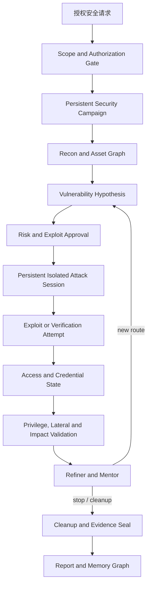

# Security Testing Mode vs PentAGI: 持续渗透能力对比

> 对比日期：2026-08-01  
> 对象：本项目 `Agent_Server/src/modes/security_testing_mode/` 与本地参考项目 `项目借鉴/pentagi/`  
> 目的：判断本项目是否已经具备“持续受到渗透仍能验证安全性”的底层能力，并明确可以借鉴的架构。

## 1. 结论

本项目的安全模式已经不是空壳，也不是只能生成报告的模拟器。它可以在授权目标范围内启动受控 Docker/Kali 扫描，执行任务并发、依赖调度、审批、中断、证据收集、失败分析、结果压缩和跨会话成功 profile 召回。现有测试报告记录了真实 Kali 执行、3 个 Campaign、9 个 Worker 任务全部完成，以及 `75 passed, 1 skipped` 的定向测试结果。

但如果问题是“项目能否扛住攻击者不断尝试、失败后换路线、利用成功后继续扩大验证，并最终证明防守边界”，当前答案仍然是否定的。当前模式更准确的定位是：

> 受授权、受策略约束的安全评估与部分漏洞验证平台；尚不是完整的持续渗透/攻击链验证平台。

关键原因不是扫描器数量，而是以下底层能力仍未形成闭环：

1. 缺少持久的交互式攻击环境和跨命令会话状态；
2. 利用、权限提升、后渗透、横向移动没有形成可持续攻击链；
3. 工具主要依赖固定 command profile，尚无 PentAGI Installer 式动态装配；
4. 没有反连监听、C2、回连端口和战利品治理；
5. 任务状态虽可 refine，但整体仍以一次 Campaign 阶段推进结束，不能自然驻留并反复攻击；
6. 角色中存在 `security-exploit-coder`，但没有完整的“写 exploit -> 编译/运行 -> 获取结果 -> 再规划”执行落点。

## 2. 证据范围

### 2.1 本项目已核对的代码

- 编排入口：[runtime.py](../src/modes/security_testing_mode/runtime.py)
- Campaign 状态：[campaign_state.py](../src/modes/security_testing_mode/campaign_state.py)
- 多 Worker 调度：[subagent_coordinator.py](../src/modes/security_testing_mode/subagent_coordinator.py)
- 动态任务生成/重规划：[subtask_generator.py](../src/modes/security_testing_mode/subtask_generator.py)、[subtask_refiner.py](../src/modes/security_testing_mode/subtask_refiner.py)
- 执行环境：[execution_environment_service.py](../src/application/security/execution_environment_service.py)
- 受控命令目录：[command_profiles.py](../src/application/security/command_profiles.py)
- 记忆：[memory_service.py](../src/modes/security_testing_mode/memory_service.py)
- 证据：[evidence_service.py](../src/modes/security_testing_mode/evidence_service.py)
- 模式声明：[manifest.py](../src/modes/security_testing_mode/manifest.py)

### 2.2 PentAGI 已核对的代码和文档

- 流程层级与生命周期：[flow_execution.md](../../项目借鉴/pentagi/backend/docs/flow_execution.md)、[controller.md](../../项目借鉴/pentagi/backend/docs/controller.md)
- Docker 执行与端口：[client.go](../../项目借鉴/pentagi/backend/pkg/docker/client.go)
- Terminal/File 工具：[terminal.go](../../项目借鉴/pentagi/backend/pkg/tools/terminal.go)
- 工具注册与执行：[registry.go](../../项目借鉴/pentagi/backend/pkg/tools/registry.go)、[executor.go](../../项目借鉴/pentagi/backend/pkg/tools/executor.go)
- 结构化上下文：[chain_ast.go](../../项目借鉴/pentagi/backend/pkg/cast/chain_ast.go)
- 上下文压缩：[chain_summary.go](../../项目借鉴/pentagi/backend/pkg/csum/chain_summary.go)
- 图谱记忆：[client.go](../../项目借鉴/pentagi/backend/pkg/graphiti/client.go)

## 3. 能力总览

| 能力 | 本项目现状 | PentAGI 做法 | 判断 |
|---|---|---|---|
| 目标授权 | 有目标 allowlist、授权状态、风险审批和执行前二次校验 | Flow 级执行环境，工具调用受容器边界约束 | 本项目合规门更明确 |
| 基础侦察 | 20 个受控 profile，覆盖 nmap/httpx/whatweb/ffuf/gobuster/nikto/nuclei/sqlmap/sslscan 等 | 容器内可组合任意工具，另有 browser、Google、DDG、Sploitus 等搜索工具 | 本项目适合基线，PentAGI 更开放 |
| 多任务调度 | 批量并发、依赖、资源锁、Refiner、Reflector、Mentor 类监控 | Flow -> Task -> Subtask，Subtask 完成后 Refiner 重排 | 核心调度接近，但生命周期不同 |
| 长任务 | Docker detached + poll + 输出文件 | Docker exec attach/detach + 终端日志 | 非交互长任务接近 |
| 交互 Shell | 每次独立 `docker exec`，无 PTY、无 shell 状态 | Terminal 工具支持 Docker exec，仍以命令为主，但有更完整 Flow 容器上下文 | 本项目缺多步交互能力 |
| 文件通道 | `docker cp` 双向传输，路径限制明确 | File 工具读写容器文件、tar 通道 | 本项目已有基础实现 |
| 漏洞利用 | searchsploit/msf 信息查询及受审批 profile；部分 free command | Pentester/Coder 可在容器中组合工具并执行 | 本项目只有利用前/信息级能力 |
| Exploit 编写 | 有 exploit coder 角色名，但无完整代码执行闭环 | Coder Agent + Terminal + File | 关键缺口 |
| 后渗透 | 没有权限提升、持久化、战利品、横向移动编排 | 可继续使用容器 Terminal/File/Pentester/Coder | 关键缺口 |
| 回连/C2 | 无监听端口分配、反弹 Shell、C2 | Docker client 为每个 Flow 分配回连端口，可承载回连场景 | 关键缺口 |
| 工具安装 | 固定工具/包 bootstrap | Installer Agent 运行时安装工具 | 动态性不足 |
| 长期记忆 | pgvector/Observation，能按目标指纹召回成功 profile | pgvector + Graphiti，支持事件、实体、关系和成功工具检索 | 本项目缺情景图谱 |
| 上下文 | Pydantic campaign state + 结构感知输出压缩 | ChainAST + csum，按字节、消息类型和 tool call 关系压缩 | 本项目可维护性和长战役能力较弱 |
| 可观测性 | 事件流、execution record、evidence、报告 | 多种日志、GraphQL subscription、Langfuse trace、截图和 terminal logs | 本项目可审计，但复盘粒度不足 |

## 4. 本项目已经具备的基础

### 4.1 不是“只扫描不执行”

[execution_environment_service.py](../src/application/security/execution_environment_service.py) 已实现 Docker backend、同步执行、detached 执行、轮询、文件上传下载、容器清理和输出日志读取；执行前还会执行目标 allowlist 校验。这个基础足以支撑真实的授权扫描和长时间非交互命令。

### 4.2 调度闭环已经存在

[runtime.py](../src/modes/security_testing_mode/runtime.py) 会构建 Campaign、派发任务、运行 Worker、收集结果、执行 Refiner、执行失败分析和 Reflection，再生成报告并持久化观察记录。也就是说，当前实现已超出简单的“固定顺序执行 profile”。

### 4.3 安全门和证据链是优点

[manifest.py](../src/modes/security_testing_mode/manifest.py) 要求 `verified_target_authorization`，并限制自动风险等级；[evidence_service.py](../src/modes/security_testing_mode/evidence_service.py) 会将命令、输出、状态和发现归档。对于企业产品，这些边界比盲目开放任意命令更重要，不应直接复制 PentAGI 的开放执行策略。

### 4.4 记忆已经能复用“成功 profile”

[memory_service.py](../src/modes/security_testing_mode/memory_service.py) 会持久化 campaign summary、finding、failed task 和 execution record，并按 target fingerprint、surface type、risk level 过滤召回。该机制已经具备 PentAGI `SuccessfulTools` 的部分价值，但还不是完整的攻击情景记忆。

## 5. 影响“持续渗透验证”的关键差距

### 5.1 缺少持久攻击会话

当前 detached 解决的是“命令需要运行很久”，不是“攻击者需要保持一个环境”。每次普通命令仍通过独立 Docker exec 运行；系统没有 PTY、stdin 持续输入、当前工作目录/环境变量/后台进程组的会话模型。

这会直接影响：

- 需要先登录再执行下一条命令的场景；
- 需要交互式 Metasploit、数据库客户端或调试器的场景；
- 需要保留临时文件、环境变量和进程状态的场景；
- 需要建立反连通道并持续读取结果的场景。

**建议**：先实现受控的 `SecurityShellSession`（PTY/容器 exec attach、stdin/stdout、cwd、环境、超时、关闭），再决定是否需要 SSH。PentAGI 的经验表明，Docker exec 已能覆盖多数容器化场景，不必先引入 SSH。

### 5.2 “发现漏洞”没有自动进入“证明影响”

当前 profile 主要是探测和信息查询：例如 nmap、nuclei、sqlmap read-only、searchsploit、msf module info。即使发现高价值漏洞，也没有统一的状态转换：

```text
finding -> exploit hypothesis -> authorized exploit attempt -> access proof
        -> privilege/impact validation -> containment/cleanup -> report
```

PentAGI 的 Primary/Pentester/Coder/Refiner 组合能在同一个 Flow 内继续执行。当前模式通常在任务完成后整理结果并进入报告阶段，攻击链容易在“发现”处终止。

**建议**：增加独立的 `attack_chain` 状态和阶段，不要把利用逻辑继续堆进扫描 profile。每条链至少要有 `hypothesis`、`preconditions`、`approval_scope`、`attempts`、`evidence`、`impact`、`cleanup` 和 `rollback_status`。

### 5.3 Exploit Coder 目前更多是角色声明

[agent.py](../src/modes/security_testing_mode/agent.py) 定义了 `security-exploit-coder`，但 [command_profiles.py](../src/application/security/command_profiles.py) 的注册项仍以固定 profile 为中心。没有看到一个完整的临时代码目录、编译器/解释器执行、编译错误回传、依赖安装、二次修复和结果验证闭环。

**建议**：为 Coder 增加隔离 workspace 和专用工具契约，所有生成代码必须：

1. 绑定目标与授权范围；
2. 静态检查和危险 API 检查；
3. 走审批；
4. 在临时容器内编译/运行；
5. 保存源码、命令、stdout/stderr、exit code；
6. 成功或失败都回到 Refiner，而不是直接报告。

### 5.4 没有后渗透、横向和战利品模型

当前模式有 `credential_attack` 和 `exploit` family，但没有可持续表示“拿到凭证/会话后可以访问什么”的资产图，也没有横向移动边界、凭证复用策略、权限提升状态、战利品分类和销毁确认。

安全性不能只看“入口漏洞是否存在”，还要看攻击成功后影响能否扩散。至少要增加：

- `credential`：来源、用途、作用域、敏感度、过期时间；
- `session/access`：访问主体、权限、到期时间、证明材料；
- `asset_graph`：主机、服务、账号、信任关系和可达路径；
- `loot`：文件、token、数据库记录、截图，带脱敏和留存策略；
- `cleanup`：临时账号、文件、监听器、进程和网络规则的清理状态。

### 5.5 工具目录窄，且没有动态装配

当前默认命令 profile 共 20 个，优点是可审计、参数受控；缺点是遇到工具缺失或新攻击面时，系统只能失败或切换到有限 profile。PentAGI 的 Installer Agent 可以在隔离容器中安装工具，并把结果交给后续 Agent。

不建议直接开放宿主机 `apt install`。合理的企业化方案是：

- 只允许安装到临时安全容器；
- 包名、镜像、网络出口和版本锁定；
- 安装过程单独审批；
- 安装结果写入环境 manifest；
- 安装失败必须返回完整 stderr；
- Campaign 结束清理容器和工具层。

### 5.6 没有回连基础设施

PentAGI 的 Docker client 有 Flow 级端口分配，支持回连场景。本项目没有监听端口分配、回连地址注入、连接生命周期和清理模型，因此无法可靠验证反弹 Shell、回连代理、临时 callback 或部分 C2 场景。

**建议**：在明确授权后增加 per-campaign callback broker，而不是直接把端口暴露给任意命令。它应该包含端口租约、目标绑定、协议白名单、超时、连接日志和结束时强制释放。

### 5.7 Campaign 仍偏“一次运行后报告”

当前 [runtime.py](../src/modes/security_testing_mode/runtime.py) 以阶段机推进到 `PHASE_REPORT_READY`；Refiner 主要在当前批次 settle 后调整任务。PentAGI 的 Flow 是持久对象，可以在同一 Flow 中追加 Task、等待用户输入、停止后恢复和继续攻击。

这决定了两者的产品行为不同：本项目是“完成一次评估”，PentAGI 是“保持一个攻击工作区”。如果要验证抗持续渗透，必须让 Campaign 在报告前支持多个 attack loop，并支持 `waiting_for_approval`、`waiting_for_input`、`paused`、`resumed` 和 `aborted` 等明确状态。

### 5.8 记忆缺少攻击情景图谱

当前 pgvector 适合找“相似目标上哪些 profile 曾成功”，但不擅长回答：

- 某个账号从哪个入口取得；
- 某个服务与哪些资产存在信任关系；
- 某条攻击路径在哪一步被阻断；
- 某个凭证是否在其他服务复用；
- 某种防守控制在不同时间是否持续有效。

PentAGI 的 Graphiti/Neo4j 设计正适合保存这些实体、关系、时间和事件。建议在现有 pgvector 之上增加安全专用图模型，而不是替换现有记忆系统。

## 6. 推荐目标架构



这里的关键改变是：报告不再是扫描结束后的唯一出口；每次发现都可以进入受控攻击链，攻击链经过审批、执行、影响验证、清理和证据封存后，才结束。

## 7. 分阶段落地路线

### P0：先补“持续验证闭环”，不扩大危险能力

- 把 Campaign 从一次性阶段机升级为可循环的 `attack loop`；
- 增加 finding -> hypothesis -> verification 的状态模型；
- 统一记录每次尝试的命令、原始 stdout/stderr、退出码、证据和 cleanup；
- 为重复失败、重复工具调用和无进展情况增加硬预算；
- 报告中区分 `detected`、`verified_exploitable`、`impact_verified`、`blocked_by_control`。

### P1：受控持久环境

- 增加容器级 `SecurityShellSession`；
- 支持 stdin、stdout/stderr、cwd、环境变量、后台进程、文件通道和会话关闭；
- 支持多步非破坏性验证；
- 继续保留 allowlist、审批、超时和清理，不直接开放宿主机 shell。

### P2：利用与影响验证

- 建立 exploit coder workspace；
- 增加只读/可回滚的利用验证 profile；
- 增加权限证明、凭证状态、资产关系和影响范围记录；
- 在授权实验室中加入 callback broker 和最小化的回连测试；
- 把 cleanup 作为 Campaign 的强制终态。

### P3：工具和记忆扩展

- 安全容器内的审批式 Installer；
- Graphiti/Memgraph 安全情景图谱；
- ChainAST 类结构化消息链和按字节压缩；
- LLM 调用级 trace、工具调用统计和可回放证据链。

## 8. 不应直接照搬 PentAGI 的部分

1. **无限制自由命令**：PentAGI 偏研究/渗透工作台，本项目面向企业安全验证，必须继续保留 allowlist、风险等级和审批。
2. **宿主网络能力**：NET_RAW/NET_ADMIN、回连端口和网络切换必须由 Campaign 授权和环境策略控制。
3. **任意工具安装**：只允许安装到临时、可销毁、可审计的安全容器。
4. **持久战利品保存**：凭证、token、数据库记录和截图需要脱敏、保留期限和销毁策略。
5. **攻击成功即继续扩张**：每一步横向或提权都必须重新验证作用域，不应让 Agent 自行扩大目标边界。

## 9. 验收标准

在不接触未授权目标的前提下，安全模式达到下面标准，才可以称为“持续渗透验证”而不是“增强扫描”：

- 同一 Campaign 能跨多个 attack loop 持久运行，而不是发现后立即进入报告；
- 每个 finding 都能明确标记为“仅发现”或“已验证可利用”；
- 至少支持一个多步、非破坏性的 exploit verification 流程；
- 能在同一隔离环境中保留会话状态，并完整回传 stdout/stderr；
- 失败三次后能切换路线，不能无限重复同一工具；
- 高风险尝试必须暂停等待审批，并可恢复原 Campaign；
- 获得访问证明后能记录权限、凭证来源和可达资产，但不会自动越界；
- Campaign 结束时临时文件、进程、监听器、容器和凭证副本均有清理结果；
- 报告能区分检测、利用验证、影响验证、防守阻断和环境限制；
- 重跑同一目标时，记忆能召回成功和失败路径，而不只是召回 profile 名称。

## 10. 最终判断

本项目目前的安全模式底层“能用”，而且在企业合规边界、授权校验、审批、中断和证据方面有自己的优势；但它还没有达到 PentAGI 那种持续驻留、动态重规划、工具自由组合和攻击链延伸能力。

因此，下一步不应继续简单增加 nmap、nuclei 或 profile 数量。优先级应该是：

```text
持久 Campaign
-> finding/hypothesis/verification 状态
-> 受控持久 Shell
-> exploit coder 执行闭环
-> access/impact/cleanup 模型
-> callback 与情景图谱
```

这条路线既借鉴了 PentAGI 的真正优势，也保留了本项目面向企业安全验证所必须的授权和风险边界。
